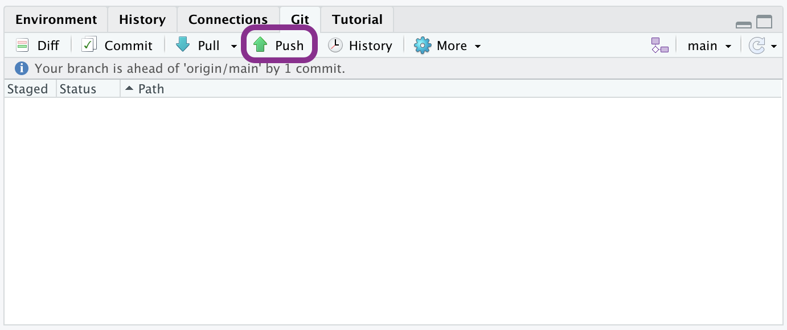
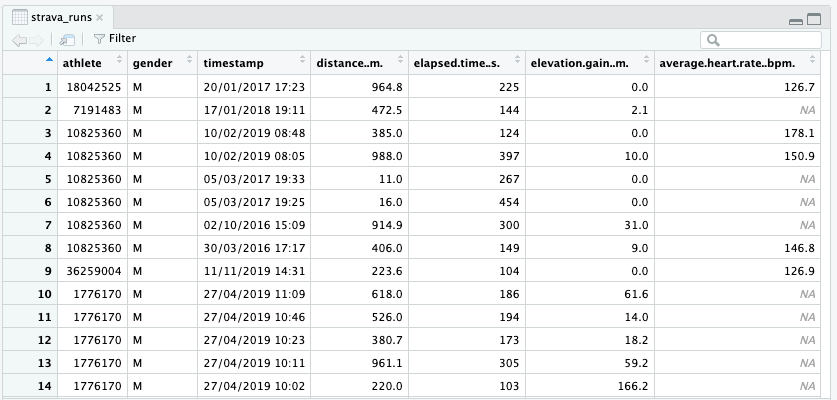
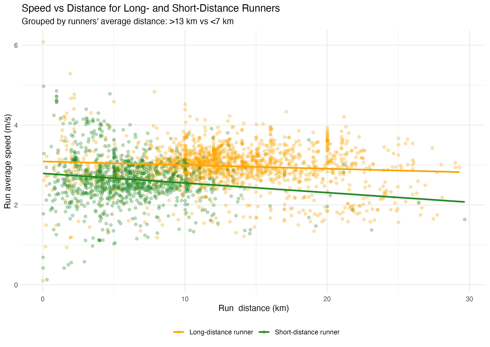

```{r setup, include=FALSE}
library(tidyverse)
library(cherryblossom)

knitr::opts_chunk$set(
  eval = FALSE,
  out.width = "100%"
  )
```

```{r unsplash, fig.margin = TRUE, echo = FALSE, eval = TRUE, fig.cap = "Image by roxanawilliams1920 from Pixabay"}

```


In this assignment you will get to put your newly acquired data visualisation skills into action.

## Prerequisites

This assignment assumes that you have worked through all materials up to and including:

-   [Week 5](https://uoe-ids.netlify.app/week05/) on effectively communicating data science results, and
-   [Week 6](https://uoe-ids.netlify.app/week06/) on creating data visualisations.

You may need to use some of your data wrangling skills from earlier in the course.


----


# Getting started

## Accessing the homework template

1.   From your profile in GitHub, go to **Repositories** (along the top) and click on the green **New** button.

2.  Click on the text **Import a repository**.

3.  Type the following URL: `https://github.com/uoeIDS/hw-02-template`

4. Add a name for your repository, for example, `hw-02`.

5. **IMPORTANT**: Set the privacy of your repository to **Private**. If you make your repository public then anyone can see and copy your work. Failure to set your repository private risks incurring an academic misconduct case.

6. Click on the green **Begin import** button

Once you have created your repository, you will need to add the course GitHub account as a collaborator. This will be useful for the course team to help you if there are any major issues or problems with your homework.

1.    In the repository you have just created, go to **Settings** (along the top) and select **Collaborators** along the side.

2.    Next, click on the green **Add people** people button under **Manage access**

3.    Type `uoeIDS` into the search box and select the `Introduction to Data Science` account. Finally, click on the green button that says **Add uoeIDS to this repository**.

## Creating a version control R project

1. Open RStudio, click on **File** at the very top and then select **New Project...**.

2. In the new project wizard, select **Version Control** and then **Git**.

3. Go to GitHub and open the repository that you have just created. Click the green **Code** button and copy the HTTPS URL.

4. Return to RStudio and paste the **Repository URL** in the first text box. The project directory name will automatically be filled, it is recommended that you do not change this name.

5. Click on the **Browse...** button to find a location in your file system where you want to save your project.

6. Click on the **Create Project** button

## Warm up

### Step 1. Rename the template worksheet

In the lower right panel in RStudio, click the **Files** tab to see what files are provided in the homework template. You should see an R markdown document called `hw-02-template.Rmd`. Click on the box next to this file and then above (in the same panel) click on the **Rename** button. In the new window, edit the file name to read `hw-02-s<nnnnnn>.Rmd` where `<nnnnnn>` should be your University User Number (UUN). When done, click on **OK**.

### Step 2. Update the document author

Open the R Markdown file that you have just renamed, which will appear in the top left panel of RStudio. At the top, edit the author name to your name and include your UUN. Do not change any of the other details in the YAML (the area between the triple dashes).

Now press the **Knit** button at the top of the R Markdown document, which will compile the code and produce a document with your updated information. Depending on your settings, this will either appear in a new window or within the **Viewer** tab in the bottom right panel.


### Step 3. Commit

Now that we have made an important edit to the document, we need to add the changes into the version control.

Go to the **Git pane** in your RStudio. If you have done the above steps then you should see three items: the creation of `hw-02-s<nnnnnn>.Rmd` and the deletion of `hw-02-template.Rmd` as a result of renaming the R Markdown file, and the creation of `hw-02-s<nnnnnn>.html` from the first knit to produce the html document. Any further changes you make to your project will appear hear.


Next, click on **Diff**.
This will pop open a new window that shows you the **diff**erence between the last committed state of the document and its current state that includes your changes.
If you are happy with these changes, click on the checkboxes of all files in the list. This will **stage** the files ready for committing to the version control structure. Type a short yet informative description of the changes you have made in the **commit message** text box, for example *"Update author name"*. Once done, hit **Commit**.

```{r update-author-name-commit, echo = FALSE, eval = TRUE, fig.align = "left"}
knitr::include_graphics("img/update-author-name-commit.png")
```


You do not have to commit after every change as this would get quite cumbersome.
You should consider committing states that are *meaningful to you* for inspection, comparison, or restoration.
For the homework, we recommend that you make a commit after each time you attempt or make an edit to each exercise.

### Step 3. Push

```{r ready-to-push, fig.margin = TRUE, echo = FALSE, eval = TRUE}

```

Now that you have made an update and committed the changes, it is time to push these changes to the web!
Or more specifically, to your repo on GitHub.
Why?
So that others can see your changes.
And by others, we mean the course teaching team that you added as a collaborator (you should have made your repository private so that it can only be seen by you and collaborators).
In order to push your changes to GitHub, you will need to click on the **Push** button.


<!--
However, GitHub recently made some changes for extra security.
As such, you will first need to follow the [Push and Pull Changes](https://idsed.digital/troubleshoot/setup/openingaproject/#push-and-pull-changes) instructions on the [Opening a Project](https://idsed.digital/troubleshoot/setup/openingaproject/) page.
The good news is you will only need to do this once per RStudio Cloud project - rather than constantly typing in your username and password every time you want to push a change to GitHub.
-->


---


# Exercises

Now let’s get started with the homework exercises!

## Data

The data for this assignment is a CSV file containing records of running activities collected from Strava. Each row represents a single run from one of several runners. The dataset contains the following columns (some values may be missing):

- `athlete`: Unique identifier for each runner
- `gender`: Runner's stated gender ("M" or "F")
- `timestamp`: Date and time when the run was recorded
- `distance..m.`: Distance of the run in meters
- `elapsed.time..s`: Total time taken for the run in seconds
- `elevation.gain..m.`: Total elevation gain in meters
- `average.heart.rate..bpm.`: Average heart rate during the run in beats per minute

### Getting the data

Import the data into your environment using:
```{r eval = FALSE}
strava_runs <- read_csv("data/strava_runs.csv")
```

You can view the dataset as a spreadsheet using the `View()` function. 
Note that you should not put this function in your R Markdown document, but instead type it directly in the Console, as it pops open a new window (and the concept of popping open a window in a static document does not really make sense...).
When you run this in the console, you will see the following **data viewer** window pop up.

```{r view-data}
View(strava_runs)
```

```{r data.viewer, echo = FALSE, eval = TRUE, fig.align = "left"}

```

For some of these exercises, we will now restrict our focus to 5k and 10k runs. Use the following code to extract runs that are approximately 5k and 10k in distance:
```{r eval=FALSE}
data_5k_10k <- strava_runs %>%
  mutate(
    event = case_when(
      distance..m. > 4998 & distance..m. < 5015  ~ "5k",
      distance..m. > 9998 & distance..m. < 10015 ~ "10k",
      TRUE ~ NA_character_
    )
  ) %>%
  filter(!is.na(event))
```

-----


## Exercise 1

The code below produces a simple histogram of the average heart rate (in bpm) for male runners ("M"):

```{r ex1, eval = FALSE}
data_5k_10k %>% 
  filter(gender == "M") %>%
  filter(!is.na(average.heart.rate..bpm.)) %>%
  ggplot(aes(x = average.heart.rate..bpm.)) + 
  geom_histogram(bins = 20)
```

a. Describe the overall _shape_ of the histogram. What does this suggest about the _structure_ of the distribution of average heart rate among male runners? Calculate some simple summary statistics to support your comments. (**3 pts**)

b. Create a similar data visualisation for female runners. Describe the _shape_ of this histogram and discuss any similarities or differences between the male and female runners’ heart rate distributions. (**2 pts**)

✏️️🧶 ✅ ⬆️ *Write your answer in your R Markdown document under Exercise 1, knit the document, commit your changes with a commit message that says "Completed Exercise 1", and push.*

-----

## Exercise 2

a. Create a data visualisation based on the following description. (**4 pts**)

> Make a sequence of boxplots for the pace (in minutes per km) achieved in 5K and 10K runs. The boxplots should be orientated vertically (i.e. side-by-side) based on the run's length (5K vs 10K). Furthermore, the data visualisation should consist of two panels for the two different genders the runners identify with, with shared axes. Finally, add appropriate text to the image in order to assist the reader in understanding the data visualisation.

Note: Use good coding practices to format your code so that it is easily readable. For example, add spaces, newlines and indentation in appropriate places.

b. Provide a brief comment about the relationships seen in the data visualisation created by the above description. (**1 pt**)


✏️️🧶 ✅ ⬆️ *Write your answer in your R Markdown document under Exercise 2, knit the document, commit your changes with a commit message that says "Completed Exercise 2", and push.*


-----

## Exercise 3

In this exercise, we are interested in how different types of runners perform depending on their typical running distances. For this, we consider all runners who recorded activities with Strava. We classify runners into two groups based on their average run distance:

- Long-distance runners: those whose average run distance is greater than 13 km
- Short-distance runners: those whose average run distance is less than 7 km

We hypothesize that long-distance runners may pace themselves differently, or have varying speed and distance profiles, compared to those who generally run shorter distances.

To explore this, we create the following scatter plot of average speed (in m/s) against distance (in km) for all runs made by athletes in these two groups.
This visualization demonstrates that runners who are, on average, short-distance runners tend to have lower speeds compared to long-distance runners. As short-distance runners increase their run distance, their speed decreases more sharply, whereas long-distance runners tend to maintain a more constant speed across a wider range of distances.


```{r ex3, echo = FALSE, eval = TRUE, fig.align = "left"}

```

* Recreate the above data visualisation. (**5 pts**)

#### Supplementary information for this exercise

You will need to wrangle, filter and transform the `strava_runs` data before creating the data visualisation.

The colours used in this data visualisation are `"orange"` and `"forestgreen"`.

The `ggplot2` [cheat sheet](https://rstudio.github.io/cheatsheets/html/data-visualization.html?_gl=1*1uyk3g7*_ga*MTUxMzczNDUyLjE2Nzk1NjY2NDg.*_ga_2C0WZ1JHG0*MTY5ODA0NzI0Ni4yMy4wLjE2OTgwNDcyNDYuMC4wLjA.) may also help as a reference guide with aspects of this data visualisation.

<br>

✏️️🧶 ✅ ⬆️ *Write your answer in your R Markdown document under Exercise 3, knit the document, commit your changes with a commit message that says "Completed Exercise 3", and push.*


-----

## Exercise 4

Find two visualisations:

* One that you think provides a _good_ representation of the data, and
* One that you think provides a _bad_ representation of the data.

For each case, give _two_ reasons why you consider the data visualisation you have found are good/bad. Your reasons should make reference to the '4 respects' of data visualisations. (**4 pts**)

The images you select should not be any of the data visualisations that you have seen in the lectures/workshops. You should also ensure that you provide an appropriate citation for your images. (**1pt**)


### Instructions on adding your image to the R Markdown document.

To add your visualisation to the homework template:

1.    Take a photo of the visualisation or save a copy of the image from the internet. Preferred file types for images are `.png` and `.jpeg`.

2.    Copy and paste your image to the `img/` folder of your homework template.

3.    In the corresponding R chunk for this exercise, edit the path within the `include_graphics()` command to the file name of your image.

Citations for where you downloaded your image should be in the following form:

&lt;Author/Organisation>, "&lt;Title of website>" [Online]. Available at: &lt;URL> (Accessed: &lt;day month year>)

For example, the reference for the RStudio logo would be:

RStudio, "RStudio Logo Usage Guidelines" [Online]. Available at: https://www.rstudio.com/about/logos/ (Accessed: 19 September 2022)


✏️️🧶 ✅ ⬆️ *Write your answer in your R Markdown document under Exercise 4, knit the document, commit your changes with a commit message that says "Completed Exercise 4", and push.*


-------

# Submission


⬆️ Once you have answered all of the exercises, please make sure that you have knitted your document and committed all the changes to GitHub.

To submit your homework:

1.    Login to LEARN-ULTRA and navigate to the Introduction to Data Science course.

2.    In the **Assessment** folder, select **Gradescope**.

3.    Click on the **Dashboard** in the left-hand panel and select **Homework Assignment 2 (hw-02)**.

4.    In the question, provide your **GitHub username** and then click on **Select file(s)** to upload the knitted html document containing your answers. 
Once done, press **Save Answer** and then **Submit & View Submissions**.

**IMPORTANT**: You must _only_ upload the knitted html document! **Submitting the wrong file type risks receiving zero marks**.

If you have uploaded the wrong file or have made some changes and want to resubmit before the deadline, then return to the assignment on Gradescope and click on the **Resubmit** button in the lower left corner. Select **Remove** and then press **Save Answer** to delete the old version, and re-do step 4 with the correct/updated html file.

------------------------------------------------------------------------------

## How the homework graded

The homework is grades out of a 25 where:

*   Each exercise is marked out of 5, and

*   Up to five additional marks are awarded based on the clarity of your writing, coding skills, reproducibility and overall presentation. 

## Getting help

If you have any questions about the assignment, please post them on [Piazza!](https://piazza.com/ed.ac.uk/fall2023/math0807720234ss1sem1/info)
