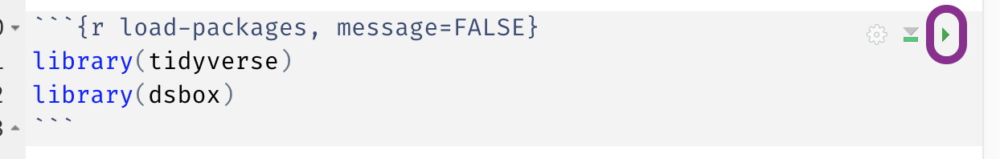
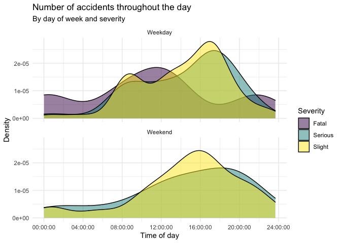

```{r setup, include=FALSE}
library(tidyverse)
library(openintro)
library(ggimage)
library(ggrepel)
    
knitr::opts_chunk$set(out.width = "100%")
```

```{r unsplash, fig.margin = TRUE, echo = FALSE, fig.cap = "Photo by Peiheng Yang on Unsplash"}
knitr::include_graphics("img/peiheng-yang-wa8U2Y01nmY-unsplash.jpg")
```

# **WARNING**: This material needs to be reviewed!!!


In this assignment you'll get to put your newly acquired data visualisation and wrangling chops to use as well as continue practicing working with Git and GitHub.

## Prerequisites

-   This assignment assumes that you've worked through all materials for [week 1](https://idsed.digital/week01/), [week 2](https://idsed.digital/week02/), and [week 3](https://idsed.digital/week03/).
    Make sure you're familiar with this content.

-   This assignment uses datasets from the following interactive R tutorials that were assigned during these weeks.
    If you haven't gone through the tutorials then, this is a good time to give them a try.
    While it's not strictly required that you finish the tutorials before the homework, they will be useful if you want some guided practice before working on open-ended questions as part of this assignment.

    -   [Airbnb listings in Edinburgh](https://minecr.shinyapps.io/dsbox-01-edibnb/)
    -   [Road traffic accidents](https://minecr.shinyapps.io/dsbox-02-accidents/)

## Workflow

```{marginfigure}
**IMPORTANT:** If there is no GitHub repo created for you for this assignment, it means I didn't have your GitHub username as of when I assigned the homework. Please let me know your GitHub username asap, and I can create your repo.
```

```{=html}
<details>
  <summary>Click here for workflow overview.</summary>
  
<p>For each assignment in this course you will start with a GitHub repo that I created for you and that contains the starter documents you will build upon when working on your assignment. The first step is always to bring these files into RStudio so that you can edit them, run them, view your results, and interpret them. This action is called cloning.</p>

<p>Then you will work in RStudio on the data analysis, making commits along the way (snapshots of your changes) and finally push all your work back to GitHub.</p>

<p>The <a href="https://idsed.digital/troubleshoot/setup/openingaproject/">Opening a Project</a> page walks you through the process of getting information of the repo to be cloned, cloning your repo in a new RStudio Cloud project, and getting started with the analysis.</p>
  
</details>
```
**Step 1. Get URL of repo to be cloned:** On GitHub, click on the green **Code** button, select **HTTPS** (this might already be selected by default).
Click on the clipboard icon 📋 to copy the repo URL.

**Step 2. Go to RStudio Cloud:** Go to [rstudio.cloud](https://rstudio.cloud/ "RStudio Cloud") and then **navigate to the course workspace** via the left sidebar.
Before you proceed, confirm that you are in the course workspace by checking out what's on your top bar in RStudio Cloud; it should say Introduction to Data Science.

**Step 3. Clone the repo:** In RStudio, click on the **down arrow** next to New Project and then choose **New Project from Git Repository**.
In the pop-up window, **paste the URL** you copied from GitHub, make sure the box for **Add packages from the base project** is checked (it should be, by default) and then click **OK**.

## Warm up

Before we introduce the data, let's warm up with some simple exercises.

**Step 1. Update the YAML:** Open the R Markdown (Rmd) file in your project, change the author name to your name, and **knit** the document.

**Step 2. Commit:** Go to the **Git pane** in RStudio.
You should see that your Rmd (R Markdown) file and its output, your md file (Markdown), file are listed there as recently changed files.
Next, click on **Diff**.
This will pop open a new window that shows you the **diff**erence between the last committed state of the document and its current state that includes your changes.
If you're happy with these changes, click on the checkboxes of all files in the list, and type *"Update author name"* in the **Commit message** box and hit **Commit**.

```{marginfigure}
Don't fret if you miss a commit suggested or end up making more commits than what's suggested here. The important thing is that you make incremental commits, the precise number doesn't matter. And your commit messages should be informative, but the precise wording doesn't matter either.
```

You don't have to commit after every change, this would get quite cumbersome.
You should consider committing states that are *meaningful to you* for inspection, comparison, or restoration.
In the first few assignments we will tell you exactly when to commit and in some cases, what commit message to use.
As the semester progresses we will let you make these decisions.

**Step 3. Push:** Now that you have made an update and committed this change, it's time to push these changes to the web!
Or more specifically, to your repo on GitHub.
Why?
So that others can see your changes.
And by others, we mean the course teaching team (your repos in this course are private to you and us, only).
In order to push your changes to GitHub, first follow the [Push and Pull Changes](https://idsed.digital/troubleshoot/setup/openingaproject/#push-and-pull-changes) instructions on the [Opening a Project](https://idsed.digital/troubleshoot/setup/openingaproject/) page, then click on **Push**.

## Packages

R is an open-source language, and developers contribute functionality to R via packages.
In this assignment we will use the following packages:

-   `tidyverse`: a collection of packages for doing data analysis in a "tidy" way
-   `dsbox`: a package that contains the datasets that we will use in this course

We use the `library()` function to load packages.
In your R Markdown document you should see an R chunk labelled `load-packages` which has the necessary code for loading both packages.
You should also load these packages in your Console, which you can do by sending the code to your Console by clicking on the **Run Current Chunk** icon (green arrow pointing right icon).

```{r load-packages-chunk, echo = FALSE, fig.align = "left"}

```

Note that these packages are also get loaded in your R Markdown environment when you **Knit** your R Markdown document.

## Airbnb listings in Edinburgh

Once upon a time in a land before the plague, people travelled all over the world, and some stayed in hotels and others chose to stay in other people's houses that they booked through Airbnb.
Recent developments in Edinburgh regarding the growth of Airbnb and its impact on the housing market means a better understanding of the Airbnb listings is needed.
Using data provided by Airbnb, we can explore how Airbnb availability and prices vary by neighbourhood.

The data can be found in the **dsbox** package, and it's called `edibnb`.
Since the dataset is distributed with the package, we don't need to load it separately; it becomes available to us when we load the package.

You can view the dataset as a spreadsheet using the `View()` function.
Note that you should not put this function in your R Markdown document, but instead type it directly in the Console, as it pops open a new window (and the concept of popping open a window in a static document doesn't really make sense...).
When you run this in the console, you'll see the following **data viewer** window pop up.

```{r view-data, eval = FALSE}
View(edibnb)
```

You can find out more about the dataset by inspecting its documentation, which you can access by running `?edibnb` in the Console or using the Help menu in RStudio to search for `edibnb`.
You can also find this information [here](https://rstudio-education.github.io/dsbox/reference/edibnb.html).

```{marginfigure}
You may want to use **inline** code instead of hard coding the number
```

1.  How many observations and variables does the dataset have? Write your answer as a full sentence.

✏️️🧶 ✅ ⬆️ *Write your answer in your R Markdown document under the appropriate exercise, knit the document, commit your changes with a commit message that says "Completed Exercise 1", and push. Make sure you commit and push all files so your Git pane is clear after the push.*

```{marginfigure}
Remember to give your figure an appropriate title and axis labels.
```

1.  Create a faceted histogram where each facet represents a neighbourhood and displays the distribution of Airbnb prices in that neighbourhood. Think critically about whether it makes more sense to stack the facets on top of each other in a column, lay them out in a row, or wrap them around. Along with your visualisation, include your reasoning for the layout you chose for your facets.

✏️️🧶 ✅ ⬆️ *Write your answer in your R Markdown document under the appropriate exercise, knit the document, commit your changes with a commit message that says "Completed Exercise 2", and push. Make sure you commit and push all files so your Git pane is clear after the push.*

1.  The following question will require creating three pipelines, one of which ends in a visualisation, and a narrative.

    A - Use a single pipeline to identity the neighbourhoods with the top five median listing prices.

    B - In another pipeline filter the data for these neighbourhoods and make ridge plots of the distributions of listing prices in these neighbourhoods.

    C - In a third pipeline calculate the minimum, mean, median, standard deviation, IQR, and maximum listing price in each of these neighbourhoods.

    D - Use the visualisation and the summary statistics to describe and interpret the distribution of listing prices in the neighbourhoods.

✏️️🧶 ✅ ⬆️ *Write your answer in your R Markdown document under the appropriate exercise, knit the document, commit your changes with a short and informative commit message, and push. Make sure you commit and push all files so your Git pane is clear after the push.*

1.  Create a visualization that will help you compare the distribution of review scores (`review_scores_rating`) across neighbourhoods. You get to decide what type of visualisation to create and there is more than one correct answer! In your answer, include a brief interpretation of how Airbnb guests rate properties in general and how the neighbourhoods compare to each other in terms of their ratings.

✏️️🧶 ✅ ⬆️ *Write your answer in your R Markdown document under the appropriate exercise, knit the document, commit your changes with a short and informative commit message, and push. Make sure you commit and push all files so your Git pane is clear after the push.*

## Road traffic accidents in Edinburgh

Next we'll look at traffic accidents in Edinburgh.
The data are made available [online](https://data.gov.uk/dataset/cb7ae6f0-4be6-4935-9277-47e5ce24a11f/road-safety-data/datafile/36f1658e-b709-47e7-9f56-cca7aefeb8fe/preview) by the UK Government.
It covers all recorded accidents in Edinburgh in 2018 and some of the variables were modified for the purposes of this assignment.

The data can be found in the **dsbox** package, and it's called `accidents`.
Since the dataset is distributed with the package, we don't need to load it separately; it becomes available to us when we load the package.
You can find out more about the dataset by inspecting its documentation, which you can access by running `?accidents` in the Console or using the Help menu in RStudio to search for `accidents`.
You can also find this information [here](https://rstudio-education.github.io/dsbox/reference/accidents.html).

```{marginfigure}
Don't forget to label your R chunk as well (where it says `label-me-1`). Your label should be short, informative, shouldn't include spaces, and shouldn't shouldn't repeat a previous label.
```

1.  Recreate the following plot, and describe and interpret it in context of the data.

```{r echo=FALSE}

```

1.  Create another data visualisation based on this data and interpret it. You can choose any variables and any type of visualisation you like, but it must have at least three variables, e.g. a scatterplot of x vs. y isn't enough, but if points are coloured by z, that's fine.

```{marginfigure}
__IMPORTANT: How do we mark assignments?__

Your teaching team will mark your work using your __knitted file__ (ending in .md) and not your R Markdown (.Rmd) file that you use to create and run your code. This is because your knitted file is a completely _reproducible_ document where we can see your code and its output without having to run any code ourselves. It is important you knit your work while working on your assessments as we will only mark what is in the knitted file and not what is in the .Rmd file.
```

✏️️🧶 ✅ ⬆️ *After writing your answer in your R Markdown document under the appropriate exercise, make sure to knit, commit, and push your changes to GitHub with an appropriate commit message. Make sure you have committed and pushed all changed files so that your Git pane is cleared up afterwards. Your last push to the repo needs to come before the deadline, **14 October, 16:00 UK time**. You can confirm that what you committed and pushed are indeed in your repo that we will see by visiting your repo on GitHub. Make sure your Rmd and md files are there and that your md file contains all of your code and plots!*

## Getting help

If you have any questions about the assignment, please post them on Piazza and/or stop by student hours!
