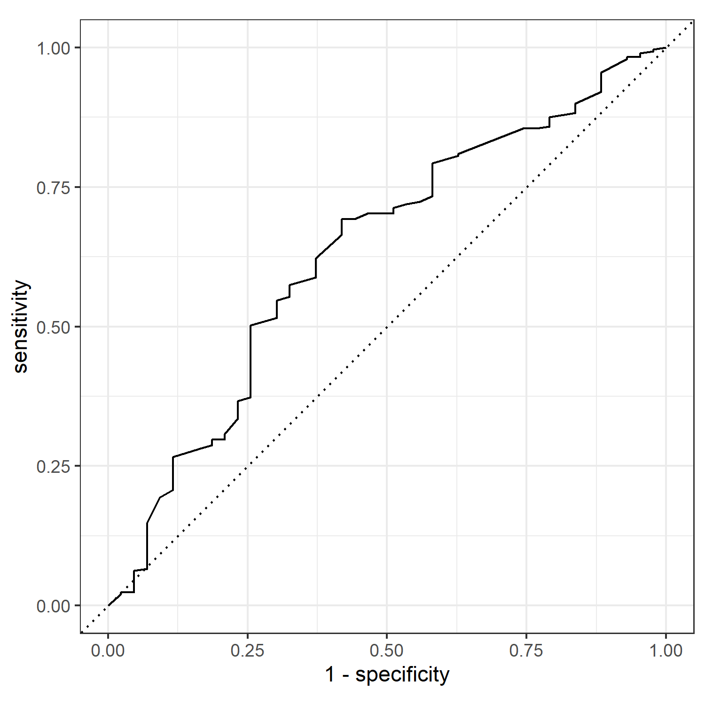
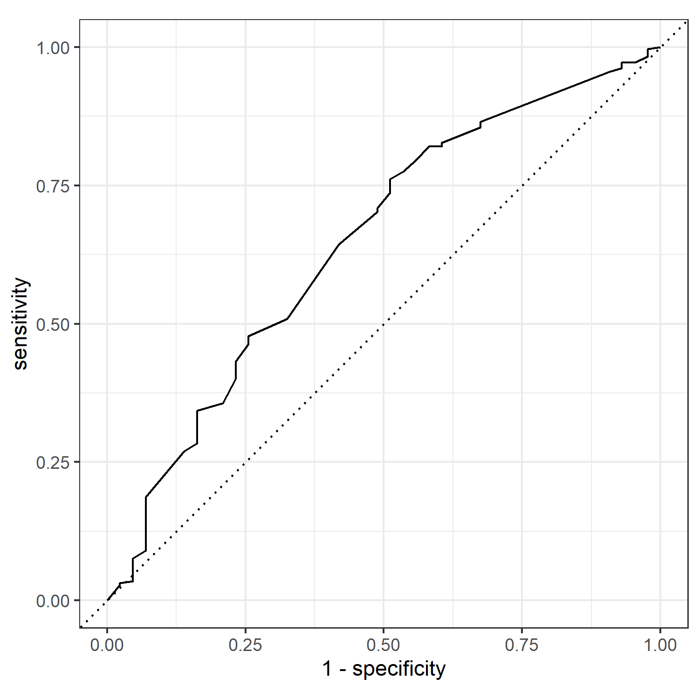

HW 4 - Model and review
================

### Notes

------------------------------------------------------------------------

# Part 1 - General Social Survey

## Scientific research

``` r
gss16<-read.csv("data/gss16.csv")
```

### Ex. 1. a)

``` r
gss16 <- gss16 %>%
  mutate(
    advfront = case_when(
      advfront %in% c("Agree", "Strongly agree") ~ "Agree",
      is.na(advfront) ~ NA_character_,
      TRUE ~ "Not agree"
    ),
    advfront = fct_relevel(advfront, "Not agree", "Agree")
  )

gss16 %>%
  count(advfront)
```

    ##    advfront    n
    ## 1 Not agree  226
    ## 2     Agree 1159
    ## 3      <NA> 1482

### Ex. 1. b)

``` r
gss16 <- gss16 %>%
  mutate(
    polviews = case_when(
      str_detect(polviews, "[Cc]onservative") ~ "Conservative",
      str_detect(polviews, "[Ll]iberal") ~ "Liberal",
      TRUE ~ polviews
    ),
    polviews = fct_relevel(polviews, "Conservative", "Moderate", "Liberal")
  )

gss16 %>%
  count(polviews)
```

    ##       polviews    n
    ## 1 Conservative  928
    ## 2     Moderate 1032
    ## 3      Liberal  796
    ## 4         <NA>  111

### Ex. 1. c)

``` r
gss16_advfront <- gss16 %>%
  select(advfront, educ, polviews, wrkstat) %>%
  drop_na()

gss16_advfront[1:10,]
```

    ##     advfront educ     polviews          wrkstat
    ## 1      Agree   16     Moderate Working fulltime
    ## 2  Not agree   12      Liberal Working fulltime
    ## 3  Not agree   12     Moderate Working parttime
    ## 4      Agree   14      Liberal    Keeping house
    ## 5      Agree   14      Liberal Working fulltime
    ## 6  Not agree   12 Conservative          Retired
    ## 7      Agree   12      Liberal Working parttime
    ## 8      Agree   10     Moderate Temp not working
    ## 9      Agree   10      Liberal    Keeping house
    ## 10     Agree   13      Liberal Working fulltime

### Ex. 2.

``` r
set.seed(1234)
gss16_split <- initial_split(gss16_advfront)
gss16_train <- training(gss16_split)
gss16_test  <- testing(gss16_split)
```

#### recipe

``` r
gss16_rec_1 <- recipe(advfront ~ polviews + wrkstat + educ, data = gss16_train) %>%
  step_other(wrkstat, threshold = 0.10, other = "Other") %>%
  step_dummy(all_nominal(), -all_outcomes())
```

#### model

``` r
gss16_spec <- logistic_reg() %>%
  set_engine("glm")
```

#### workflow

``` r
gss16_wflow_1 <- workflow() %>%
  add_model(gss16_spec) %>%
  add_recipe(gss16_rec_1)
```

#### Narrative

A logistic regression is the appropriate model to use here because the
response variable is binary (agree or not agree).

### Ex. 3.

``` r
gss16_fit_1 <- gss16_wflow_1 %>%
  fit(gss16_train)
tidy(gss16_fit_1)
```

    ## # A tibble: 7 × 5
    ##   term                     estimate std.error statistic   p.value
    ##   <chr>                       <dbl>     <dbl>     <dbl>     <dbl>
    ## 1 (Intercept)                -0.954    0.461      -2.07 0.0386   
    ## 2 educ                        0.138    0.0327      4.22 0.0000247
    ## 3 polviews_Moderate           0.595    0.199       2.99 0.00283  
    ## 4 polviews_Liberal            0.676    0.226       2.99 0.00281  
    ## 5 wrkstat_Working.fulltime    0.482    0.219       2.21 0.0274   
    ## 6 wrkstat_Working.parttime    0.478    0.317       1.51 0.131    
    ## 7 wrkstat_Other               0.278    0.247       1.12 0.261

``` r
o1<-exp(tidy(gss16_fit_1)$estimate[1]+13*tidy(gss16_fit_1)$estimate[2])

o2<-exp(tidy(gss16_fit_1)$estimate[1]+13*tidy(gss16_fit_1)$estimate[2]+tidy(gss16_fit_1)$estimate[4])

o1
```

    ## [1] 2.31283

``` r
o2
```

    ## [1] 4.547074

``` r
# the odds ratio
o2/o1
```

    ## [1] 1.966022

``` r
# the exponential of the coefficient associated with liberal political views

exp(tidy(gss16_fit_1)$estimate[4])
```

    ## [1] 1.966022

#### Narrative

$o_1$ are the predicted odds for someone who is conservative, has an
education level of 13 and is retired agreeing with the statement. $o_2$
are the predicted odds for someone who is liberal, has an education
level of 13 and is retired agreeing with the statement. Thus the ratio
$o_2/o_1$ is the odds ratio. **The odds ratio tells us that all else
being equal, the odds of someone with liberal political views agreeing
with the statement are 1.97 times greater than the odds of someone with
conservative views agreeing with the statement.** This is also how we
can interpret the exponential of the coefficients.

### Ex. 4.

Define workflow for the second model and fit it

``` r
gss16_rec_2 <- recipe(advfront ~ polviews + educ, data = gss16_train) %>%
  step_dummy(all_nominal(), -all_outcomes())

gss16_wflow_2 <- workflow() %>%
  add_model(gss16_spec) %>%
  add_recipe(gss16_rec_2)

gss16_fit_2 <- gss16_wflow_2 %>%
  fit(gss16_train)
```

Use both models to predict the test set, produce ROC curves and compute
the area under the ROC curves.

``` r
gss16_test_pred_1 <- predict(gss16_fit_1, new_data = gss16_test, type = "prob") %>%
  bind_cols(gss16_test %>% select(advfront))

gss16_test_pred_1 %>%
  roc_curve(truth = advfront, .pred_Agree, event_level = "second") %>%
  autoplot()
```



``` r
gss16_test_pred_1 %>%
  roc_auc(truth = advfront, .pred_Agree, event_level = "second")
```

    ## # A tibble: 1 × 3
    ##   .metric .estimator .estimate
    ##   <chr>   <chr>          <dbl>
    ## 1 roc_auc binary         0.633

``` r
gss16_test_pred_2 <- predict(gss16_fit_2, new_data = gss16_test, type = "prob") %>%
  bind_cols(gss16_test %>% select(advfront))

gss16_test_pred_2 %>%
  roc_curve(truth = advfront, .pred_Agree, event_level = "second") %>%
  autoplot()
```



``` r
gss16_test_pred_2 %>%
  roc_auc(truth = advfront, .pred_Agree, event_level = "second")
```

    ## # A tibble: 1 × 3
    ##   .metric .estimator .estimate
    ##   <chr>   <chr>          <dbl>
    ## 1 roc_auc binary         0.648

#### Narrative

Model 2 has better test set AUC (area under ROC curve) than model 1,
although whether this performance is a substantive improvement is
arguable. Never-the-less, as model 2 has fewer variables, which is
generally favoured due to reduced model complexity, run time, and better
generalisability, this model should be favoured.
