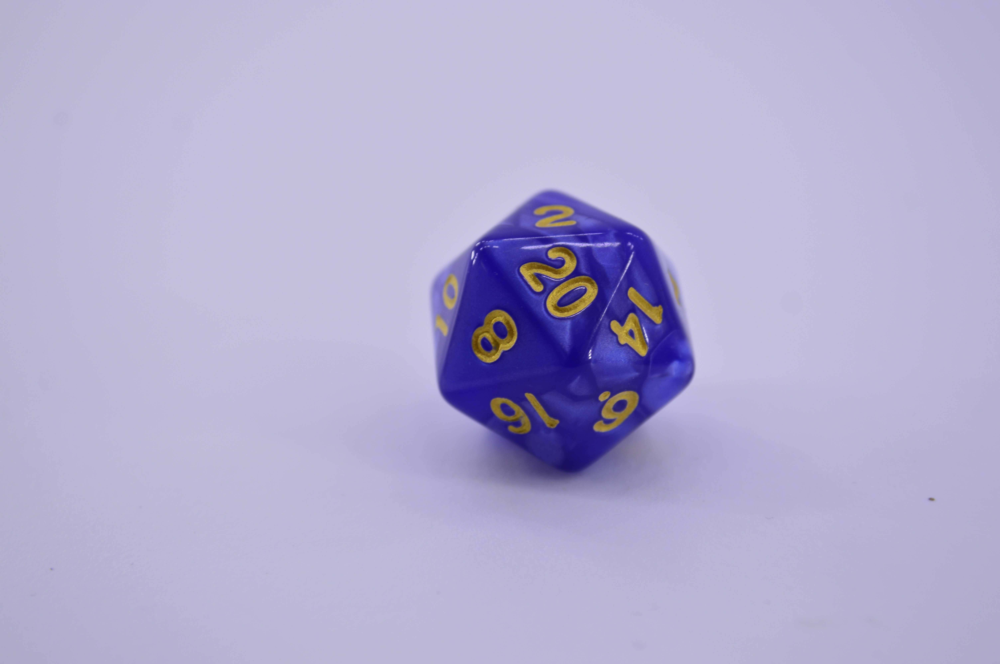

Below are the tasks we will be working through in today's workshop.
The primary goal in all of this is to form your teams for the class, check you are all setup for the course, and to have a practice with some of the core technology we will be using.
If you do not get through all of the Lab work today, this is not an issue.

```{marginfigure}
**Example:** You turn up to the workshop and after introducing yourself, your tutor will tell you that you are allocated to group 12. After a brief introduction you will then be asked to form a smaller team of 4 or 5 students with other students in your group.
```

Each workshop session will start with a brief introduction in the "big group" and then you will work in your teams for the rest of the workshop.
Who you can form a team with will depend on your pre-allocated group number.
These groups are a little big for the purposes of the class (they are around 12 students), so we will ask you to form smaller subteams (\~4 students).
You are free to form a team with whoever you like as long as they are in the same group as you.
You will stay in the same team for the entire semester and work together for the final project.

1.  Take turns to introduce yourself to your team (e.g. your name, where you studied previously, what degree programme you are taking, etc.).
    Tell the rest of your team a boring fact about yourself.
    (For example, "I had cornflakes for breakfast this morning.")

2.  Decide on a team name.
    Feel free to be creative with the name (provided its not offensive or inappropriate).

```{marginfigure}
**Note:** Each participant in the team needs to have completed the "first time setup" to be able to do the rest of the workshop.
    Team members who have already got themselves set up can move on and include the remaining members once they are ready. Please help others in your team set up their tools. 
```

3.  Before the session, you should have set up accounts on:

    -   GitHub
    -   Piazza

    If you haven't done this, please open your GitHub account now.
    Your can set up a Piazza account later.
    Instructions on how to do this can be found on the [Setup & Troubleshooting](https://ids2022.netlify.app/troubleshoot/) page on the course website.

4.  We will use RStudio for the coding in this course.
    You will need to download and install various pieces of software to get this to work.
    Please follow the instructions on the [RStudio setup](https://ids2022.netlify.app/troubleshoot/setup/rstudio/) page on the course website.

5.  You will then need to download and install Git and link this to your GitHub account and to RStudio.
    To do this, follow the instructions on the [GitHub setup](https://ids2022.netlify.app/troubleshoot/setup/github/) page on the course website.

    If you encounter any issues with any of these steps you can ask for help by raising your hand.
    If anyone in your team has successfully completed the set up procedure, please ask them for help too!

We're now going to set up an RStudio project using files already stored on GitHub.
Only one member of the team needs to do these steps.
They can add the other members afterwards.

6.  Navigate to the repository containing the slides, labs and homeworks on the course GitHub page (<https://github.com/uoeIDS/uoeIDS.github.io>).
    Click the green code button and copy the URL given under HTTPS.

7.  Now log into your own GitHub account, click on "Repositories" and then click on "New" to set up a new repository.
    Then click "Import a repository".

8.  Paste the URL from step 6.
    into the "Your old repository's clone URL" box.

9.  Add a repository name.
    Don't use any spaces in this.
    Set the repository to public (remember that if you are following these steps for homework this should be private).

10. Click "Begin import".

11. Add the rest of the team to your new GitHub repository (this is done under "Settings")

```{marginfigure}
**Note:** There are instructions for the above steps at the bottom of the [troubleshooting page](https://ids2022.netlify.app/troubleshoot/setup/github/) of the course website (under "Set up a GitHub repository for coursework").
```

```{marginfigure}
**Note:** We recommend you do this setup in future weeks (week 2+) before coming to class so you can start working on R code with your teammates quicker.
```

If you have managed all that **congratulations**!
This setup will become easier each week and you only need to do it for each project/repository once.

Now we are finally ready to start learning R!
Don't worry today if you don't understand what every line of code does---the purpose of this workshop is to give you experience working with RStudio.
Lets start by making a data frame.
Normally we'll load these from outside R, but you can also create them within R as well, using a function called "`tibble`".
This isn't something you'll want to do except for really simple data frames---like the one we're about to make!

The data frame we'll make will contain four variables: the GitHub username of each member of the team, the outcome of rolling a die for each member, a colour for each member, and a hobby.
We're going to fill in the data frame with some information.

The entries for the first column, for one of your lecturers (Amy), are already filled in for you.
Leave these in place.

12. Decide in what order you will work on the task (i.e. who is going first, second, third).

Now, **in turn**, each member of the team should perform the following.

```{marginfigure}
**Note:** If you are the first member of the group to work on the repository, then this will not change anything (because you haven't changed anything yet).
```

13. Add your GitHub username into the first unused space in the `usernames` vector (i.e. the first person replaces the text `username 1`, the second person replaces the text `username 2`, the third person replaces the text `username 3` and so on. If you have more than four people in your team the fourth person will have to add a completely new entry to the vector).

```{r die, echo = FALSE, fig.margin = T}

```

14. Roll a 20-sided die.
    You can do this within R by typing `sample(20, 1)` into the console (or just roll a die, if you happen to have one with you)!
    Enter the result into the `nums` vector, replacing the next `NA` (or extending the vector, if you are the fourth or later member of your team).
    **Do not** enclose it in quotes!

15. Pick a colour, and enter it into the `colours` vector, like you did with your username.
    If you want to see a list of available colours, type `colours()` (or `colors()`) into the console, and press Enter.

16. Put one of your hobbies in the `hobbies` vector, like you did with your username.
    This can be anything you like, but make sure it has quotes around it!

```{marginfigure}
**WARNING:** Don't click the button that says: "Amend previous commits" - it can cause some errors!
```

17. **Commit** your changes by pressing commit and ticking all the boxes on the left, type your message in the box, and then press **commit**. Now **Pull** again (in case anyone has made changes since the last time you pulled---they shouldn't have if you have been taking turns!), and **push**, using the Git tab at the top-right.

```{marginfigure}
**Note:** If others have been changing the code too you will run into a "merge conflict". This will add a bunch of stuff to your code. See here for how to fix it: https://stackoverflow.com/questions/10657315/git-merge-left-head-marks-in-my-files and ask your tutor :)
```

If everyone in the team has completed Exercises 13--17, move on to the next exercise.
Otherwise, the next member of your team should go back to Exercise 13.

18. "Uncomment" the three lines that look like the code below (that is, remove the `#` symbol from the beginning, so that R knows to run them as lines of code). Then press the "Knit" button. You should see that a plot has appeared in your R Markdown document, just after the code.

```{r colplot, echo = T}
# p <- ggplot(team_data, aes(x = username, y = die_roll)) +
#   geom_col(fill = team_data$colour)
# p
```

19. What does the plot show?
    Type your answer into the space provided in your team's R Markdown document.

20. Uncomment the code corresponding to this exercise, and press the "Knit" button.
    What's changed about this plot?

21. Replace `Insert text here` each time it appears with sensible choices of text.
    Press the "Knit" button.

22. Have a look at the plot on the knitted R Markdown document for "Exercise 22".
    (Re-knit the document if you need to.) This plot probably isn't a good data visualisation, unless one of your team also has hiking as a hobby.
    In fact, suppose you had a data frame that extended to everyone taking this course.
    The data visualisation produced by this method would probably be even worse at conveying information.
    Why?
    Can you think of any way to display these data nicely?
    (You do not need to write code to do this!)

That's the end of this lab!
Remember, this lab isn't marked, so if you did not reach the end you don't have to worry about it.

**Extra:** If you have finished all the exercises, take a look at Application Exercise 1.
You can find the link on webpage for week 1.
You will need to set up a new GitHub repository for this.
