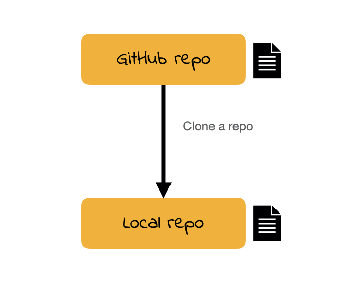
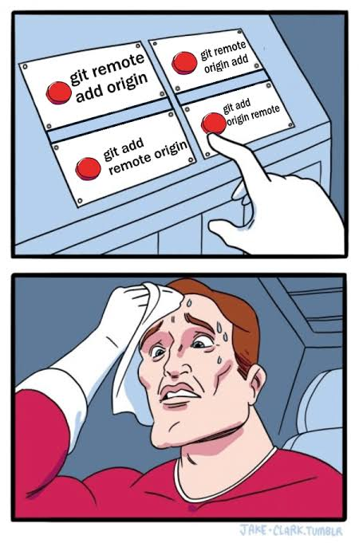

```{r unsplash, fig.margin = TRUE, echo = FALSE, eval = TRUE, fig.cap = "Photo by Carlos Muza on Unsplash", warning=FALSE, message=FALSE}
library(tidyverse)
library(emoji)

```

Below are the tasks we will be working through in today's workshop.

**The primary goal in all of this is to form your teams for the class**, check you are all setup for the course, and to have a practice with some of the core technology we will be using.

If you do not get through all of the Lab work today, this is not an issue. But spend more time after workshop, to cover all the steps given here

Each workshop session will start with a brief introduction in the "big group" and then you will work in your teams for the rest of the workshop.
Who you can form a team with will depend on your pre-allocated workshop time and location.
These groups are a little big for the purposes of the class, so we will ask you to form smaller subteams (\~4-5 students).
**You are free to form a team with whoever you like as long as they are in the same workshop time and location as you.**
You will stay in the same team for the entire semester and work together for the final project. Possibly, there might be some changes based on timetabling or your course decisions but good to discuss team possibilities from the first day.

1.  Take turns to introduce yourself to your team (e.g. your name, where you studied previously, what degree programme you are taking, etc.).
    Tell the rest of your team a interesting fact about yourself.
    (For example, "My favorite music genre is old days metal" or "I am really fan of theatre")

2.  Introduce yourselves to your tutor.
    If you have any problems with any of your lab exercises or have any questions during the course, then your tutor is a good person to ask. From week to week, there could be some changes on your tutor, but first workshop is about knowing the whole teaching team, as much as you can do. 

## Setting up the software

```{marginfigure}
**Note:** Each participant in the team needs to have completed the "first time setup" to be able to do the rest of the workshop.
    Team members who have already got themselves set up can move on and include the remaining members once they are ready. Please help others in your team set up their tools. 
```

Hopefully you would have had the chance to download and install the necessary software you will need for this course. If not, then now is your chance.

Read though the instructions carefully, it is easy to skip a step and then the installation fails!
If you encounter any issues with any of these steps then please ask for help by raising your hand. Please also see the below glossary before dive into the upcoming instructions!

## (An incomplete) Git/GitHub glossary

**Git:** is software for tracking changes in any set of files

**GitHub:** is the home for your Git-based projects on the internet

**repo:** is a short form of repository. They contain all of your project’s files as well as each file’s revision history. You will interact with specific repos within each lab session

**clone:** Cloning a repo means like creating a copy of your version by bringing (pulling) all the elements of a repo available at that specific time.

**commit:** A snapshot of your repo at a specific point in time, they can be recognized and separated by what is written as a commit message. So for the good practice, be cautios of your commit message writing all the time. 

**push:** Uploads (Sends) the latest *committed* state of your *repo* to your external GitHub account.


3.  Create an account on GitHub, if you have not done yet.
    Instructions on how to do this can be found on the [Setup & Troubleshooting](https://uoe-ids.netlify.app/troubleshoot/) page on the course website.
    If you already have a GitHub account, then feel free to use your own account.

4.  We will use RStudio for the coding in this course.
    You will need to download and install various pieces of software to get this to work.
    Please follow the instructions on the [RStudio setup](https://uoe-ids.netlify.app/troubleshoot/setup/rstudio/) page on the course website.

5.  You will then need to download and install Git and link this to your GitHub account and to RStudio.
    To do this, follow the instructions on the [GitHub setup](https://uoe-ids.netlify.app/troubleshoot/setup/github/) page on the course website.
    
```{r github-user, fig.margin = TRUE, echo = FALSE, eval = TRUE, fig.cap = "Clone your repo (Credit: https://www.introdata.science/)"}

```

## Cloning a Github repo and loading an R project

We're now going to set up an RStudio project using files already stored on GitHub.
<!--
Only one member of the team needs to do these steps.
They can add the other members afterwards.
-->

6.  Navigate to the repository containing today's lab template on the course GitHub page (<https://github.com/uoeIDS/lab-00-template>).
    Click the green '\<\> code' button and copy the URL given under HTTPS.

7.  Now log into your own GitHub account, click on "Repositories" and then click on "New" to set up a new repository.
    Then click "Import a repository".

8.  Paste the URL from step 6.
    into the "Your old repository's clone URL" box.

```{marginfigure}
**Note:** In the near future, when cloning the homework template repository it is important to make your repository **private**. It is at this point where you would do this.
```

9.  Add a repository name.
    **Don't use any spaces in this**.
    Set the repository to public.

10. Click "Begin import".

```{marginfigure}
**Note:** There are instructions for the above steps at the bottom of the [troubleshooting page](https://uoe-ids.netlify.app/troubleshoot/setup/github/) of the course website (under "Set up a GitHub repository for coursework").
```

If you have managed all that, **congratulations**! `r emoji::emoji("celebration")`
This setup will become easier each week and you only need to do it for each project/repository once. So it is better to exercise this process in your study time as well. 

## Linking Github repo to RStudio

We now need to create a project in RStudio that links to the repository you have just created on GitHub.

- Open your repository page on Github; **check it's your repository by making sure the username shown at the top-left of the page it's yours, not the course's one (`uoeIDS`)**. 

- Click the green 'Code' button and copy the URL given under HTTPS (you can also check this is the correct repository because it should include your username, not the course's one).

- Open RStudio. In the top-right panel, click on 'File' > 'New Project...' > 'Version Control' > 'Git'. Paste the URL you copied from GitHub into the 'Repository URL' box. Choose a location on your computer to save the project. Click 'Create Project'.

## First commit and push

The next stage is to learn how to commit and push edits to your work from the R project to GitHub. 

```{r github-panic, fig.margin = TRUE, echo = FALSE, eval = TRUE, fig.cap = "No panic please, can be challenging when you do for the first time (Credit: https://www.codeitbro.com/blog/funny-git-memes)"}

```

11. Under the 'Files' tab (bottom right panel), click on 'lab-00.Rmd' to open the template R markdown file.

12. On line 3, **replace the author text with your name within the quotation marks**. Save your work via save button `r emoji::emoji("save")` at the top panel of the 'lab-00.Rmd' file. 

13. Now go to the 'Git' tab (top right panel) and click on the 'commit' button `r emoji::emoji("white_check_mark")` which will open a new window. If you cannot find this tab then please ask a tutor. 

```{marginfigure}
**WARNING:** **Never click the button that says: "Amend previous commits" - it can cause some errors!**
```

14. Tick the boxes next to the files that have changed since your last pull from your GitHub repository, add an information commit message (e.g. "Added my name") and then press the 'Commit' button.

15. Click on the green push button, looks like `r emoji::emoji("arrow_up")`.

You have now made your first version control commit and push to GitHub. If you now go to your GitHub account on-line you should be able to see the changes that you have made.


```{marginfigure}
**Target:** Please ensure that you at least get to this point in today's workshop. 
```

It is important to commit and push your work regularly. Throughout future workshops you will see the icons  `r emoji::emoji("white_check_mark")` `r emoji::emoji("arrow_up")` as a reminder to go through the above commit/push steps. If you need to get the recent version from the GitHub account again for your local, it is important to start with "pull" first, via blue pull button, looks like `r emoji::emoji("arrow_down")`


## First steps in coding

Now we are ready to start learning R! Make sure that you are working on the correct lab-00 template for the rest of it!

**Don't worry today if you don't understand what every line of code does---the purpose of this workshop is to give you an initial experience working with RStudio**.

Lets start by making a data frame.

Note: Normally we'll load these from outside R, but you can also create them within R as well, using a function called "`tibble`". Please see the help documentation of that function via and related examples;

```{r, echo=TRUE}
# To see the help document for that function
# Remove the comment symbol below and run the code chunk

# help(tibble)
```

Did you see where this function comes from? 

This isn't something you'll want to do except for really simple data frames---like the one we're about to make! Let us consider first the outcome of this code chunk for a simple tibble data vs the classical data frame object 

```{r}
# It is used like base::data.frame(), but with a couple notable differences
tib <- tibble(a = c(1,2,3), b = c(4,5,6), c = c(7,8,9))
tib

# Consider base version as well
my_df <- data.frame(a = c(1,2,3), b = c(4,5,6), c = c(7,8,9))
my_df

# Look at their structures to compare by class function
class(tib)
class(my_df)

```

What is the main difference between these two outcomes ? 

16. Edit the "`tibble`" in the first R code chunk with data collected from your team members. Ask each member:
  - What is your name?
  - What is your GitHub username?
  - What is your favourite colour?
  - What is your hobby?
  - What is your favourite number between 1 and 10.
The first row of the first row has already been completed as an example.

If you are struggling to think of what is your favourite number, you can ask R to generate a random one for you! On the console (bottom left panel), type `sample(10, size = 1)` and hit return.

R contains a list of over 600 pre-defined colours. You can see see the full list by running `colours()` (or `colors()`) into the console.

17. Press the "Knit" button to run and compile your document, aka "lab-00.Rmd". The result should be presented in the 'Viewer' tab (bottom right panel). There you will be able to see your data.

18. Also in the output, there should be a data visualisation of your data generated by the code in the next R code chunk. What does the plot show?
    Type your answer into the space provided in your team's R Markdown document.

<!-- 19. Look at the third R chunk. What do you think the command `labs()` do? If you are unsure, run `?labs` on the console to open the manual page for this function. Replace `Insert text here` each time it appears with sensible choices of text. Press the "Knit" button again to re-compile your document. -->

<!-- 20. Have a look at the plot on the knitted R Markdown document for "Exercise 20". -->
<!--     (Re-knit the document if you need to.) This plot probably isn't a good data visualisation unless at least two members have the same hobby. -->
<!--     In fact, suppose you had a data frame that extended to everyone taking this course. -->
<!--     The data visualisation produced by this method would probably be even worse at conveying information. -->
<!--     Why? -->
<!--     Can you think of any way to display these data nicely? -->
<!--     (You do not need to write code to do this!) -->


# Wrapping up

That's the end of this lab! 

`r emoji::emoji("white_check_mark")` `r emoji::emoji("arrow_up")` Remember to commit and push your changes to GitHub with an appropriate commit message. Make sure to commit and push all changed files (that is, make sure every file has a tick next to it) so that your Git pane is cleared up afterwards. Also, you will be benefiting pull button later in detail so these are always good to remember commands we have 

REMEMBER:**Don't worry if you did not reach the end of the worksheet today, but please try to go through any remaining exercises in your own time.**


