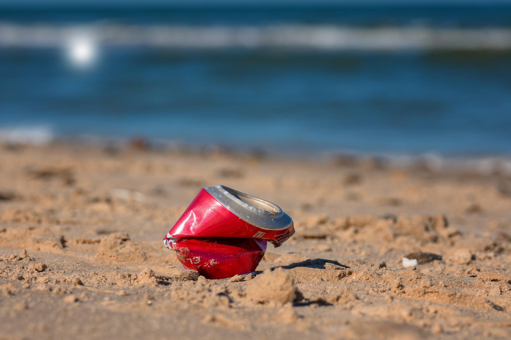

```{r setup, include=FALSE}
knitr::opts_chunk$set(eval = FALSE)
```

```{r unsplash, fig.margin = TRUE, echo = FALSE, eval = TRUE, fig.cap = "Image by Willfried Wende from Pixabay"}

```


Plastic pollution is a major and growing problem, negatively affecting oceans and wildlife health.
[Our World in Data](https://ourworldindata.org/plastic-pollution) has a lot of great data at various levels including globally, per country, and over time.
For this lab we focus on data from 2010.

Additionally, National Geographic ran a data visualization communication contest on plastic waste as seen [here](https://www.nationalgeographic.org/funding-opportunities/innovation-challenges/plastic/dataviz/). The winners, [Perpetual Plastic](https://perpetual-plastic.net/), created a physical data visualisation sculpture on Bali's beaches out of washed up flip-flops and other plastic debris.

# Learning goals

-   Visualize numerical and categorical data and interpret your visualisations.
-   Recreate visualizations.
-   Get more practice using with Git and GitHub.

<!--
::: {.home}
In future weeks we will ask you complete some steps before you come to the workshop!
:::-->

Before we get stated, please ensure that you have RStudio installed, a GitHub account and are able to push and pull correctly. I not, please follow the set-up instructions [here](https://ids2022.netlify.app/troubleshoot/) and contact a tutor for help.

# Getting started


## Meet your group

Find your workshop group. If you do not know what group you are in, go to your course timetable and you will see that the title of this class is "Introduction to Data Science - Workshop/&lt;nn>" where "&lt;nn>" is your group number. 

Each workshop session will start with a brief introduction to the whole class and then you will work in your groups for the rest of the workshop. Ideally, you will stay in the same team for the entire semester and work together for the final project.


1.    Take turns to introduce yourself to your team (e.g. your name, where are you from, what degree programme you are taking, etc.). Tell the rest of your team a boring fact and an interesting fact about yourself (For example, "I decided to walk to class this morning rather than taking the bus" and "I play the guitar in a band with my friends".)

2.    Discuss in your group when was the last time you saw a data visualisation that was outside of this course (e.g. in a different course, on a poster/flyer, in the news, etc.). Would you say that this data visualisation was good or bad, discuss why?

Please help each other in your group in answering the workshop exercises and de-bugging each other's code. If you are stuck or unsure as to what you need to do, raise your hand and a tutor will come over to help you.


## Accessing 

Create a new repository on GitHub and clone today's lab worksheet from [https://github.com/uoeIDS/lab-01-template](https://github.com/uoeIDS/lab-01-template). To remind you of the step:

-    Go to *Your repositories* in your GitHub account and then click on the *New* button.

-    Click on *Import a repository* and type the URL of today's lab template worksheet: [https://github.com/uoeIDS/lab-01-template](https://github.com/uoeIDS/lab-01-template)

-    Add an appropriate name to your worksheet, say `lab-01`, and click on *Begin import*.

Now open RStudio to begin a new version control project and link it to the repository you have just made. To remind you of the steps:

-    Open *RStudio* and go to *File* > *New Project...* 

-    Select *Version Control*, then *Git* and paste the URL of the repository you have just created. 

-    Browse an appropriate location for the project and then click on *Create Project*.


First, open the R Markdown document `lab-01-plastic-waste.Rmd`, change the author to your name and then *Knit* it. Make sure that it compiles without errors. Remember to periodically keep your version control up to date by staging and committing any substantial changes, and push them to GitHub.


<!--
```{marginfigure}
**IMPORTANT:** If there is no GitHub repo created for you for this assignment, it means I didn't have your GitHub username or team assignment when I assigned the lab. Please let David Elliott know this and he can create your repo.
```

Check that you have been added to the team you expected (https://github.com/orgs/ids-s1-21/teams). If not then please let David know (you can go find him in the workshop if in Appleton Tower, or give him an email).

Go to the course [GitHub organization](https://github.com/ids-s1-21) and locate your Lab 01 repo, which should be named `lab-01-plastic-waste-YOUR_TEAM_NAME`.

Grab the URL of the repo, and clone it in RStudio.
Refer to the [Opening a Project](https://idsed.digital/troubleshoot/setup/openingaproject/) troubleshooting page if you would like to see step-by-step instructions for cloning a repo into an RStudio project.

First, open the R Markdown document `lab-01.Rmd` and Knit it.
Make sure it compiles without errors.
The output will be in the file markdown `.md` file with the same name.
-->

## Packages

We will use the **tidyverse** package for this analysis.
Run the following code in the Console to load this package.

```{r load-packages, message=FALSE, eval=TRUE}
library(tidyverse)
```

## Data

The dataset for this assignment can be found as a csv file in the `data` folder of your repository.
You can read it in using the following.

```{r load-data, message=FALSE, eval=TRUE}
plastic_waste <- read_csv("data/plastic-waste.csv")
```

The variable descriptions are as follows:

-   `code`: 3 Letter country code
-   `entity`: Country name
-   `continent`: Continent name
-   `year`: Year
-   `gdp_per_cap`: GDP per capita constant 2011 [international \$](https://datahelpdesk.worldbank.org/knowledgebase/articles/114944-what-is-an-international-dollar), rate
-   `plastic_waste_per_cap`: Amount of plastic waste per capita in kg/day
-   `mismanaged_plastic_waste_per_cap`: Amount of mismanaged plastic waste per capita in kg/day
-   `mismanaged_plastic_waste`: Tonnes of mismanaged plastic waste
-   `coastal_pop`: Number of individuals living on/near coast
-   `total_pop`: Total population according to Gapminder

::: {.video}
Complete the following steps during the workshop with your team.
:::

# Warm up with your team

You have 5 minutes to complete this section.

**Warm up 1:** Recall that RStudio is divided into four panes.
Without looking, can you name them all and briefly describe their purpose?

**Warm up 2:** Verify that the dataset has loaded into the Environment.
How many observations are in the dataset?
Clicking on the dataset in the Environment will allow you to inspect it more carefully.
Alternatively, you can type `View(plastic_waste)` into the Console to do this.

```{marginfigure}
**HINT:** If you are not sure, run the command `?NA` which will lead you to the documentation.
```

**Warm up 3:** Have a quick look at the data and notice that there are cells taking the value `NA` -- what does this mean?

<details>

<summary>

Show answers

</summary>

<i> **Warm up 1:** The four RStudio panes contain: (top-left) Editor; (bottom-left) Console; (top-right) Environment, History and Git; (bottom-right) Files, Plots, Packages, Help and Viewer\
**Warm up 2:** The dataset `plastic_waste` has 240 observations (`nrow(plastic_waste)`)\
**Warm up 3:** The term `NA` stands for Not Available and indicates that the value in the cell is missing.
</i>

</details>

# Exercises

Let's start by taking a look at the distribution of plastic waste per capita in 2010.

```{r plastic_waste_per_cap-hist, eval=TRUE}
ggplot(data = plastic_waste, aes(x = plastic_waste_per_cap)) +
  geom_histogram(binwidth = 0.2)
```

One country stands out as an unusual observation at the top of the distribution.
One way of identifying this country is to filter the data for countries where plastic waste per capita is greater than 3.5 kg/person. (Don't worry if you don't understand the syntax here, this will be discussed in week 3.)

```{r plastic_waste_per_cap-max, eval=TRUE}
plastic_waste %>%
  filter(plastic_waste_per_cap > 3.5)
```

Did you expect this result?
You might consider doing some research on Trinidad and Tobago to see why plastic waste per capita is so high there, or whether this is a data error.

1.  Plot, using histograms, the distribution of plastic waste per capita faceted by continent. What can you say about how the continents compare to each other in terms of their plastic waste per capita?

```{marginfigure}
**NOTE:** From this point onwards the plots and the output of the code are not displayed in the lab instructions, but you can and should copy the code and paste it into your worksheet within an R code chunk to run and view the results yourself.
```

Another way of visualizing numerical data is using density plots.

```{r plastic_waste_per_cap-dens}
ggplot(data = plastic_waste, aes(x = plastic_waste_per_cap)) +
  geom_density()
```

And compare distributions across continents by coloring density curves by continent.

```{r plastic_waste_per_cap-dens-color}
ggplot(data = plastic_waste, 
       mapping = aes(x = plastic_waste_per_cap, 
                     color = continent)) +
  geom_density()
```

The resulting plot may be a little difficult to read, so let's also fill the curves in with colors as well.

```{r plastic_waste_per_cap-dens-color-fill}
ggplot(data = plastic_waste, 
       mapping = aes(x = plastic_waste_per_cap, 
                     color = continent, 
                     fill = continent)) +
  geom_density()
```

The overlapping colors make it difficult to tell what is happening with the distributions in continents plotted first, and hence coverred by continents plotted over them.
We can change the transparency level of the fill color to help with this.
The `alpha` argument takes values between 0 and 1: the value 0 is completely transparent and 1 is completely opaque.
There is no way to tell what value will work best, so you just need to try a few.

```{r plastic_waste_per_cap-dens-color-fill-alpha}
ggplot(data = plastic_waste, 
       mapping = aes(x = plastic_waste_per_cap, 
                     color = continent, 
                     fill = continent)) +
  geom_density(alpha = 0.7)
```

This still does not look great...

2.  Recreate the density plots above using a different (lower) alpha level that works better for displaying the density curves for all continents.

```{marginfigure}
**Pause:** Now that you have started writing some code, take a moment to look at it and ask yourself "Is it easy to read?". Add spaces, new lines and tabs to format your code to aid readability. Try to copy the coding style in the examples of this lab.
```

3.  Describe why we defined the `color` and `fill` of the curves by mapping aesthetics of the plot but we defined the `alpha` level as a characteristic of the plotting geom.

`r emo::ji("white_check_mark")` `r emo::ji("arrow_up")` *Now is a good time to commit and push your changes to GitHub with an appropriate commit message. Make sure to commit and push all changed files (that is, make sure every file has a tick next to it) so that your Git pane is cleared up afterwards.*

And yet another way to visualize this relationship is using side-by-side box plots.

```{r plastic_waste_per_cap-box}
ggplot(data = plastic_waste, 
       mapping = aes(x = continent, 
                     y = plastic_waste_per_cap)) +
  geom_boxplot()
```

4.  Convert your side-by-side box plots from the previous task to [violin plots](http://ggplot2.tidyverse.org/reference/geom_violin.html). What do the violin plots reveal that box plots do not? What features are apparent in the box plots but not in the violin plots?

```{marginfigure}
**REMEMBER:** We use `geom_point()` to make scatterplots.
```

5.  Visualize the relationship between plastic waste per capita and mismanaged plastic waste per capita using a scatterplot.
    Describe the relationship.

6.  Color the points in the scatterplot by continent.
    Does there seem to be any clear distinctions between continents with respect to how plastic waste per capita and mismanaged plastic waste per capita are associated?

7.  Visualize the relationship between plastic waste per capita and total population as well as plastic waste per capita and coastal population.
    You will need to make two separate plots.
    Do either of these pairs of variables appear to be more strongly linearly associated?

`r emo::ji("white_check_mark")` `r emo::ji("arrow_up")` *Now is another good time to commit and push your changes to GitHub with an appropriate commit message. Make sure to commit and push all changed files (that is, make sure every file has a tick next to it) so that your Git pane is cleared up afterwards.*

::: {.marker}
Aim to make it to this point during the live workshop.
:::

# Wrapping up

We do not expect you to complete all of the exercises within the time reserved for the live workshop.
Ideally, you should have got to this point.
If you still have some time left, move on to the remaining exercises below.
If not, you should find a time to meet with your team and complete them after the workshop.
If you have not had time to finish the exercises above, please ask for help before you leave!

```{marginfigure}
**HINT:** The *x*-axis is a calculated variable. One country with plastic waste per capita over 3 kg/day has been filtered out. And the data are not only represented with points on the plot but also a smooth curve. The term "smooth" should help you [pick which geom to use](https://ggplot2.tidyverse.org/reference/index.html#section-geoms).
```

8.  Recreate the following plot, and interpret what you see in context of the data. For this you will need the transformed dataset `plastic_waste_edit` that is defined below. (The specifics of this code will be dicussed in week 3.)

```{r edit_data, eval=FALSE, echo=TRUE}
plastic_waste_edit <- plastic_waste %>% 
  mutate(coastal_pop_prop = coastal_pop / total_pop) %>%
  filter(plastic_waste_per_cap < 3)
```


```{r echo=FALSE, message=FALSE, eval=TRUE, warning=FALSE}
plastic_waste_edit <- plastic_waste %>% 
  mutate(coastal_pop_prop = coastal_pop / total_pop) %>%
  filter(plastic_waste_per_cap < 3)

ggplot(data = plastic_waste_edit, 
       mapping = aes(x = coastal_pop_prop, 
                     y = plastic_waste_per_cap, 
                     color = continent)) + 
    geom_point() +
    geom_smooth(color = "black") +
    scale_color_viridis_d() +
    labs(x = "Coastal population proportion (Coastal / total population)", 
         y = "Plastic waste per capita ", 
         color = "Continent",
         title = "Plastic waste vs. coastal population proportion",
         subtitle = "by continent") +
    theme_minimal()
```

`r emo::ji("white_check_mark")` `r emo::ji("arrow_up")` *Commit and push your changes to GitHub with an appropriate commit message again. Make sure to commit and push all changed files (that is, make sure every file has a tick next to it) so that your Git pane is cleared up afterwards.*

Once you are done, check to make sure your latest changes are on GitHub. <!-- and all your code is inside the .md file (created by pressing "knit").-->

