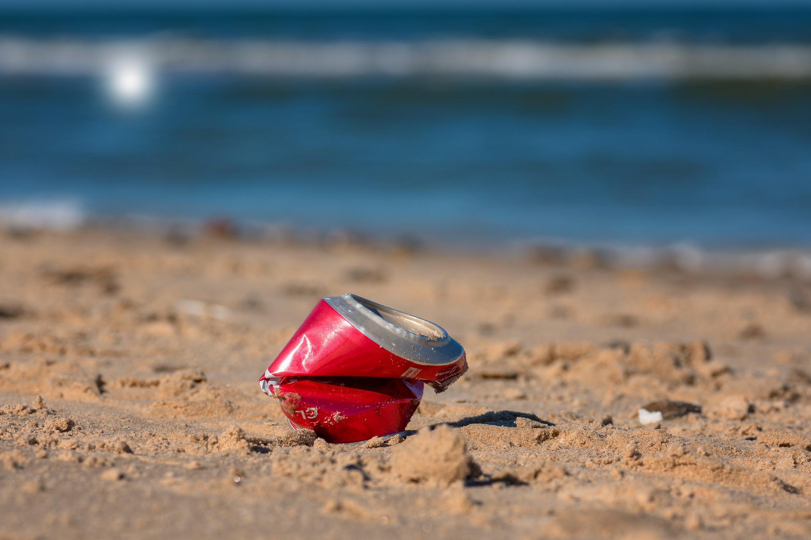

```{r setup, include=FALSE}
knitr::opts_chunk$set(eval = FALSE)
```

```{r unsplash, fig.margin = TRUE, echo = FALSE, eval = TRUE, fig.cap = "Image by Willfried Wende from Pixabay"}

```

Plastic pollution is a major and growing problem, negatively affecting oceans and wildlife health.
[Our World in Data](https://ourworldindata.org/plastic-pollution) has a lot of great data at various levels including globally, per country, and over time.
For this lab we focus on data from 2019.

Additionally, National Geographic ran a data visualization communication contest on plastic waste as seen [here](https://www.nationalgeographic.org/funding-opportunities/innovation-challenges/plastic/dataviz/). The winners, [Perpetual Plastic](https://perpetual-plastic.net/), created a physical data visualisation sculpture on Bali's beaches out of washed up flip-flops and other plastic debris.

# Learning goals

-   Load data from different file types.
-   Join multiple data frames.
-   More practice of data wrangling and summarising
-   Working collaboratively via GitHub.

Before we get started, please ensure that you have RStudio installed, a GitHub account and are able to push and pull correctly. 
If not, please follow the set-up instructions [here](https://uoe-ids.netlify.app/troubleshoot/). Ask a tutor for help if you have any problems.


-----------------------------------------------------------------------

In today's lab you will be working collaboratively from the same repository in GitHub. This will be extremely useful in your projects for sharing out the workload among the team members.

- GitHub is very smart when merging file when you _Push_ committed changes from RStudio. 
- Typically, each team member works in different locations in the repository and there should not be any major merger issues. 
- However, if two or more team members are making different changes at the same location at the same time, then it is not possible for GitHub to identify which is the correct version.
- This issue is called a _Merger Conflict_ (ask a tutor for help if this happens to your team). 


`r emo::ji("exclamation")` For today, it is **very important** that you follow the instructions carefully to avoid creating any merger conflicts. Ask a tutor for help if this happens to your team. We will discuss how to resolve merger conflicts in the next lab.

-----------------------------------------------------------------------

# Getting started

Find your workshop group. If you do not know what group you are in, go to your course timetable and you will see that the title of this class is "Introduction to Data Science - Workshop/&lt;nn>" where "&lt;nn>" is your group number. 

```{marginfigure}
If your group consists of fewer than 4 people, then take it in turns to do the tasks.
```


Today you will be working in a team of _no more than 4 people_. It is important that you take it in turns to work on each activity one person at a time. Give each member of your team a number and look-out for the following emoji sequence to indicate who should be completing the activity:  

* 😄😄😄😄 - All member does the activity.
* 😄🙂🙂🙂 - Only member 1 does the activity.
* 🙂😄🙂🙂 - Only member 2 does the activity.
* 🙂🙂😄🙂 - Only member 3 does the activity.
* 🙂🙂🙂😄 - Only member 4 does the activity.

If it is not your turn, then advise your team member in doing their task. **Do not** make any changes to your work and **do not** make any pushes to or pulls from GitHub -- Keep your hand off the keyboard!

---------------

## Creating a collaborative repository

Let's first set-up GitHub.

😄🙂🙂🙂 (Member 1 only)

You are the maintainer of the GitHub repository for today's lab worksheet. This means that you will need to take a clone of today's lab template and to add your team members as collaborators so that they can add their contribution.

First, log onto GitHub and create a new repository by cloning  today's lab template project. To remind you of the step:

- Go to *Your repositories* in your GitHub account and then click on the green *New* button.

- Click on *Import a repository* and type/copy the URL of today's lab template project: [https://github.com/uoeIDS/lab-02-template](https://github.com/uoeIDS/lab-02-template)

- Add an appropriate name to your repository, say `lab-02`, and click on *Begin import*.

Next, to add your team members as collaborators:

- Navigate to your version the repository you have just cloned. 
- Click on  **'setting'** along the top and then **'Collaborators'** in the sidebar. 
- Add each of your team members as collaborators.

(🙂😄😄😄 - You should receive a collaboration invitation via email, accept this.)


In addition to the above set-up, it is important to write the team name and team members on the wooclap this week. We will get this information to create the related groups and group member names within the Learn Ultra course page. Later on we will be using this information to track the group projects easily. Please help us on the collection of this information via;

- Go to the main page of  [Wooclap](https://www.wooclap.com/)

- Use the event code to enter: **AUDBTR**

- Follow the instruction and given example to write your team name and team members. 

- Submit your answer in the Wooclap at the end. 

-----

## Version control R project

😄😄😄😄 (For all)

Once everyone has been added to the collaborative repository, open RStudio and create a new version control project using the GitHub repository you have just made. To remind you of the steps:

- Open *RStudio* and go to *File* > *New Project...* 

- Select *Version Control* and then *Git*. Type/paste the URL of the repository you have just created. 

- Browse an appropriate location for the project and then click on *Create Project*.


**PAUSE**: Ensure that all team members have successfully created an R project and have pulled the current content from GitHub. Everyone, hands off the computer unless it is your turn!

-----

## Adding your own name

```{marginfigure}
**MERGING CONFLICT:** A git merge conflict is an event that takes place when Git is unable to automatically resolve differences in code between two commits. Git can merge the changes automatically only if the commits are on different lines or branches. For some general instructions on how to solve merging conflict, you can have a look at [this page](https://docs.github.com/en/pull-requests/collaborating-with-pull-requests/addressing-merge-conflicts/resolving-a-merge-conflict-on-github)

```

You are going to take it in turns to add your own name to the author string at the top of the `lab-02.Rmd` .

😄🙂🙂🙂 (Member 1 only)

* Hands on the computer.
* Open `lab-02.Rmd`.
* At the top, replace the author text _User1_ with your name.
* 🧶 *Knit* the document and ensure that your name appears in the html file.
* ✅ Commit all of the changes you have made, with an informative message (e.g. `Add name of user 1`).
* ⬆️ _Push_ the changes to GitHub. Verify on GitHub that the repository has been updated.
* Hands off your computer.

🙂😄🙂🙂 (Member 2 only)

* Hands on the computer.
* Click on ⬇️ _Pull_ in the Git tab to download the latest updates from the shared repository.
* Open `lab-02.Rmd`. You should notice that team member 1 has written their name.
* Replace the author text _User2_ with your name.
* 🧶 *Knit* the document and ensure that your name appears in the html file.
* ✅ _Commit_ all of the changes you have made, with an informative message (e.g. `Add name of user 2`).
* ⬆️ _Push_ the changes to GitHub. Verify on GitHub that the repository has been updated.
* Hands off your computer.

🙂🙂😄🙂 (Member 3 only)

* Hands on the computer.
* ⬇️ _Pull_ the latest changes from the shared repository.
* Replace the author text _User 3_ with your name.
* 🧶 ✅ ⬆️ _Knit_, _Commit_ and _Push_ the changes.
* Hands off the computer.


🙂🙂😄🙂 (Member 4 only)

* Hands on the computer.
* ⬇️ _Pull_ the latest changes from the shared repository.
* Replace the author text _User 4_ with your name.
* 🧶 ✅ ⬆️ _Knit_, _Commit_ and _Push_ the changes.
* Hands off the computer.

😄😄😄😄 (For all)

Everybody, ⬇️ _Pull_ the latest changes from the shared repository so that the version you have has everyone's name.


**Congratulations!** - You have now started working collaboratively from the same repository in GitHub. Now let's do some data science...


----------------------------------

## Packages

Before getting started with the Exercises, run the following code in the Console to load the packages you will need to today's lab.

```{r load-packages, message=FALSE, eval=TRUE}
library(tidyverse)
library(readxl)
```


## Loading the data

The data for this lab is contained with 4 different files, each saved as different file types within the `data` folder. Detailed below 

**File 1**: `mismanaged-plastic-waste-per-capita.csv`

* Data about the amount of mismanaged plastic waste for 159 coastal countries/territories.
* From [Our World in Data](https://ourworldindata.org/plastic-pollution)
* Data stored with comma delimitation encoding.
* Variable information:
  - `name`: Country or territory name.
  - `code`: ISO3 Alpha-code.
  - `mismanaged_plastic`: 2019 mismanaged plastic estimates (kg per capita)


**File 2**: `per-capicta-ocean-plastic-waste.txt`

* Data on the amount of mismanaged plastic escapes into the ocean from 159 coastal countries/territories.
* From [Our World in Data](https://ourworldindata.org/plastic-pollution)
* Data stored with semicolon delimitation encoding.
* Variable information:
  - `name`: Country or territory name.
  - `code`: ISO3 Alpha-code.
  - `mismanaged_plastic_ocean`: 2019 estimates of ocean deposited mismanaged plastic (kg per capita)

**File 3**: `UN_country_population.tsv`

* 2019 population estimates from 237 countries/territories (includes coastal and landlocked regions).
* From the [United Nations](https://population.un.org/wpp/Download/Standard/MostUsed/)
* Data stored with tab delimitation encoding.
* Variable information:
  - `name`: Country or territory name.
  - `code`: ISO3 Alpha-code.
  - `population`: 2019 population estimates.

**File 4**: `UN_country_region.xlsx`

* UN region identification for 237 countries/territories.
* From the [United Nations](https://population.un.org/wpp/Download/Standard/MostUsed/)
* Data stored with Excel encoding.
* Variable information:
  - `name`: Country or territory name (may differ from the above 2 data sets).
  - `code`: ISO3 Alpha-code.
  - `region`: The continent/region where the country/territory is located.

**Note**: The two data sources use different text for `name`, like “Turkey” or “Turkiye”, so joining of data should be based on the ISO3 Alpha-code.

Due to this difference, I suggest using a `select()` prior to joining the data sets in order to remove all but one of the `name` columns. Otherwise, the resulting joined data will have variables `name.x` and `name.y` but not `name` which may be confusing.

-----------------------------------------------------

## Load & join each data set.

Let's do more collaborative work.


😄🙂🙂🙂 (Member 1 only)

* Hands on the computer and ⬇️ _Pull_ the latest changes.
* You will be loading and printing the content of _File 1_. The data is encoded with comma separated delimitation, so we use the `read_csv()` function to load the data.
* In the code chunk labelled `load-data`, write the following code:
```{r load-data1, message = FALSE, eval = TRUE}
data1 <- read_csv("data/mismanaged-plastic-waste-per-capita.csv")
```
* In the code chunk labelled `join-data`, write the following code. Renaming may seem pointless, but your team members will be joining their data to this object.
```{r join-data1, message = FALSE, eval = TRUE}
plastic_data_all <- data1
```
* In the code chunk labelled `print-data`, write:
```{r print-data, message = FALSE, eval = FALSE}
plastic_data_all %>% head(n = 10)
```
* 🧶 ✅ ⬆️ _Knit_ your work and check the output. _Commit_ your changes with an informative message and _Push_ them to the shared repository on GitHub.
* Hands off your computer.


🙂😄🙂🙂 (Member 2 only)

* Hands on the computer and ⬇️ _Pull_ the latest changes.
* You will be loading and printing the content of _File 2_. The data is encoded with semicolon separated delimitation, so we use the `read_csv2()` function to load the data.
* Add the following code into the code chunk labelled `load-data`:
```{r load-data2, message = FALSE, eval = TRUE}
data2 <- read_csv2("data/per-capita-ocean-plastic-waste.txt")
```
* Write the following code in the `join-data` code chunk. Ensure that you and your team members understand what this code is doing.
```{r join-data2, message = FALSE, eval = TRUE}
plastic_data_all <- data2 %>%
  select(-name) %>%
  left_join(plastic_data_all, by = "code")
```
* 🧶 ✅ ⬆️ _Knit_ your work and check that `plastic_data_all` contains the data from both files. _Commit_ your changes with an informative message and _Push_ them to the shared repository on GitHub.
* Hands off your computer.


🙂🙂😄🙂 (Member 3 only)

* Hands on the computer and ⬇️ _Pull_ the latest changes.
* You will be loading and printing the content of _File 3_. The data is encoded with tab separated delimitation, so we use the `read_tsv()` function to load the data.
* Add the following code into the code chunk labelled `load-data`:
```{r load-data3, message = FALSE, eval = TRUE}
data3 <- read_tsv("data/UN_country_population.tsv")
```
* Write the following code in the `join-data` code chunk.
```{r join-data3, message = FALSE, eval = TRUE}
plastic_data_all <- data3 %>%
  select(-name) %>%
  right_join(plastic_data_all, by = "code")
```
* *Question*: The above code does a _right_ join, what would happen if you instead did a _left_ join?
* 🧶 ✅ ⬆️ _Knit_ your work and check that `plastic_data_all` contains the data from both files. _Commit_ your changes with an informative message and _Push_ them to the shared repository on GitHub.
* Hands off your computer.

<details>

<summary>

Show answer to question

</summary>

<i> 

The data from the UN contains more rows (run `nrow(data3)`) than the plastic waste data set (run `nrow(data1)`). This is because the plastic waste data set only contains data from countries/territories with a coastline, whilst the UN data contains population data on all countries/territories whether they are coastal nations or landlocked. If we instead ran the code `data3 %>% left_join(data1, by = "code")` then the plastic waste data is added to the UN data, but there are no plastic waste data for landlocked countries. Consequently, the missing entries will be filled with `NA`s. This can be resolved by using `drop_na()` to remove all rows that contain at least one `NA`. Therefore, the following code should produce the same result:
```{r extra, eval = FALSE, message = FALSE}
data3 %>% 
  select(-name) %>%
  left_join(plastic_data_all, by = "code") %>%
  drop_na()
```

</i>

</details>


🙂🙂🙂😄 (Member 4 only)

* Hands on the computer and ⬇️ _Pull_ the latest changes.
* You will be loading and printing the content of _File 4_. The data is saved using Excel encoding. To load this file you will need to use the `read_excel()` function from the `readxl` package.
* Add the following code into the code chunk labelled `load-data`:
```{r load-data4, message = FALSE, eval = TRUE}
data4 <- read_excel("data/UN_country_region.xlsx")
```
* Write the following code in the `join-data` code chunk to join the final data set into `data_all`.
```{r join-data4, message = FALSE, eval = TRUE}
plastic_data_all <- data4 %>%
  select(-name) %>%
  right_join(plastic_data_all, by = "code")
```
* 🧶 ✅ ⬆️ _Knit_ your work and check that `plastic_data_all` contains the data from both files. _Commit_ your changes with an informative message and _Push_ them to the shared repository on GitHub.
* Hands off your computer.

😄😄😄😄 (For all)

Everybody, ⬇️ _Pull_ the latest changes from the shared repository. Check that all 4 files are loaded and that they are joined into a single data frame.


-------------------------------------------------------

# Exercises

Now that you have loaded and joined the data, let's now do some investigations. 

Please continue to work collaboratively and take it in turns to contribute to the questions. When the team member changes, remember to begin with a ⬇️ _Pull_ from GitHub and then finish with a 🧶 ✅ ⬆️ _Knit_, _Commit_ and _Push_.

Only one person should have their hands on their computer at any one time to minimise the chance of merger conflicts.


## EXERCISE 1.


* Create a frequency table of coastal countries/territories by region.
* Which region has the most number of coastal countries/territories?


## EXERCISE 2

* The mismanaged plastic waste is measured in kg per capita. Add a new variable to `plastic_data_all` called `total_mismanage_plastic` by multiplying `mismanaged_plastic` by `population`.
* What is the mean total of mismanaged plastic waste per `region`?
* Which region has the highest total and which has the lowest total?


## EXERCISE 3

* Add a new variable called `pct_mismanaged_plastic_ocean` to `plastic_data_all` that represents the amount of ocean emitted mismanaged plastic waste as a percentage of all mismanaged plastic waste.
* Calculate the median `pct_mismanaged_plastic_ocean` for each region.
* Your answer for `Africa` should be `NaN`. What does this mean and what is causing this issue? Hint: filter your data using `code == "SOM"`.
* Add the command `drop_na()` after computing the variable `pct_ocean` and re-evaluate the median estimates. Which region has the lowest median?


## Exercise 4

The variable names in `plastic_data_all` are quite long, let's do something about that.

* Use the `rename()` command to replace the existing variable names with something that is more concise. For example, we can contract `population` to `pop` using the following code:

```{r rename, eval = TRUE, echo = FALSE, warning=FALSE}
plastic_data_all <- plastic_data_all %>%
  rename(pop = population)
```

* Examine the names of the other variables in `plastic_data_all` and rename them to something that is concise yet still informative about what the variable contains. Discuss and agree in your group how best to simplify the variable names.


In addition, region name of `"Latin America and The Caribbean"` is much longer than the other regions, so we can consider replacing this text with a suitable acronym. 

* Mutate the `region` variable to replace the text `"Latin America and The Caribbean"` with `"LAC"`. Hint: have a look at how to use the `str_replace_all()` command.

Finally, create a frequency table or calculate an interesting statistic per region that uses the renamed variables.


---------------------------------------------------------------------------------------------

# Wrapping up

At the end of the lab, you need to ensure that you have your own personal copy of today's work. Please follow the following instructions carefully:

😄😄😄😄 (For all)

Everybody, ⬇️ _Pull_ the latest changes from the shared repository.


🙂😄😄😄 (All except member 1)

On GitHub, create your own copy of the shared repository. You can do this using the same instructions as at the start when copying today's template repository, but instead importing from member 1's GitHub account rather than the course account.

If you want to continue to work on today's lab after the workshop, then you will need to create a new version control project with your personal copy of the repository that you have just created.

😄🙂🙂🙂 (Member 1 only)

At the end of the workshop, you want to ensure that only you can make further changes to the shared repository. To do this, you will need to remove the collaboration permissions of your team members. To do this:

- First ensure that your team members have pulled the latest version of the repository.
- In the lab worksheet repository on GitHub, go to _Settings_ and then _Collaborators_.
- Remove your team members so that they can no longer push changes to the repository.

<br>

That all for today. In next week's lab we will continue to work collaboratively, but we will look at how to resolve merger conflicts.
