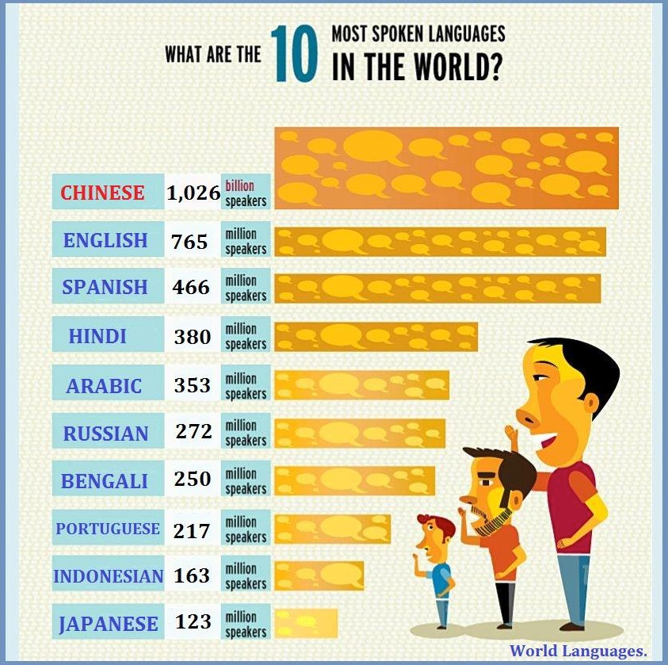
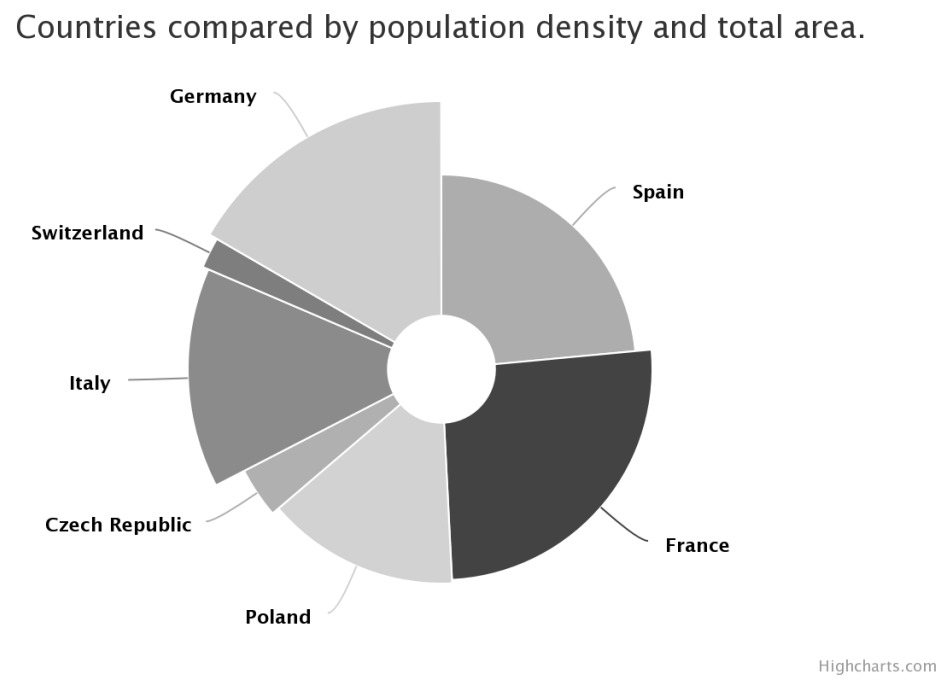
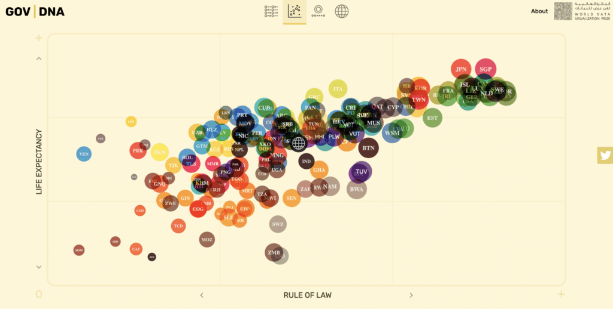
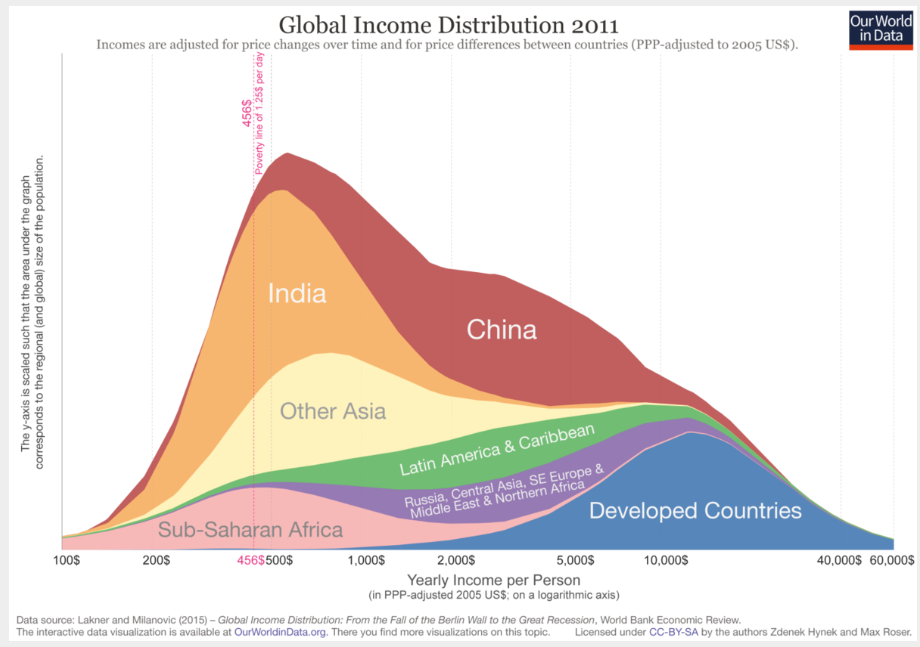

### Load packages

```{r load-packages, warning = FALSE, message = FALSE, warning=FALSE}
library(tidyverse)
library(ggplot2)
```

# Questioning data visualisations

## Image 1

```{r echo=FALSE, out.width="100%"}

```


* Respect the people: How should the comma in "1,026" be interpreted? As a thousands place seporator (ie one thousand and twenty six) or as a decimal place seporator (ie one and twenty-six thousands)? As the text states "billion" speakers then it is unlikely to be 1026 billion (ie about 1 trillion) as there are only about 8 billion people in the world.

* Respect the mathematics: The geometry relationship of the boxes do not correspond to the numbers. For example, based on the numbers there are about 65% more english speakers than spanish speakers, but the length of the boxes appear to be the same. Furthermore, it is unclear what aspect of the box geometry relates to the number of speakers - length, width or area?


## Image 2

```{r echo=FALSE, out.width="100%"}

```


* Respect the people: The image is in grayscale, so the shaded color for Switzerland and Italy are difficult to distinguish if it wasn't for the text. If it was not possible to add colour to the image (due to printing constraints) then we may consider different shading patterns (cross-hash, lines, dots, etc.) or consider a different data visualisation.

* Respect the data: There are no values or axes! As such it is difficult to assess the relationshiop between the countries

* Respect the mathematics: The title states the two variables of 'population density' and 'total area', but it is unclear how each variable is mapped to each component of the rose chart -- the radius distance, the angle propotion, the segment area?


## Image 3

```{r echo=FALSE, out.width="100%"}

```

_Write your comments about image 3 below_

* Respect the people: Who is this data visualisation created for and what are they wanting to undersand from the image. If they wish to understand the overall relationship (ie positive linear correlation) then this visualisation is ok, but if they want to explore the life expectancy vs rule of law relationship in certain regions of the world (ie compare one colour against another) then the image may be difficult to interpret.

* Respect the data: There are no values on the axes! Also, how is 'Rule of Law' measured? Furthermore, some of the points are different sizes and it is unknow what this aesthetic variable relates to.

* Respect the computer: Many of the points are overlapping and so the author of the data visualisation has chosen to make the points partially transparent to aid identifying points that intesect. However, since the points are different colours the impact of the transparency results in a different colour when point intersect - for example, the intersection if a yellow and a blue point has a green appearance, but the green colour is used by other points.


## Image 4

```{r echo=FALSE, out.width="100%"}

```

_Write your comments about image 4 below_


* Respect the people: Althougth the data visualisation is correct, the design choice to partition the area under the density curve for each region may make the image difficult to comprehend. For example, is the "Other Asian" proportion at \$750 yearly income bigger or smaller than the "China" proportion at \$3000 yearly income? The issue here is that there does not exisit a consistent baseline - a sequence of individual density plot would be better for assessing this question.

* Respect the data: There are no values on the y-axis. Also, the ends of the density plot does not touch the x-axis, which indicates that the visualisation has been truncated to be between \$100 and \$60,000 - are there any outliers in the data that may be interesting to examine closely?


# Exercises

```{r load-data-staff, message=FALSE, eval=TRUE}
staff <- read_csv("data/instructional-staff.csv")
```


## Exercise 1

A *wide* data set is where each row and column relate to a unique case with the data value appearing in a single cell.

A *long* data set is where each row of the data set corresponds to a unique observation.

The `staff` data set is in a *wide* format

There are 11 years and 5 faculty types,  so there are `11 * 5 = 55` observations in the data set.


## Exercise 2

```{r pivoting}
staff_long <- staff %>%
  pivot_longer(
    cols = c("1975", "1989", "1993", "1995", "1999", "2001", 
             "2003", "2005", "2007", "2009" ,"2011"), 
    names_to = "year",
    values_to = "percent"
  )

```


## Exercise 3

```{r dot-plot}
ggplot(data = staff_long,
       mapping = aes(x = year, 
                     y = percent, 
                     colour = faculty_type)) +
  geom_point()
```

## Exercise 4

```{r bad-line-plot}
ggplot(data = staff_long,
       mapping = aes(x = year, 
                     y = percent, 
                     colour = faculty_type)) +
  geom_line()
```

Note that the lines in this plot do not appear! This is because the type of variable `year` is character.

## Exercise 5

```{r mutate-year}
staff_long <- staff_long %>%
  mutate(year = as.numeric(year))
```


```{r working-line-plot}
ggplot(data = staff_long,
       mapping = aes(x = year, 
                     y = percent, 
                     colour = faculty_type)) +
  geom_line()
```

This time the data visualisation works!

## Exercise 6

```{r better-line-plot}
# Write your code for Exercise 6 here


ggplot(data = staff_long,
       mapping = aes(x = year, 
                     y = percent, 
                     colour = faculty_type)) +
  geom_line() +
  labs(
    title = "Instructional staff employment trends, 1975–2011",
    x = "Year",
    y = "Percentage",
    colour = "Faculty Type",
    caption = "Data source: American Association of University Professors"
  )

```

## Exercise 7

(e.g.) Change colours to highlight---other options are possible here!


## Exercise 8


(NB. The "correct" answer to this section will depend on the ideas generated in Exercise 7.  The code below shows one example as to how you may implement the idea given above.)

```{r implement-Ex7}

#Edit staff_long to create a new variable that 
#   identifies if the row relates to part-time or other
staff_long <- staff_long %>%
  mutate(part_time = 
           case_when(
             faculty_type == "Part-Time Faculty" ~ "Part-Time Faculty",
             TRUE ~ "Other Faculty Types"))

ggplot(data = staff_long,
       mapping = aes(x = year, 
                     y = percent, 
                     group = faculty_type,  
                        # to draw seporate lines per faculty type
                     colour = part_time  
                        # to colour the lines using the new part_time variable
       ))+
  geom_line() +
  scale_colour_manual(values = c("gray", "red")) +
  theme_minimal() +
  labs(
    title = "Instructional staff employment trends, 1975–2011",
    x = "Year",
    y = "Percentage",
    colour = "",
    caption = "Data source: American Association of University Professors"
  ) +
  coord_cartesian(ylim = c(0, 45)) + 
  theme(legend.position = "bottom")
```


