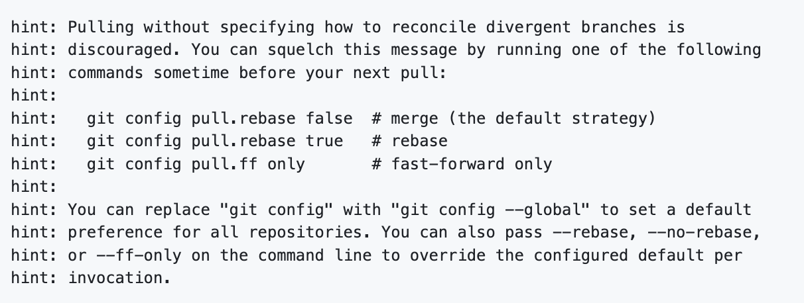

```{r setup, include=FALSE}
knitr::opts_chunk$set(eval = FALSE)
```

```{r unsplash, fig.margin = TRUE, echo = FALSE, eval = TRUE, fig.cap = "Image by Winston Tjia from Unsplash"}

```

**Learning goals:**

-   Use GenAI tools critically and reflection.
-   More practice of data wrangling and summarising.
-   Bootstrap confidence intervals.
-   Working collaboratively via GitHub and learn how to resolve merge conflicts.

In this lab you will use **Generative AI tools (e.g. ELM, ChatGPT)** to help you **learn data science**, with a focus on understanding, not copying answers. We will also be using **bootstrap** to create confidence intervals.

**Policy reminder:**  
- GenAI tools are not allowed for submitting assessed work, but can be used for concept exploration, drafting, and learning outside assessment.  
- If you use GenAI, always acknowledge it in your work.

You will analyze a subset of the `r emoji::emoji("airplane")` `flights` dataset (from the package `nycflights13`), combine wrangling/joining and bootstrap tasks with reflection on GenAI's strengths and limitations, and practice critical prompting.

-----------------------------------------------------------------------

`r emoji::emoji("busts")``r emoji::emoji("busts")` For this workshop, keep working with your team! 
You will keep working collaboratively from the same repository in GitHub. 
You are encouraged to use pair programming, and to connect one of your laptops to the table's screen, so everyone can see and discuss the code.

In today's lab you will continue to work collaboratively from the same repository. An important learning objective for today is to be aware of **merge conflicts** and learn how to resolve them when pushing changes you your team's shared repository.

As with last week, it is very important that you follow the instructions carefully and that only specified team members do the activity at stated times.

Form pairs, give each member of your team a number (it can be different from last week) and look-out for the following emoji sequence to indicate who should be completing the activity:  

* 🚘🚘🚘🚘 - All members do the activity.
* 🚘🧭😐😐 - Member 1 is the driver, member 2 is the navigator.
* 🧭🚘😐😐 - Member 2 is the driver, member 1 is the navigator.
* 😐😐🚘🧭 - Member 3 is the driver, member 4 is the navigator.
* 😐😐🧭🚘 - Member 4 is the driver, member 3 is the navigator.

If it's your turn to be the navigator 🧭, then guide your partner member in doing their task, and keep a watchful eye on these instructions.

If it is not your turn, then advise your team member in doing their task. **Do not** make any changes to your work and **do not** make any pushes to or pulls from GitHub -- Keep your hand off the keyboard!

----------

## Creating a collaborative repository

Let's first set-up GitHub.

🚘🧭😐😐 (Member 1 only - pair 1)

You are the maintainer of the GitHub repository for today's lab worksheet. This means that you will need to take a clone of today's lab template and to add your team members as collaborators so that they can add their contribution.

First, log onto GitHub and create a new repository by cloning  today's lab template project. To remind you of the step:

- Go to *Your repositories* in your GitHub account and then click on the green *New* button.

- Click on *Import a repository* and type/copy the URL of today's lab template project: [https://github.com/uoeIDS/lab-03-template](https://github.com/uoeIDS/lab-03-template)

- Add an appropriate name to your repository, say `lab-03`, and click on *Begin import*.

Next, to add your team members as collaborators:

- Navigate to your version the repository you have just cloned. 
- Click on  **'setting'** along the top and then **'Collaborators'** in the sidebar. 
- Add each of your team members as collaborators.

(😐🚘🚘🚘 - You should receive a collaboration invitation via email, accept this.)

-----

## Version control R project

🚘🚘🚘🚘 (For all)

Once everyone has been added to the collaborative repository, open RStudio and create a new version control project using the GitHub repository you have just made. To remind you of the steps:

- Open *RStudio* and go to *File* > *New Project...* 

- Select *Version Control* and then *Git*. Type/paste the URL of the repository you have just created. 

- Browse an appropriate location for the project and then click on *Create Project*.


**PAUSE**: Ensure that all team members have successfully created an R project and have pulled the current content from GitHub. Everyone, hands off the computer unless it is your turn!


-----

# Information about merges and merge conflicts

**Please read this section before proceeding**

What happens when you push your committed changes from your computer to a repository on GitHub? 

It may appear that GitHub simply replaces the version it has with the latest version that that you have on your computer. This may not appear to be problematic when working by yourself, but there is a major issue when working collaboratively. Say that you and your friend are working collaboratively, your friend pushes their work first and then you push your work afterwards. If GitHub simply replaces old code with new code then you risk loosing your friend's work!

What happens is that GitHub attempts to _merge_ the existing and new files. 

What actually happens is that there is an initial check to verify that version currently on GitHub matches with the version on your computer at the last time you communicated with GitHub (either via a _pull_ or the previous _push_). If they are the same,then GitHub will happily replace the old files with the most version on your computer when you _push_ the latest committed changes.

However, when working collaboratively, your team member may _push_ their changes which would mean that your personal copy of the repository will be behind the version on GitHub.

In this case, GitHub will **stop** you from pushing your changes to the shared repository. When this happens, you will need to explicitly "merge" your work and your collaborator's work before you can push.

If you and your collaborator's changes are in different files or in different parts of the same file, your work will be automatically merged on your next ⬇️ _pull_ from the shared repository. -- This is what happened last week each time when you pulled the latest changes from your team's repository.

However, if you and your collaborator has made changes to the _same part_ of a file, then it is not possible to automatically merge the files. This is what is called a **merge conflict** as the merge procedure does not know which change you want to keep and which to overwrite. The decision to rectify the differences will have to be made by you.

When there is a merge conflict, additional _conflict markers_ will appear in the file to indicate where the conflict is. This will look like:

```{message}
<<<<<<< HEAD 

goldilocks %>% filter(porridge == "Too Hot")

======= 

goldilocks %>% filter(porridge == "Just Right")

>>>>>>> some1alpha2numeric3string4
```

The code `<<< HEAD` indicates the start of the conflict and `>>>` identifies the end. The content in the middle is partitioned by `===` to separate your changes (**top**) from the latest version on GitHub (**bottom**). 

Your job is to *reconcile* the changes: edit the file so that it incorporates the best of both versions, and then delete the conflict markers (the `<<<`, `===`, and `>>>` lines).

Once you have reconciled the changes, you should then stage and commit the results. Only then will you will be permitted to _push_ your changes to GitHub.

## Note

If Git can automatically resolve the merge conflict, you might see the following message:

```{r pull_rebase, echo = FALSE, eval = TRUE}

```

If this happens, we recommend running the first command shown in the _command line_ (not the R console): 
`git config pull.rebase false`. 
Once you do this, the message should not appear again in the future.

-------------------------------------------

# Making a merge conflict - add your name

```{marginfigure}
Whilst you are waiting for your turn, either help each other with their steps or look ahead to the next section on discussing data visualisations.
```

🚘🧭🚘🧭 (Members 1, 3 - all pairs)

Open `lab-03.Rmd`. Type your own name and your navigator's name at the top of the file and 🧶 _Knit_ the document. ✅ _Commit_ your changes, but **do not push** to GitHub!

Everyone, hands off your computer.

🚘🧭😐😐 (Member 1 only - pair 1)

Hands on your computer.

⬆️ _Push_ your changes to GitHub. This should happen as usual with no issue.

Hands off your computer.

😐😐🚘🧭 (Member 3 only - pair 2)

Hands on your computer.

Attempt to ⬆️ _push_ your changes to GitHub. This time you will see the message similar to:

```{message}
To https://github.com/StuDent/lab-03
 ! [rejected]        HEAD -> main (fetch first)
error: failed to push some refs to 'https://github.com/StuDent/lab-03'
```

This error message indicates that GitHub has failed to merge the changes that member 2 made with the changes made by member 1.

To resolve the _merge conflict_:

1. ⬇️ _Pull_ the latest version currently on GitHub. You will see the following message:

```{message}
CONFLICT (content): Merge conflict in lab-03.Rmd
Automatic merge failed; fix conflicts and then commit the result.
```

2. Return to `lab-03.Rmd` and you should now see the following at the top of your file that indicates where and what was the merge conflict:

```{message}
---
title: "Critical Use of GenAI for Data Science"
<<<<<<< HEAD 
author: "Team Name: User1, User2, Erik, Ozan"
======= 
author: "Team Name: Clara, Tania, User3, User4"
>>>>>>> 40f6ad0a10c26482b377
date: "`r Sys.Date()`"
output: html_document
---
```

3. Rectify the conflict so that names of all members from pair 1 and 2 are listed as the author. For example:

```{message}
---
title: "Critical Use of GenAI for Data Science"
author: "Team Name: Clara, Tania, Erik, Ozan"
date: "`r Sys.Date()`"
output: html_document
---
```

4. 🧶 _Knit_ your document and verify that the author line in the output is correct.

5. ✅ _Commit_ the changes with an informative message, for example `resolved merge conflict with authors`.

6. ⬆️ _Push_ your changes to GitHub. This time there should not be any issue.

Hands off your computer.

🧭🚘😐😐 (Member 2 only - pair 1)

Hands on your computer.

Edit the author line of your version of `lab-03.Rmd` so that it contains your group's team name. 🧶 _Knit_ the document and ✅ _commit_ your changes.

If you now attempt to ⬇️ _push_ you will be faced with an error message. Follow the above steps to resolve your merge conflict.

Hands off your computer.

🚘🚘🚘🚘🚘🚘 (For all)

Finally, everybody ⬇️ _pull_ the latest changes from the shared repository. You all should now have the same document that has everyone's name and your team name. Provided that you all followed the above instructions carefully then there should not be any further merge conflicts.

## Tips for collaborating via GitHub

-   Always pull first before you start working.
-   Resolve a merge conflict (commit and push) *before* continuing your work. Never do new work while resolving a merge conflict.
-   Knit, commit, and push often to minimize merge conflicts and/or to make merge conflicts easier to resolve.
-   In the `Git` panel, look out for the message `Your branch is ahead of 'origin/master' by 1 commit`. This indicates that your personal version is ahead of the version on GitHub. In this case, it is advisable to _pull_ before you _push_ anything to minimise any communication errors.
-   If you find yourself in a situation that is difficult to resolve, ask questions ASAP. Do not let it linger and get bigger.

---

# 1. Data Structure Summary & Initial Exploration

## 1.1. Subset the data

Today we will be working with the `r emoji::emoji("airplane")` `flights` dataset (from the package `nycflights13`).
To import the dataset, we need to load the library:

```{r}
library(nycflights13)
```

For this workshop, we will focus on a subset of the dataset, specifically only the flights in January and February:

```{r subset-data}
jan_feb_flights <- flights %>% 
  filter(month %in% c(1, 2))
```

## 1.2. Column Review

Explore the columns in `jan_feb_flights`.

- Which are numeric?
- Which are categorical/text/factor?
- Are there missing values? How can you tell?

**Prompt GenAI as a tutor:**  
First, discuss with your team how to approach these questions and make an attempt. 
After trying on your own, ask genAI to act as a tutor for you, and think about which instructions to give them in the prompt, so that they don't just provide answers, but explain the concepts. For example, you might ask:
"How do I check the types of columns and spot missing values in a dataframe in R? Please explain the concepts, not just code."  

- In the code, include both your first attempt, and anything that was suggested by genAI (if you used it).

## 1.3. Reflection

Did the GenAI explanation (if used) help you? What was clear or unclear? Did it make any errors or skip anything important? Did you fact-check? Did you need to provide follow-up prompts or clarifications, or was the first response sufficient?

---

# 2. Delays & Weather

**Goal**: Is there a relationship between average *departure delay* and whether *wind gusts* are recorded?

- Join with the `weather` dataset (also included in the `nycflights13` package) by `origin, year, month, day, hour`.
- Is there a difference in wind speed when `wind_gust` is missing vs not missing?
- Create a new variable, `gust_present`, which is TRUE if wind_gust is not missing, FALSE otherwise.
- Is there a relationship between gust_present and dep_delay? Compute mean and sd for dep_delay for different values of gust_present.

**Prompt GenAI as a tutor:**
Ask GenAI to act as a navigator in pair-programming. For example, you might write:
"Act as a navigator in pair programming. I want to join two datasets in R using dplyr, but I'm not sure which join function I should use." or "..here is what I would try, but is it correct?" or "..help me think through the steps to join and summarise these datasets."

## 2.1. Reflection

Was GenAI helpful as a navigator? Did it ask you questions to guide your thinking?
Is there anything you could learn from this to be a better navigator, next time we will work in pairs?

---

# 3. Bootstrap confidence intervals

## 3.1 Bootstrap CI using `infer`

Using the code from the lecture, create a 95% confidence intervals using bootstrap for the mean departure delay for flights with and without wind gusts recorded.

**Goal**: 

- Focus on flights departing from JFK with non-missing dep_delay

```{r}
jfk_flights <- jan_feb_flights %>%
  filter(origin == "JFK", !is.na(dep_delay))
```

- Construct bootstrap distribution using functions from the `infer` package (1500 samples)
- Compute 95% confidence interval using the quantiles of the bootstrap samples
- Provide an interpretation for the confidence interval

Attempt this question with your teammates, and if you get stuck, ask GenAI for help as suggested above (make sure to use the `infer` package).

## 3.2 Using base R

The following code achieves the same using base R and a for loop. 
Try to guess with your team what each line does.
Then, ask GenAI to explain how it works and discuss it with the group. 
Finally find a tutor, and talk with them about what you did or didn't understand (and ask for more explanations if needed!).

```{marginfigure}
For-loops are a common programming construct, used to repeat a block of code multiple times.
In each iteration, the iterator variable (here `i`) takes on a new value from a specified range (here `1` to `B`).
```

```{r eval=FALSE}
set.seed(99)
n <- nrow(jfk_flights)
B <- 1500 
boot_means2 <- numeric(B)

for (i in 1:B) {
  idx <- sample(n, replace = TRUE)
  boot_means2[i] <- mean(jfk_flights$dep_delay[idx])
}

hist(boot_means2, breaks = 30, main = "Bootstrap means (for loop)", xlab = "Mean Departure Delay")
ci2_lower <- quantile(boot_means2, 0.025)
ci2_upper <- quantile(boot_means2, 0.975)

mean_arr_delay; ci2_lower; ci2_upper
```

## 3.3 Reflection

What was good and what was bad of GenAI's explanation? Did you have to clarify or re-prompt? 
Did it match the information provided by the tutor?

---

# 4. Airline Delay Analysis

**Goal**: For each airline, what is the mean and median arrival delay for Jan/Feb? Which is the worst on average?

- Join with the `airlines` dataset (also included in the `nycflights13` package) for airline names.
- For each carrier, compute number of flights, mean & median arrival delay.
- Is there anything notable about the worst airline?

**Prompt GenAI as a tutor:**   
Attempt this question on your own, and then ask GenAI for help if you get stuck. Or, if you are able to complete the exercise, ask for feedback or alternative (potentially better) ways to approach it. 
"I used this code to join the flights and airlines data in R using dplyr. How could I improve it? Are there other ways of doing the same task? Explain the concepts, not just code."

After your conversation, add any alternative attempts.

## 4.1. Reflection

What did GenAI help with? Was anything inaccurate, missing, or did you spot any typical "AI mistakes"? Or did you instead learn something new? Did you have to clarify or re-prompt?

---

# 5. GenAI Use Reflection

- Discuss with your teammates, what are the risks of using GenAI for coding? 
- More specifically, what are the risks of copying code verbatim?
- Discuss the differences for someone who is just learning to code (like you) versus someone who is already proficient.
- What are your thoughts on using GenAI as a *thinking partner* or *pair-programming navigator*, rather than a code-generator?
- What are your thoughts on attempting a task on your own first, and then asking GenAI for help or feedback?
- What is one insight or tip each of you learned today about using GenAI productively or spotting misleading AI-generated code?

---

# 6. GenAI Acknowledgment

If you used AI for this lab, provide a statement like (make sure to specify which GenAI tool you used):  

> I used ELM/ChatGPT/Copilot to discuss wrangling and explain Base R code, and to clarify syntax. I did not copy any code directly, and verified any advice through my own R coding and interpretation.

---

# Wrapping Up

Remember to commit and push your work. If you relied on GenAI at any point, make sure to acknowledge it.
