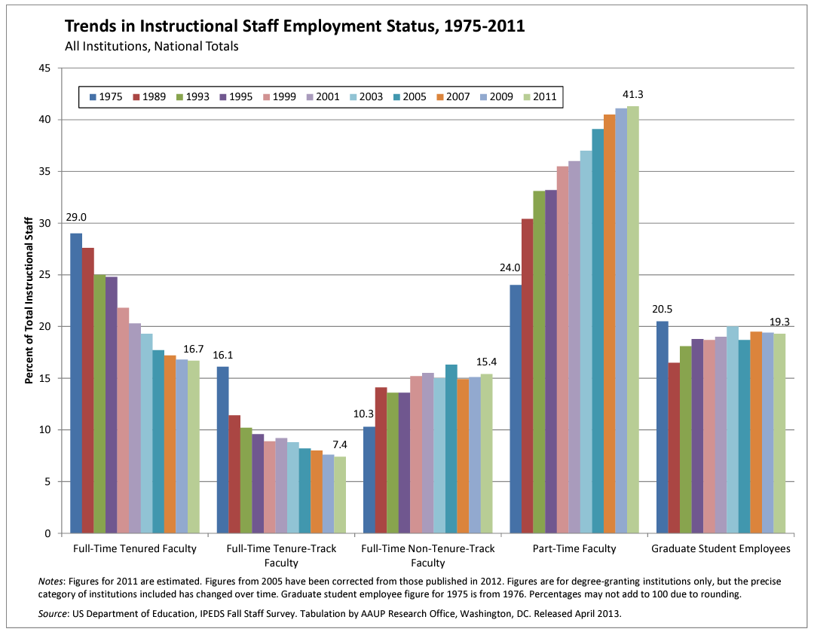

```{r setup, include=FALSE}
knitr::opts_chunk$set(eval = TRUE)
```


```{r unsplash, fig.margin = TRUE, echo = FALSE, eval = TRUE, fig.cap = "Image by Fauxels from Pexels"}
knitr::include_graphics("img/pexels-fauxels-3184360.jpg")
```


The American Association of University Professors (AAUP) is a non-profit membership association of faculty and other academic professionals.
[This report](https://www.aaup.org/sites/default/files/files/AAUP_Report_InstrStaff-75-11_apr2013.pdf) compiled by the AAUP shows trends in instructional staff employees between 1975 and 2011. The report begins with the following data visualisation.

```{r echo=FALSE, out.width="100%"}

```

In this lab you will discuss in your groups what makes a good data visualisation and create a better visualisation for the above data.


# Learning goals

-   Discuss the qualities of data visualisation.
-   Create data visualisation.
-   Working collaboratively via GitHub and learn how to resolve merge conflicts.


-----------------------------------------------------------------------

# Set-up

Please find your team members that you formed in last week's workshop. 
In today's workshop you won't necessarily be asked to work in pairs, but you are welcome to do so if you find it's useful for you. You are definitely encouraged to discuss the questions with the rest of your team, but feel free to work on individual repositories if you prefer.

In the following:
- if you want to keep working in pairs or teams, create a shared repository and invite your team members as collaborators (see instructions from previous workshops);
- if you prefer to work individually, then each of you should create your own repository by cloning the template as described below. 


### Instructions to clone repository & create a vesion control project

Log onto GitHub and create a new repository by cloning  today's lab template project. To remind you of the step:

* Go to *Your repositories* in your GitHub account and then click on the green *New* button.
* Click on *Import a repository* and type/copy the URL of today's lab template project: [https://github.com/uoeIDS/lab-06-template](https://github.com/uoeIDS/lab-06-template)
* Add an appropriate name to your repository, say `lab-06`, and click on *Begin import*.
    
Open RStudio and create a new version control project using the GitHub repository you have just made. To remind you of the steps:

- Open *RStudio* and go to *File* > *New Project...* 
- Select *Version Control* and then *Git*. Type/paste the URL of the repository you have just created. 
- Browse an appropriate location for the project and then click on *Create Project*.

Open the R Markdown document `lab-06.Rmd` and change the author to your name. *Knit* the document and make sure that it complies correctly without any errors.

`r emoji::emoji("white_check_mark")` `r emoji::emoji("arrow_up")` Commit and push your changes to GitHub with an appropriate commit message. Remember do good version control practices by periodically keeping your repository on GitHub up-to-date by staging and committing any substantial changes, and then push them to GitHub.

-----

# Questioning data visualisations

Look at the following data visualisations. Have a discussion with your team members at what might be problematic with the images. Do any of the visualisations have a problem with the 4 respects -- *people*, *data*, *mathematics* and *computer*.

### Image 1

```{r echo=FALSE, out.width="100%"}
knitr::include_graphics("img/Speaking-the-world.jpg")
```

### Image 2
```{r echo=FALSE, out.width="100%"}
knitr::include_graphics("img/rose-pop-density-total-area-bw.jpg")
```

### Image 3

```{r echo=FALSE, out.width="100%"}
knitr::include_graphics("img/life-expectancy-rule-of-law.png")
```

### Image 4

```{r echo=FALSE, out.width="100%"}
knitr::include_graphics("img/global-income-dist.PNG")
```

------


# Exercises

In your groups, take it in turn to work collaboratively in answering the following exercises. 

Remember to regularly 🧶 _knit_, ✅ _commit_ and ⬆️ _push_ your work to your shared repository on GitHub. If you are faced with a merge conflict, then carefully follow the above instructions to reconcile the conflict before pushing your changes. If you come across an issue that you are unsure how to resolve, then please ask a tutor for assistance.


# Packages & Data

For the following exercises, you will be needing to use some of the data wrangling functions from the `tidyverse` package and the data visualisation code from the `ggplot2` package. Ensure that you have the following two lines of code at the top of `lab-03.Rmd` to make the commands available to you.

```{r load-packages, warning=FALSE, message=FALSE, eval=TRUE}
library(tidyverse)
library(ggplot2)
```

Let's start by loading the data from the AAUP that was used to create the data visualisation shown at the beginning of this worksheet.

```{r load-data-staff, message=FALSE, eval=TRUE}
staff <- read_csv("data/instructional-staff.csv")
```


## Exercise 1.  

```{marginfigure}
While you work on these exercises, aim to create a merge conflict so that members 2, 4 and 6 can also practice resolving one. For example in pair 1, member 1 can make a minor edit in the answer box (like adding placeholder text), then commit and push this change to the repository. At the same time, member 2 should work on the actual answer for the exercise (without pulling the recent changes). When member 2 tries to push, they’ll encounter an error due to a merge conflict. Follow the instructions provided above to resolve the conflict.
```


View the data. Discuss as a team the following questions and write down your answer.

* What is the difference between *wide format* data and *long format* data?
* Is the format `staff` data *wide* or *long*?
* How many observations are there in the data set?

## Exercise 2.

When creating a data visualisation, it is generally preferable to have the data set in a *long* format. That is to say, each row should relate to a unique case/observation.

If the data set is in a *wide* format then we need to reshape its structure by pivoting from wide to long using `pivot_longer()`. The animation below show how this function works, as well as its counterpart `pivot_wider()`.

```{r echo=FALSE}
knitr::include_graphics("img/tidyr-longer-wider.gif")
```


Quick reminder: the function has the following arguments:

```{r eval=FALSE}
pivot_longer(data, cols, names_to = "name")
```

-   The first argument is `data` as usual.
-   The second argument, `cols`, specifies the columns to pivot into longer format.
-   The third argument, `names_to`, is the name of the column where column names of pivoted variables go (character string).
-   The fourth argument, `values_to` is the name of the column where data in pivoted variables go (character string).


Fill in the blanks in the following code chunk to pivot the staff data longer and save it as a new data frame called `staff_long`.

```{r eval=FALSE}
staff_long <- ___ %>%
  ___(
    cols = ____, 
    names_to = "_____",
    values_to = "percent"
    )
```

Inspect `staff_long`. How many rows does it have? Does this correspond to your answer from Exercise 1?


## Exercise 3.  

We will begin by plotting instructional staff employment trends as a dot plot. Copy the following code that creates a dot plot of `percentage` on the y-axis against `year` on the x-axis, with the dots coloured based on the `faculty_type`. Ensure that you understand what each part of the code is doing.

```{r eval=FALSE}
ggplot(data = staff_long,
       mapping = aes(x = year, 
                     y = percent, 
                     colour = faculty_type)) +
  geom_point()
```

## Exercise 4.  

Perhaps the trend over time can be better visualised using lines rather than dots. Edit the above code to use the `geom_line()` command.

What is wrong with the graph? Have a look at the data and the dot plot for clues as to what might be wrong before progressing to the next exercise. (You do not need to say how to fix it here---that is the next question!)


## Exercise 5.

In the dot plot from exercise 3, notice that the scaling along the x-axis is not consistent. The physical distance between each of the years are the same, but numerically there are 14 years between the first two cases and 2 years between the last two!

The reason for this is because the `year` variable in `staff_long` is a `"character"` variable, not a numerical variable. 

Complete the following code to edit the variable type of `year` from character to numerical.

```{r eval=FALSE}
staff_long <- staff_long %>%
  mutate(year = ______(year))
```

Now create the line plot described in exercise 4 to illustrate how the faculty proportions have changed over time.


## Exercise 6.

Improve the line plot from the previous exercise by fixing up its labels (title, axis labels, and legend label) as well as any other components you think could benefit from improvement.


## Exercise 7.

Suppose the objective of this plot was to show that the proportion of part-time faculty have gone up over time compared to other instructional staff types. What changes would you propose making to this plot to tell this story? Write down your idea(s). The more precise you are, the easier the next step will be. Get creative, and think about how you can modify the dataset to give you new/different variables to work with.

## Exercise 8.

Implement at least one of these ideas you came up with in the previous exercise. You should produce an improved data visualisation and accompany your visualisation with a brief paragraph describing the choices you made in your improvement, specifically discussing what you didn't like in the original plot and why, and how you addressed them in the visualisation you created.


----


# Finishing off

At the end of the lab, make sure you  🧶 _knit_, ✅ _commit_ and ⬆️ _push_ any remaining changes to your repository on Github.

If you worked with a shared repository, make sure to resolve any merge conflicts and then ⬇️ _Pull_ the latest changes so that your personal copy is up-to-date. If you were not the owner of the shared repository, then please follow the instructions below to create your own copy of the repository for future reference:

- On GitHub, create your own copy of the shared repository. You can do this using the same instructions as at the start when copying today's template repository, but instead importing from member 1's GitHub account rather than the course account.
- If you want to continue to work on today's lab after the workshop, then you will need to create a new version control project with your personal copy of the repository that you have just created.

If you were the owner of the shared repository, at the end of the workshop, you want to ensure that only you can make further changes to the shared repository. To do this, you will need to remove the collaboration permissions of your team members. To do this:

- First ensure that your team members have pulled the latest version of the repository.
- In the lab worksheet repository on GitHub, go to _Settings_ and then _Collaborators_.
- Remove your team members so that they can no longer push changes to the repository.

