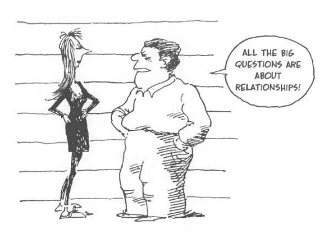
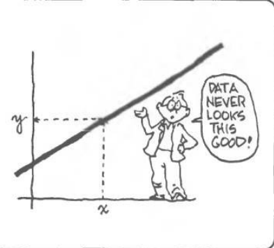
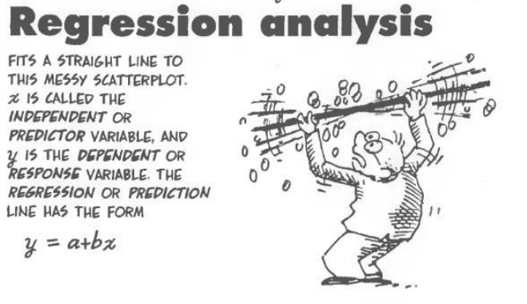
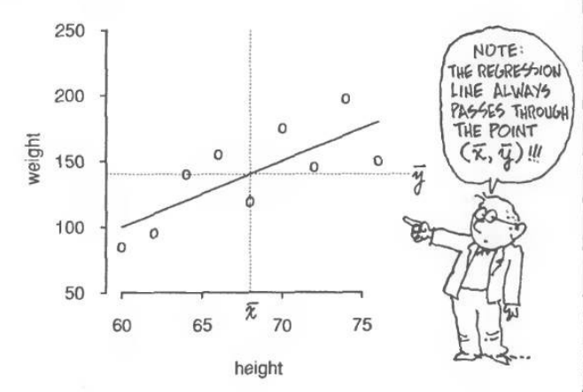

```{r setup, include=FALSE}
knitr::opts_chunk$set(eval = TRUE)
library(tidyverse)
library(tidymodels)

evals<-read.csv("data/evals.csv", row.names=1)

score_bty_fit <- linear_reg() %>%
  set_engine("lm") %>%
  fit(score ~ bty_avg, data = evals)

score_gender_fit <- linear_reg() %>%
  set_engine("lm") %>%
  fit(score ~ gender, data = evals)
```

::: {.home}
This lab is all about linear regression, so make sure you are up to date with the week 8 material!
:::

```{r cartoon1, fig.margin = TRUE, echo = FALSE, eval = TRUE, fig.cap = "Cartoon guide to Statistics by Larry Gonick"}

```

# Learning Goals

The objective of this workshop is to:

- Learn the basics of linear regression modeling with a data set.
- Learn how to model and interpret linear regression modeling with numerical or categorical predictor variables.
- See the difference between simple linear regression and multiple linear regression.

# Set-up

In this workshop you will be working individually. However, while working on your version control project, we suggest to discuss with your group members to hear different opinions and angles. Start by doing the usual set-up steps:

* Create your own copy of today's template repository from [https://github.com/uoeIDS/lab-07-template](https://github.com/uoeIDS/lab-07-template).
* Create a new version control project in RStudio that links to _your_ copy of today's template.
* Open `lab-07.Rmd` and change the `author` at the top of the file to your name.
* Verify that everything is set-up correctly: 🧶 _knit_ your document, ✅ _commit_ your changes and ⬆️ _push_ the commits to GitHub.

# Packages & Data

During the workshop we'll use the following packages:

-   `tidyverse`: for data wrangling and visualisation
-   `tidymodels`: for modelling

## Data set: Beauty in the classroom

Many college courses conclude by giving students the opportunity to evaluate the course and the instructor anonymously.
However, the use of these student evaluations as an indicator of course quality and teaching effectiveness is often criticized because these measures may reflect the influence of non-teaching related characteristics, such as the physical appearance of the instructor.

The article titled, "[Beauty in the classroom: instructors' pulchritude and putative pedagogical productivity](http://www.sciencedirect.com/science/article/pii/S0272775704001165)" (Hamermesh and Parker, 2005) found that instructors who are viewed to be better looking receive higher instructional ratings.

For this assignment you will analyze the data from this study in order to learn what goes into a positive professor evaluation.

- The data were gathered from end of semester student evaluations for a large sample of professors from the University of Texas at Austin.
In addition, six students rated the professors' physical appearance.[^2]

- The result is a data frame where each row contains a different course and columns represent variables about the courses and professors.

[^2]: This is a slightly modified version of the original data set that was released as part of the replication data for ``Data Analysis Using Regression and Multilevel/Hierarchical Models'' (Gelman and Hill, 2007).

To familiarise yourself with the data set, reading the data dictionary and reference [here](http://openintrostat.github.io/openintro/reference/evals.html) is suggested. 
You should read the data into RStudio using the following code:

```{r}
evals<-read.csv("data/evals.csv", row.names=1)
```

# Exercise 1: Exploratory Data Analysis

```{r cartoon2, fig.margin = TRUE, echo = FALSE, eval = TRUE, fig.cap = "Cartoon guide to Statistics by Larry Gonick"}

```

1.  Visualize the distribution of `score` in the dataframe `evals`. 

- Is the distribution skewed? What does that tell you about how students rate courses? Is this what you expected to see? Why, or why not? 
- Include any summary statistics and visualizations you use in your response.

2.  Visualize and describe the relationship between `score` and `bty_avg` using `geom_point()` to represent the data. 
Then, visualise again using `geom_jitter()` for the points. What does "jitter" mean? What was misleading about the initial scatter plot?


# Exercise 2: Simple Linear regression with a numerical predictor

```{r cartoon3, fig.margin = TRUE, echo = FALSE, eval = TRUE, fig.cap = "Cartoon guide to Statistics by Larry Gonick"}

```

```{marginfigure}
**Hint:** Linear models are in the form $\hat{y} = b_0 + b_1 x$.
```

1. Fit a linear model called `score_bty_fit` to predict average professor evaluation `score` from average beauty rating (`bty_avg`). Print the regression output using `tidy()`. Based on the regression output, write down the linear model.
2. Plot the data again using `geom_jitter()`, and add the regression line.
3. Interpret the slope of the linear model in context of the data.
4. Interpret the intercept of the linear model in context of the data. Comment on whether or not the intercept makes sense in this context.

```{marginfigure}
**Hint:** Use `glance()` to obtain $R^2$ and other similar statistics for your model.
```

5. Determine the $R^2$ of the model and interpret it in the context of the data.

Next, we'll assess the model fit using a graphical diagnostic. To do so we need to calculate the predicted evaluation scores for each professor in the dataset as well as the residuals for each observation. We use the `augment()` function for this:

```{r}
score_bty_aug <- augment(score_bty_fit$fit)
```

Let's take a look at what's in this augmented dataset:

```{r}
names(score_bty_aug)
```

First, we have the variables used to build the model: `score` and `bty_avg`.
We also have the predicted values (`.fitted`) and the residuals (`.resid`).
We'll talk about a few of the other variables in the augmented data frame later in the course, and some others you will encounter in future courses.

```{marginfigure}
**Hint:** You can use `geom_hline()` with `linetype = "dashed"` for this.
```

6. Make a plot of residuals vs. predicted values for the model above. Use `geom_jitter()` instead of `geom_point()`, and overlay a dashed horizontal line at `y = 0`. Then, comment on whether the linear model is appropriate for modeling the relationship between evaluation scores and beauty scores.


# Exercise 3: Simple Linear regression with a categorical predictor

0. Look at the variable `rank`, and determine the frequency of each category level.
1. Fit a new linear model called `score_rank_fit` to predict average professor evaluation `score` based on `rank` of the professor and print out the regression output using `tidy()`. Based on the regression output, interpret the slope and intercept in context of the data.
2. Fit a new linear model called `score_gender_fit` to predict average professor evaluation `score` based on `gender` of the professor. Print out the regression output using `tidy()` and interpret the slope and intercept in context of the data. But we'll do things a bit differently this time, using inline code for the values of the intercept and the slope! Below are some tips for extracting these values from the model output to use in your inline code.

```{r cartoon4, fig.margin = TRUE, echo = FALSE, eval = TRUE, fig.cap = "Cartoon guide to Statistics by Larry Gonick"}

```

Let's start with the intercept.
You have two options for extracting the value of the intercept from the regression output.
Remember, the output looks like this:

```{r}
tidy(score_gender_fit)
```

So the intercept is in the `estimate` column, and it's the first element in there.

```{r}
# Option 1
tidy(score_gender_fit)$estimate[1]
```

We can also extract it using a dplyr pipeline:

```{r}
# Option 2
tidy(score_gender_fit) %>% 
  filter(term == "(Intercept)") %>%   # filter for the intercept
  select(estimate) %>%                # select the estimate column
  pull()                              # pull value out of data frame
```

Regardless of which option you use, you might consider storing the value in an object that you can easily refer to in your inline code, e.g.

```{marginfigure}
You can hide the code for chunks like this where you are simply preparing 
objects for later use by adding `echo = FALSE` in the code chunk options, 
that is, where you label your code chunk, separated by a comma, i.e.  
`{r label, echo = FALSE}`
```

```{r}
score_gender_intercept <- tidy(score_gender_fit) %>% 
  filter(term == "(Intercept)") %>%
  select(estimate) %>%
  pull()
```

And then, you can use the `score_gender_intercept` in inline code, e.g.

```{r eval=FALSE}
The intercept of the model is `r score_gender_intercept`...
```
    
which will render to

    The intercept of the model is `r score_gender_intercept`...

There is still one small issue here though, the number of decimal places reported.
It would be better to round the value in our narrative, for which we can use the `round()` function.
This function takes two arguments: the first one is the value (or vector of values) you want to round, and the second one is the number of digits.

```{r eval=FALSE}
The intercept of the model is `r round(score_gender_intercept, 2)`...
```

which will render to

    The intercept of the model is `r round(score_gender_intercept, 2)`...


# Exercise 4: Multiple linear regression

1. Now, we fit a multiple linear regression model, predicting average professor evaluation `score` based on average beauty rating (`bty_avg`) and `gender`. Name the model `score_bty_gender_fit`. Interpret the intercept and the slopes of `bty_avg` and `gender`. Make a scatterplot (using jitter) of `score` by `bty_avg` and color the points by `gender`.
2. What percent of the variability in `score` is explained by the model `score_bty_gender_fit`. Once again, use inline code in your answer, similar to above example.
3. What is the equation of the line corresponding to *just* male professors?
4. For two professors who received the same beauty rating, which gender tends to have the higher course evaluation score?
5. How does the relationship between beauty and evaluation score vary between male and female professors?
6. How do the adjusted $R^2$ values of `score_bty_fit` and `score_bty_gender_fit` compare? What does this tell us about how useful `gender` is in explaining the variability in evaluation scores when we already have information on the beauty score of the professor.
7. Compare the slopes of `bty_avg` under the two models (`score_bty_fit` and `score_bty_gender_fit`). Has the addition of `gender` to the model changed the parameter estimate (slope) of `bty_avg`?

# Exercise 5: Interpretation of log-transformed response variables

You saw in class that the interpretation for a slope when the response has been log-transformed is in terms of a *multiplicative factor*, or *percentage change*. You are now going to see why.

For example, in the model where we were trying to predict the log-price of paris paintings using the width of the paintings, we fitted the following model:

$$
 \widehat{log(price)} = 4.67 + 0.0192 \times Width 
$$
To interpret the slope ($b_1 = 0.0192$) we could say 

> *For each additional inch the painting is wider, the log price of the painting is expected to be higher, on average, by 0.0192 log-livres.*

However, this is not a very useful statement.

We will be using two properties of the $log$ to "undo" the log transformation. 

  a. Subtraction and logs: $log(a) − log(b) = log(a / b)$

  b. Natural logarithm: $e^{log(x)} = x$
  
and to rewrite the interpretation as

> *For each additional inch the painting is wider, the price of the painting is expected to be higher, on average, by a (multiplicative) factor of 1.0192.*


1. Using the two properties listed above, and starting from the hint provided below, prove why we can rewrite the interpretation of the slope using the *multiplicative factor of $exp(b_1)$* phrase.

*Hint*: The slope coefficient for the log transformed model is 0.0192, meaning the log price difference between paintings whose widths are one inch apart is predicted to be 0.0192 log livres:

$$ log(\text{price for width (x+1)}) - log(\text{price for width x}) = 0.0192 $$
2. Using the fact that $exp(x)\approx 1+x$, and the definition of percentage change ($(b-a)/a = \%\text{-change}$), prove that we can rewrite the interpretation of the slope as 

> *For each additional inch the painting is wider, the price of the painting is expected to be higher, on average, by 1.92%*

----

# I have time left ...

Once you're done with this week's lab, you can spend some time for thinking about your projects with the first modeling experience. 

- In your data set, which variables can be considered as response for a linear regression type model?

- Which type of predictors you have in your data and how do you create a reasonable multiple linear regression model?

----

# Wrapping up

That's the end of this lab! 

- Don't worry if you did not reach the end of the worksheet today, but please try to go through any remaining exercises in your own time.

- Remember to commit and push your changes to GitHub with an appropriate commit message. Make sure to commit and push all changed files so that your Git pane is cleared up afterwards.


