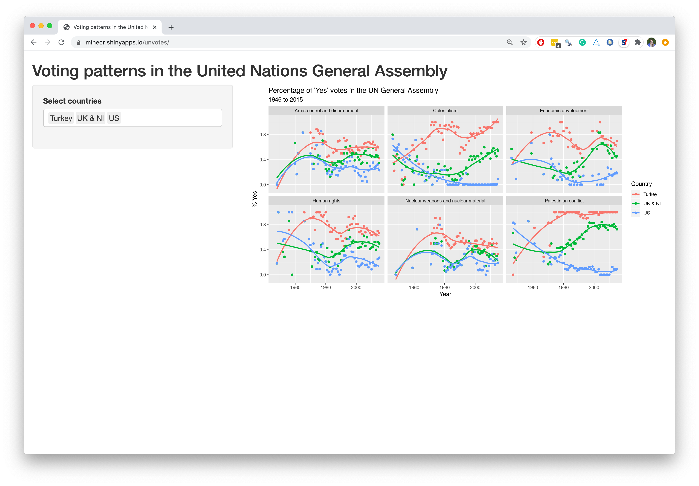
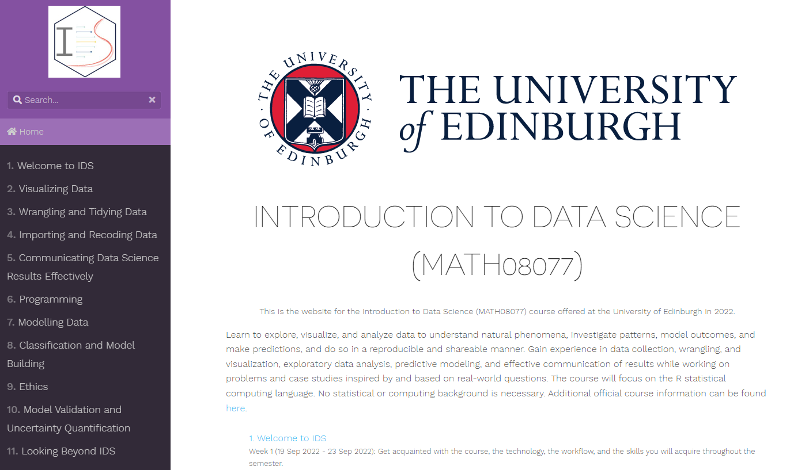
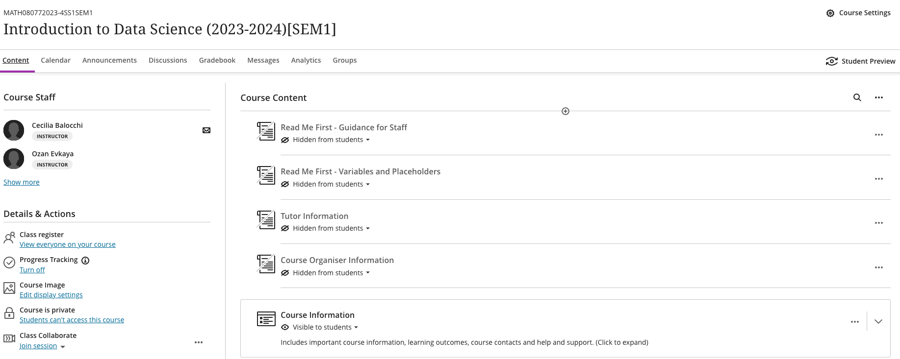

```{r packages, echo=FALSE, message=FALSE, warning=FALSE}
library(tidyverse)
# library(emo)
library(emoji)
#devtools::install_github("hadley/emo", force = TRUE)
```

class: middle

# This lecture is being recorded


---

class: middle

# Hello world!

---

## Staff

- Dr Cecilia Balocchi (_she/her_) [JCMB 4607]
- Dr Ozan Evkaya (_he/him_) [JCMB 2257]

```{r, echo=FALSE,out.width="15%", out.height="20%",fig.cap="Cecilia / Ozan",fig.show='hold',fig.align='center'}
knitr::include_graphics(c("img/people/cecilia.jpg", "img/people/Ozan.jpg"))
```

- Support staff
  - Mrs Frances Reid (_she/her_) -- Course administrator

---

## Data science

.pull-left-wide[
- Data science is an exciting discipline that allows you to turn raw data into understanding, insight, and knowledge.

- We're going to learn to do this in a `tidy` way -- more on that later!

- This is a course on introduction to data science, with an emphasis on statistical thinking.

- In addition to writing code, we will start getting familiar with some statistical concepts.
]

---

## Course FAQ

.pull-left-wide[
**Q - What data science background does this course assume?**
A - None.

**Q - Is this an intro stat course?**
A - While statistics $\ne$ data science, they are very closely related and have tremendous of overlap. Hence, this course is a great way to get started with statistics. However this course is *not* your typical high school statistics course.

**Q - Will we be doing computing?**
A - Yes.
]

---

## Course FAQ

.pull-left-wide[
**Q - Is this an intro CS course?**
A - No, but many themes are shared.

**Q - What computing language will we learn?**
A - R.

**Q: Why not language X?**
A: We can discuss that over tea/coffee `r emoji::emoji("hot_beverage")`.
]

---

class: middle

# Software

---

```{r echo=FALSE, out.width="75%", fig.align="left"}
knitr::include_graphics("img/excel.png")
```

---

```{r echo=FALSE, out.width="50%", fig.align="left"}
knitr::include_graphics("img/r.png")
```

---

```{r echo=FALSE, out.width="73%", fig.align="left"}
knitr::include_graphics("img/rstudio.png")
```

---

class: middle

# Data science life cycle

---

```{r echo=FALSE, out.width="90%", fig.align="left"}
knitr::include_graphics("img/data-science-cycle/data-science-cycle.001.png")
```

---

```{r echo=FALSE, out.width="90%", fig.align="left"}
knitr::include_graphics("img/data-science-cycle/data-science-cycle.002.png")
```

---

```{r echo=FALSE, out.width="90%", fig.align="left"}
knitr::include_graphics("img/data-science-cycle/data-science-cycle.003.png")
```

---

```{r echo=FALSE, out.width="90%", fig.align="left"}
knitr::include_graphics("img/data-science-cycle/data-science-cycle.004.png")
```

---

```{r echo=FALSE, out.width="90%", fig.align="left"}
knitr::include_graphics("img/data-science-cycle/data-science-cycle.005.png")
```

---

```{r echo=FALSE, out.width="90%", fig.align="left"}
knitr::include_graphics("img/data-science-cycle/data-science-cycle.006.png")
```

---

.pull-left[
```{r echo=FALSE, out.width="75%", fig.align="left"}
knitr::include_graphics("img/google-trend-index.png")
```
]
.pull-right[
```{r echo=FALSE, out.width="90%", fig.align="right"}
knitr::include_graphics("img/data-science-cycle/data-science-cycle.006.png")
```
```{r echo=FALSE}
travel <- tribble(
  ~date,              ~season,
  "23 January 2017",  "winter",
  "4 March 2017",     "spring",
  "14 June 2017",     "summer",
  "1 September 2017", "fall",
  "...", "..."
)
travel
```
]

---

```{r echo=FALSE, out.width="90%", fig.align="left"}
knitr::include_graphics("img/data-science-cycle/data-science-cycle.007.png")
```

---

```{r echo=FALSE, out.width="90%", fig.align="left"}
knitr::include_graphics("img/data-science-cycle/data-science-cycle.008.png")
```

---

```{r echo=FALSE, out.width="85%", fig.align="left"}
knitr::include_graphics("img/unvotes/unvotes.gif")
```

---


class: middle

# Let's dive in!

---

```{r echo=FALSE, out.width="100%"}

```

---

class: inverse

```{r echo=FALSE, out.width="100%"}
knitr::include_graphics("img/unvotes/unvotes-02.jpeg")
```

---

class: inverse

```{r echo=FALSE, out.width="100%"}
knitr::include_graphics("img/unvotes/unvotes-03.jpeg")
```

---

class: inverse

```{r echo=FALSE, out.width="100%"}
knitr::include_graphics("img/unvotes/unvotes-04.jpeg")
```

---

class: inverse

```{r echo=FALSE, out.width="100%"}
knitr::include_graphics("img/unvotes/unvotes-05.jpeg")
```

---

class: inverse

```{r echo=FALSE, out.width="100%"}
knitr::include_graphics("img/unvotes/unvotes-06.jpeg")
```

---

class: inverse

```{r echo=FALSE, out.width="100%"}
knitr::include_graphics("img/unvotes/unvotes-07.jpeg")
```

---

class: inverse

```{r echo=FALSE, out.width="100%"}
knitr::include_graphics("img/unvotes/unvotes-08.jpeg")
```

---

class: inverse

```{r echo=FALSE, out.width="100%"}
knitr::include_graphics("img/unvotes/unvotes-09.jpeg")
```

---

class: inverse

```{r echo=FALSE, out.width="100%"}
knitr::include_graphics("img/unvotes/unvotes-10.jpeg")
```

---

class: inverse

```{r echo=FALSE, out.width="100%"}
knitr::include_graphics("img/unvotes/unvotes-11.jpeg")
```

---

class: inverse

```{r echo=FALSE, out.width="100%"}
knitr::include_graphics("img/unvotes/unvotes-12.jpeg")
```

---


.center[
.large[
[minecr.shinyapps.io/unvotes](https://minecr.shinyapps.io/unvotes/)
]
]

```{r echo=FALSE, out.width="65%"}

```

---

class: middle

# Course details

---

## Learning outcomes
.pull-left-wide[
On completion of this course, the student will be able to:

1. Employ all stages of a modern **data science pipeline**, including import, tidy, transform, visualize, model, and communicate.

2. **Critique** data-based claims and **evaluate** data-based decisions.

3. **Interpret** results correctly, effectively, and in context without relying on statistical jargon

4. Use the statistical computing language `R` to perform **fully reproducible** data analyses.]

---

## One link to rule them all...

... where you can find everything except your course marks!

<br>

.larger[
.center[
[**https://uoe-ids.netlify.app/**](https://uoe-ids.netlify.app/)
]
]

<!-- --- -->

<!-- ## Topics by week -->

<!-- | Week | Topic                                     | -->
<!-- |------|-------------------------------------------| -->
<!-- | 1    | Welcome and Toolkit                       | -->
<!-- | 2    | Wrangling and tidying data                | -->
<!-- | 3    | Importing and joining data                | -->
<!-- | 4    | Visualising data                          | -->
<!-- | 5    | Communicating effectively                 | -->
<!-- | 6    | Ethics                                    | -->
<!-- | 7    | Programming and Functions                 | -->
<!-- | 8    | Predictive Modelling                      | -->
<!-- | 9    | Classification and model building         | -->
<!-- | 10   | Validation and uncertainty quantification | -->
<!-- | 11   | Looking beyond IDS                        | -->

---


## Weekly structure

- **Mondays:**
  - Release of week's material.
  - Lecture at 13:10-14:00, Alder Lecture Theatre - Nucleus.
- **Tuesdays:**
  - Quiz deadline from the previous week.
- **Wednesday:**
  - Lecture at 11:10-12:00, Alder Lecture Theatre - Nucleus.
  - Student Q&A session at 12:10-13:00, JCMB 1501.
  - New quiz released (starting week 2).
- **Thursday:**
  - Release of workshop material.
- **Fridays:**
  - Labs, 9:00 - 16:00 over 4 time slots: in JCMB 5205 (morning slots) or Murchison House G.09 (afternoon slots).
  - Check your timetable to attend the one you have been assigned to and bring your laptops!


---

## Lectures

- Two lectures per week, Monday and Wednesday, both in-person.

- During lectures, _Wooclap_ platform will be used for interactivity.

- Lecture slides are available via the course website at the start of the respective week.

- Recordings of the lecture are available as soon as possible after the lecture has concluded. However, these should be used as a reminder/back-up and not as an alternative to attending lectures - __Live is better!__

- There can be a lot of material to get through in lectures. Expect to have to go back over the slides and recordings later to make sure you understand the content.

---

## Reading

.pull-left-wide[
- Reading material and videos available each week on the course website.

- This is split into required and optional material.

- The required material forms part of the course and might not be covered in lectures, so make sure you look over this before the workshop on Friday. ]


---

## Workshops/ labs

- On Fridays, over 4 different time slots (9.00-10.30 / 10.30-12.00 / 13.10 - 14.30 / <br>
  14.30 - 16.00)

- Check your timetable to see which workshop you should attend.

- **Bring your laptop!**

  - See [Setup & Troubleshooting](https://uoe-ids.netlify.app/troubleshoot/) for the School policy on equipment or to request/loan a device.
  - This webpage also contains software installation instructions.

- Work in teams on computing lab exercises. Pair working/programming is strongly recommended.

- **Tip:** Meet with your team outside of the workshop to finish the exercises, if you need.

---

## Toolkit

- We will be using RStudio for programming and GitHub for teamwork and version control.
  - More details in the next lecture.

- You will need to spend some time downloading and installing the tools needed for the course.
  - Follow the instructions [on the course website](https://uoe-ids.netlify.app/troubleshoot/).
  - You should try to do this **before** the workshop on Friday.

- **Tip:** the final project will have marks allocated to use of GitHub for producing tidy and reproducible code.


---

## Help with installing toolkit

<!-- - Dedicated **tech support** offered by SoM Learning Technologist, Ania Domagala:  -->
<!--   - Week 1: Wednesday, 18th, 2:00 PM - 4:00 PM in Room JCMB 6301 -->
<!--   - Week 2: Thursday, 26th, 10:00 AM - 12:00 PM in Room JCMB 4325B -->
<!--   - Week 3: Monday, 30th, 10:00 AM - 12:00 PM in Room JCMB 5205 -->


- **Student hour (Q&A session)** on Wednesday - Simon and I will provide additional support.

- **labs** - you will be able to get help from the tutors in the labs.

- **Piazza** - post here for help from us or your peers

- Note: we can only guarantee IT support for Windows laptops.

<!-- --- -->

<!-- ## Installing software -->

<!-- - Follow instructions in [Setup & Troubleshooting](https://uoe-ids.netlify.app/troubleshoot/) for installing RStudio and setting up Github. -->

<!-- - Ideally do this before Friday's workshop! -->

<!-- - Dedicated tech support offered by our School Learning Technologist, Ania Domagala:  -->
<!--   - Week 1: Wednesday, 18th, 2:00 PM - 4:00 PM in Room JCMB 6301 -->
<!--   - Week 2: Thursday, 26th, 10:00 AM - 12:00 PM in Room JCMB 4325B -->
<!--   - Week 3: Monday, 30th, 10:00 AM - 12:00 PM in Room JCMB 5205 -->

<!-- - If you have problems with software set-up, we will also be available during the Q&A session on Wednesday. -->

---

## Course operation resources- Website

```{r echo=FALSE, out.width="70%", fig.align="center"}

```

---

## Course operation resources - Learn-Ultra

- University's official course management system
- Go here for:
  - announcements
  - homework, quiz and project submissions
  - course marks
  - links to join Piazza and course website

```{r echo=FALSE, out.width="50%", fig.align="center"}

```

---

## Course operation resources - Piazza

- For all course content related questions
- Ask **and** answer
- Before posting, check questions that have already been asked
- Can also be used for team based discussion
- Do not post answers to quizzes or homeworks
- For coding questions, give a simple and self-contained **minimal reproducible example**
  - Example:

.question[
Can anyone help explain why I am getting this error?
```{r error = TRUE}
1 + 2(3 - 6)
```
]

---

## Assessment

**Weekly quizzes** (10%)
- **Release**: Every Wednesday morning (starting from Week 2).
- **Deadline**: Following Tuesday at 12:00noon.
- 10 Weekly quiz in total. Grade based on best 9 out of 10 quizzes!
- Work on them individually
- 5-7 multiple choice questions, some requiring a bit of coding, some conceptual and visual based exercises.
- **Tip:** Read the instructions carefully and don't leave it until the last minute!
- Submission:
  - `Assessment` > `Quizzes` via Learn-Ultra platform
  - Enter your answers in a suitable format

---

## Assessment

**In-class test** (10%)
- **When**: During lecture, Wednesday 8 October, 11:10-12:00 (week 4).
- **Where**: Alder Lecture Theatre - Nucleus.
- **Duration**: 20–30 minutes (details TBC), followed by lecture
- Complete on Learn, using your laptops.
- Closed book; no notes or internet access (invigilated).
- Attendance will be taken, bring your student ID.


---

## Assessment

**Homework assignments** (20%)
- **Release**: Before Fridays, weeks 6, 9.
- **Deadline**: Fridays at 16:00, weeks 7 & 10.
- Work on them individually.
- All two submissions count.
- Submit via Gradescope.
- **IMPORTANT:** Your GitHub repository _MUST_ be made private for individual homework assignments. Failure to make your repository private means that others can see your work and thereby risks incurring an academic misconduct case.


---

## Assessment

**Project** (60%)
- TL;DR: Find a dataset and do something with it! You will see some data suggestions later in the semester.
- Work in teams, ideally using pair programming techniques.
- How are you graded:
  - A 5 minute team presentation.
  - A write-up of your investigation, 1,500 word count.
- You must complete the project and participate in the presentation.
- More details will be provided later in the course.

---

## Collaboration policy

- Only work that is clearly assigned as team work should be completed collaboratively.

- Individual assignments must be completed individually, you may not directly share or discuss answers / code with anyone other than the instructors and tutors.

- You are welcome to discuss the problems in general and ask for advice.

---

## Sharing / reusing code policy

- We are aware that a huge volume of code is available on the web, and many tasks may have solutions posted.

- Unless explicitly stated otherwise, this course's policy is that you may make use of any online resources (e.g. Google, StackOverflow, etc.) but you must explicitly cite where you obtained any code you directly use or use as inspiration in your solution(s).

- Any recycled code that is discovered and is not explicitly cited will be treated as plagiarism, regardless of source.

---

## Use of Generative-AI in this course

Remember: 
- assignments should contain students’ own original work; 
- be aware of the limitations of generative AI and the dangers of relying on it as a source of information; 
- you need to acknowledge the use of generative AI where it is (permitted to be) used; 
  - `r emoji::emoji("exclamation")` presenting AI outputs as your own original work is considered as academic misconduct.

Please read the [University guidance on GenAI](https://information-services.ed.ac.uk/computing/comms-and-collab/elm/guidance-for-working-with-generative-ai).

---

## Use of Generative-AI in this course

Academic integrity is an underlying principle of research and academic practice. All submitted work is expected to be your own.

**In-class test**, **Homework** and **quizzes**:
- AI tools (e.g., chatGPT, ELM) should **not be used** for this assessment. Using AI without authorisation might constitute academic misconduct
- Please ensure that you do not input direct exercise questions into the AI prompts.

---

## Use of Generative-AI in this course

Academic integrity is an underlying principle of research and academic practice. All submitted work is expected to be your own.

**Final Project**:
- AI tools (e.g., chatGPT, ELM) should **not be used to generate content** for this assessment. However, you are allowed to use these tools to identify ideas, help organize your thoughts, and plan your assessment. 
- You may also use it to improve the clarity of your writing, but you should not use it in the final wording of your work. In particular, you should not copy-paste entire sentences produced by genAI. 
- For example, you may use genAI tools for learning purposes, to enhance your understanding and develop your skills independently, similar to how you would use search engines to research information, or as a virtual tutor. 
- **If you use AI software, you must acknowledge its use in your submission.** [Here you can find examples of acknowledgements](https://www.ncl.ac.uk/academic-skills-kit/good-academic-practice/artificial-intelligence/acknowledging/) (no need to list the prompts and outputs used).


---

## Getting help

- **Piazza** for course content, logistics, etc. discussion on the course discussion forum

- **Student hour (Q&A session)** after Wednesday lecture at 12.10-13.00, JCMB 5326. Optional, drop-in if you have any questions.

- **MathsBase** for drop-in support from a tutor

- ~~Email~~ **Piazza private messages**: for questions _only_ about personal matters (e.g. illness, concessions).

- Most importantly, ask questions!

---

