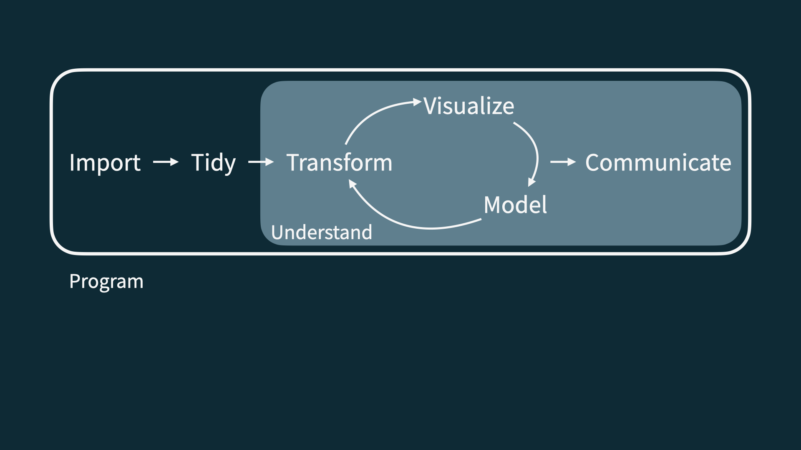

```{r packages, echo=FALSE, message=FALSE, warning=FALSE}
library(tidyverse)
library(emo)
```

class: middle

# This lecture is being recorded


---

class: middle

# Hello world!

---

## Staff

- Dr Ozan Evkaya (_he/him_) [JCMB 2257]
- Dr Simon Taylor (_he/him_) [JCMB 5314]
- Dr Cecilia Balocchi (_she/her_) [JCMB 5414]

```{r, echo=FALSE,out.width="15%", out.height="20%",fig.cap="Ozan / Simon / Cecilia",fig.show='hold',fig.align='center'}
knitr::include_graphics(c("img/people/Ozan.jpg", "img/people/Simon.jpg", "img/people/cecilia.jpg"))
```

- Support staff
 - Mrs Frances Reid (_she/her_) -- Course administrator

- SoM Student support
 
---

## Data science

.pull-left-wide[
- Data science is an exciting discipline that allows you to turn raw data into understanding, insight, and knowledge. 

- We're going to learn to do this in a `tidy` way -- more on that later!

- This is a course on introduction to data science, with an emphasis on statistical thinking.

- In addition to how you write your codes in R, it is important to understand the statistical concepts.
]

---

## Course FAQ

.pull-left-wide[
**Q - What data science background does this course assume?**  
A - None.

**Q - Is this an intro stat course?**  
A - While statistics $\ne$ data science, they are very closely related and have tremendous of overlap. Hence, this course is a great way to get started with statistics. However this course is *not* your typical high school statistics course.

**Q - Will we be doing computing?**   
A - Yes.
]

---

## Course FAQ

.pull-left-wide[
**Q - Is this an intro CS course?**  
A - No, but many themes are shared.

**Q - What computing language will we learn?**  
A - R.

**Q: Why not language X?**  
A: We can discuss that over.
]

---

class: middle

# Course details

---

## One link to rule them all...

... where you can find everything except your course marks!

<br>

.larger[
.center[
[**https://ids2023.netlify.app**](https://ids2023.netlify.app/)
]
]

---


## Weekly structure

- **Mondays:** 
  - Release of week's material.
  - Quiz deadline from previous week.

- **Tuesdays:** 
  - Lecture at 10.00-10.50am, Joseph Black Building Lecture Theatre.

- **Thursdays:** 
  - Lecture at 10.00-10.50am, JCMB Lecture Theatre (LT) A. 
  - Student Q&A session at 11.10-12.00, JCMB 5326.

- **Fridays:** 
  - Labs, ??. Bring your laptops!

---

## Tentative topics by week

| Week | Topic                                     |
|------|-------------------------------------------|
| 1    | Welcome and Toolkit                       |
| 2    | Importing and recoding data               |
| 3    | Wrangling and tidying data                |
| 4    | Visualising data                          |
| 5    | Communicating effectively                 |
| 6    | Ethics                                    |
| 7    | Programming and Functions                 |
| 8    | Predictive Modelling                      |
| 9    | Classification and model building         |
| 10   | Validation and uncertainty quantification |
| 11   | Looking beyond IDS                        |


---


## Learning outcomes
.pull-left-wide[
On completion of this course, the student will be able to:

1. Employ all stages of a modern **data science pipeline**, including import, tidy, transform, visualize, model, and communicate.

2. **Critique** data-based claims and **evaluate** data-based decisions.

3. **Interpret** results correctly, effectively, and in context without relying on statistical jargon

4. Use the statistical computing language `R` to perform **fully reproducible** data analyses.]

---

## Lectures

.pull-left-wide[
- Two lectures per week, both in-person (Tuesday) and (Thursday).

- During lectures, Wooclap platform will be used for interactivity

- Recordings and slides will be posted on the website after the lecture.

- Lecture recordings are a back up, it is better to attend live!

- There can be a lot of material to get through in lectures. Expect to have to go back over the slides and recordings later to make sure you understand the content.]

---

## Reading

.pull-left-wide[
- Reading material and videos released on Mondays. There can be some related book suggestions.

- This is split into required and optional material.

- The required material forms part of the course and might not be covered in lectures, so make sure you look over this before the workshop on Friday. ]


---

## Workshops/ labs

.pull-left-wide[
- On Fridays, ???

- Check your timetable to see which workshop you should attend.
- Bring your laptop. See [here](https://teaching.maths.ed.ac.uk/main/undergraduate/studies/equipment) for the School policy on equipment or to request a device and [here](https://www.ed.ac.uk/information-services/library-museum-gallery/using-library/borrowing-a-book/borrowing-laptops) for a laptop loan.

- Work in teams on computing lab exercises. Pair working/programming is strongly suggested

- **Tip:** meet with your team  outside of the workshop to finish the exercises, if you need.

- IT support for non-Windows laptops is not guaranteed.]

---

## Assessment

**Weekly quizzes** (20%)
.pull-left-wide[
- 10 Weekly quiz in total, 2 marks for each. Best 9 out of 10!
- Due on Mondays every week at 12:00noon
- Work on them individually
- 5-7 multiple choice questions, some requiring a bit of coding, some conceptual and visual based exercises
- **Tip:** Read the instructions carefully and don't leave it until the last minute!
- Submission:
  - `Assessment` > `Quizzes` via Learn-Ultra platform
  - Enter your answers in a suitable format
  


---

## Assessment

**Homework assignments** (30%)
.pull-left-wide[
- Due on Fridays at 16:00noon alternate weeks (4,7,10).

- Work on them individually. Individual homework deadlines (alternate weeks.)

- All submissions count.

- **IMPORTANT:** Your GitHub repository _MUST_ be made private for individual homework assignments. Failure to make your repository private means that others can see your work and thereby risks incurring an academic misconduct case.]


---

## Assessment

**Project** (50%)
.pull-left-wide[
- TL;DR: Find a dataset and do something with it! You will see some data suggestions later

- Work in teams, by supporting pair programming idea

- Proposal, 5 min team presentation, 1,500 word write-up

- You must complete the project and participate in the presentation 

- More details will be provided later in the course]


---


## Getting help

- **Piazza** for course content, logistics, etc. discussion on the course discussion forum

- **Student hour** after Thursday lecture at 11.10-12.00, JCMB 5326. Optional, drop-in if you have any questions.

- **MathsBase** for drop-in support from a tutor

- **Email** for questions _only_ about personal matters (e.g. illness, concessions).

- Most importantly, ask questions!


---

## Course operation resources- Website

```{r echo=FALSE, out.width="70%", fig.align="center"}

```

---

## Course operation resources - Learn-Ultra

- University's official course management system
- Go here for:
  - announcements
  - homework, quiz and project submissions
  - course marks
  - links to join Piazza and course website
  
```{r echo=FALSE, out.width="50%", fig.align="center"}

```

---

## Course operation resources - Piazza

- For all course content related questions
- Ask **and** answer
- Before posting, check questions that have already been asked
- Can also be used for team based discussion
- Do not post answers to quizzes or homeworks
- For coding questions, give a simple and self-contained **minimal reproducible example**
  - Example:
  
.question[
Can anyone help explain why I am getting this error?
```{r error = TRUE}
1 + 2(3 - 6)
```
]

---

## Toolkit

- We will be using RStudio for programming and GitHub for teamwork and version control.

- More details in the next lecture.

- You will need to spend some time downloading and installing the tools needed for the course.

- Follow the instructions [on the course website](https://ids2022.netlify.app/troubleshoot/).

- You should try to do this **before** the workshop on Friday. 

- **Tip:** the final project will have marks allocated to use of GitHub for producing tidy and reproducible code. 


---

## Help with installing toolkit

.pull-left[
- **labs** - you will be able to get help from the tutors in the labs.

- **Piazza** - post here for help from us or your peers

- **Note**  - we can only guarantee IT support for Windows laptops. 

]

---

class: middle

# Data science life cycle

---

```{r echo=FALSE, out.width="90%", fig.align="left"}
knitr::include_graphics("img/data-science-cycle/data-science-cycle.001.png")
```

---

```{r echo=FALSE, out.width="90%", fig.align="left"}
knitr::include_graphics("img/data-science-cycle/data-science-cycle.002.png")
```

---

```{r echo=FALSE, out.width="90%", fig.align="left"}
knitr::include_graphics("img/data-science-cycle/data-science-cycle.003.png")
```

---

```{r echo=FALSE, out.width="90%", fig.align="left"}
knitr::include_graphics("img/data-science-cycle/data-science-cycle.004.png")
```

---

```{r echo=FALSE, out.width="90%", fig.align="left"}
knitr::include_graphics("img/data-science-cycle/data-science-cycle.005.png")
```

---

```{r echo=FALSE, out.width="90%", fig.align="left"}
knitr::include_graphics("img/data-science-cycle/data-science-cycle.006.png")
```

---

.pull-left[
```{r echo=FALSE, out.width="75%", fig.align="left"}
knitr::include_graphics("img/google-trend-index.png")
```
]
.pull-right[
```{r echo=FALSE, out.width="90%", fig.align="right"}
knitr::include_graphics("img/data-science-cycle/data-science-cycle.006.png")
```
```{r echo=FALSE}
travel <- tribble(
  ~date,              ~season,
  "23 January 2017",  "winter",
  "4 March 2017",     "spring",
  "14 June 2017",     "summer",
  "1 September 2017", "fall",
  "...", "..."
)
travel
```
]

---

```{r echo=FALSE, out.width="90%", fig.align="left"}
knitr::include_graphics("img/data-science-cycle/data-science-cycle.007.png")
```

---

```{r echo=FALSE, out.width="90%", fig.align="left"}

```

---

```{r echo=FALSE, out.width="90%", fig.align="left"}
knitr::include_graphics("img/data-science-cycle/DS-cycle-Rpackages.png")
```

Image Credit: [Teaching the tidyverse in 2023](https://www.tidyverse.org/blog/2023/08/teach-tidyverse-23/)
---

class: middle

# Let's dive in!

---

```{r echo=FALSE, out.width="85%", fig.align="left"}
knitr::include_graphics("img/unvotes/unvotes.gif")
```

---

class: inverse

```{r echo=FALSE, out.width="100%"}
knitr::include_graphics("img/unvotes/unvotes-02.jpeg")
```

---

class: inverse

```{r echo=FALSE, out.width="100%"}
knitr::include_graphics("img/unvotes/unvotes-03.jpeg")
```

---

class: inverse

```{r echo=FALSE, out.width="100%"}
knitr::include_graphics("img/unvotes/unvotes-04.jpeg")
```

---

class: inverse

```{r echo=FALSE, out.width="100%"}
knitr::include_graphics("img/unvotes/unvotes-05.jpeg")
```

---

class: inverse

```{r echo=FALSE, out.width="100%"}
knitr::include_graphics("img/unvotes/unvotes-06.jpeg")
```

---


.center[
.large[
[minecr.shinyapps.io/unvotes](https://minecr.shinyapps.io/unvotes/)
]
]

```{r echo=FALSE, out.width="65%"}
knitr::include_graphics("img/unvotes/unvotes-15.png")
```

