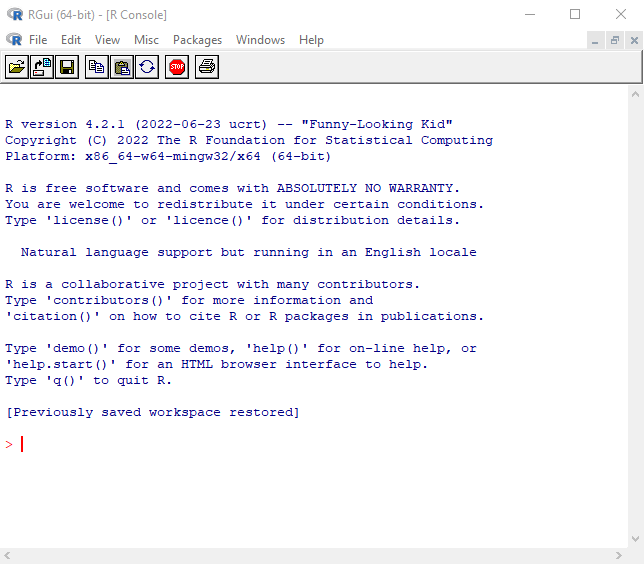
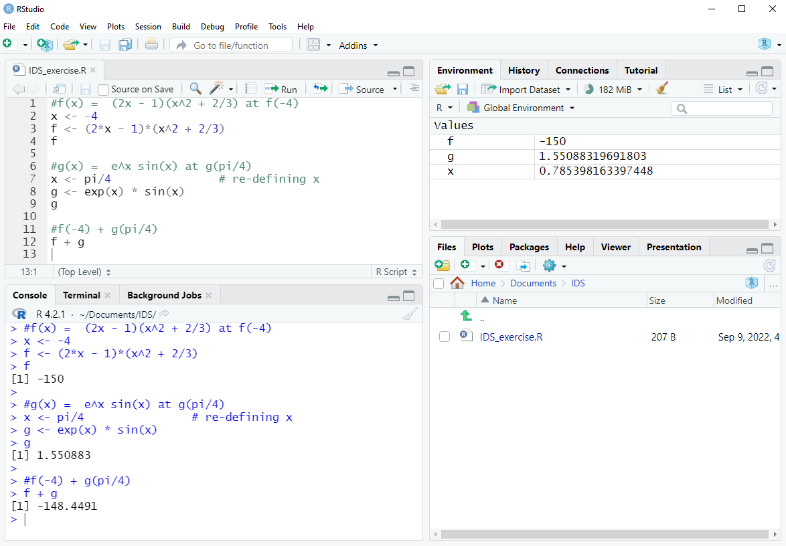
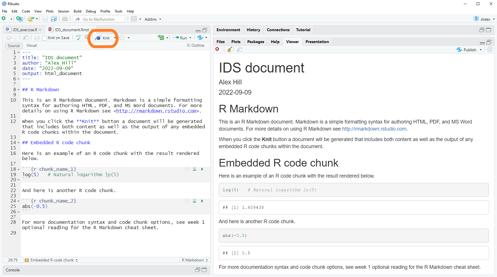
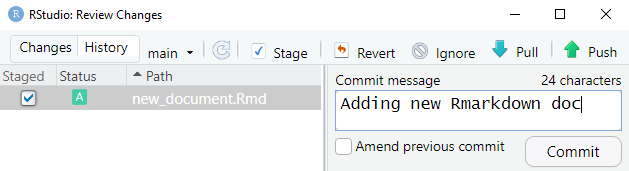

```{r packages, echo=FALSE, message=FALSE, warning=FALSE}
library(tidyverse)
library(viridis)
library(sugrrants)
library(lubridate)
#library(emo)
library(emoji)
library(fontawesome)
```

## Course toolkit

.pull-left-narrow[

$$\\[3ex]$$

- R

- RStudio

- tidyverse

- R Markdown

- GitHub
]
.pull-right-wide[

.pull-left[

```{r echo=FALSE, out.width="45%", fig.align="center"}
knitr::include_graphics("img/Rlogo.svg")
```

```{r echo=FALSE, out.width="60%", fig.align="center"}
knitr::include_graphics("img/tidyverse_logo.png")
```
]
.pull-right[
```{r echo=FALSE, out.width="100%", fig.align="center"}

```

```{r echo=FALSE, out.width="50%", fig.align="center"}
knitr::include_graphics("img/rmarkdownlogo.png")
```
]

.center[`r fontawesome::fa(name = "fab fa-github", height = "10ex")`]

]

---

class: middle

# R programming language


```{r echo=FALSE, out.width="30%", fig.align="center"}
knitr::include_graphics("img/Rlogo.svg")
```

Installation: [link](https://cloud.r-project.org/)

---

## RGui console

.pull-left[
```{r echo=FALSE, out.width="100%", fig.align="center"}

```
]
.pull-right[
<br>

| Code     | Definition     |
| -------- | -------------- |
| `2 + 3`  | Addition       |
| `2 - 3`  | Subtraction    |
| `2 * 3`  | Multiplication |
| `2 / 3`  | Division       |
| `2^3`    | Exponents      |
| `pi`     | $\pi$ constant |
| `# text` | Commenting     |
]


---

## Assigning to memory `<-`

.pull-left[
- $f(x) = (2x-1)(x^2+\frac{2}{3})$ at $x = 2$
```{r}
x <- 2           # Assignment to memory
f <- (2*x - 1) * (x^2 + 2/3)
f
```
]
.pull-right[
- $g(x) = e^x\sin(x)$ at $x = \frac{\pi}{3}$
```{r}
x <- pi/2        # re-defining x
g <- exp(x) * sin(x)
g
```
]


---

## Assigning to memory `<-`

.pull-left[
- $f(x) = (2x-1)(x^2+\frac{2}{3})$ at $x = 2$
```{r}
x <- 2           # Assignment to memory
f <- (2*x - 1) * (x^2 + 2/3)
f
```


- $f(2) + g(\frac{\pi}{3})$
```{r}
f + g
```

- Keep code clean and readable
- Add spaces and newlines
]
.pull-right[
- $g(x) = e^x\sin(x)$ at $x = \frac{\pi}{3}$
```{r}
x <- pi/2        # re-defining x
g <- exp(x) * sin(x)
g
```

- $f(-4) + g(\frac{\pi}{4})$
```{r}
#?!
```

<br>
- Max 80 characters per line
- Use the coding [syntax guidelines](https://style.tidyverse.org/syntax.html)
]


---

class: middle

# RStudio integrated development environment (IDE)

```{r echo=FALSE, out.width="40%", fig.align="center"}

```

Installation: [link](https://www.rstudio.com/products/rstudio/download/)

---

&emsp; Script editor `r emoji::emoji("point_down")` &emsp;&emsp;&emsp;&emsp;&emsp;&emsp;&emsp;&emsp;&emsp;&emsp;&emsp;&emsp;&emsp;&emsp;&emsp;&emsp; `r emoji::emoji("point_down")` Environment/History/Git
```{r echo=FALSE, out.width="70%", fig.align="center"}

```
&emsp;&emsp;&emsp; Console `r emoji::emoji("point_up_2")` &emsp;&emsp;&emsp;&emsp;&emsp;&emsp;&emsp;&emsp;&emsp;&emsp;&emsp; Files/Plots/Packages/Help `r emoji::emoji("point_up_2")`

---

class: middle

# `tidyverse` package 

```{r echo=FALSE, out.width="40%", fig.align="center"}
knitr::include_graphics("img/tidyverse_logo.png")
```


---

- Downloading and installing `tidyverse` package, on the console:
```{r eval=FALSE}
install.package("tidyverse")
```


- Importing package for use, in your script:
```{r eval=FALSE}
library(tidyverse)
```

- `tidyverse` depends on many other packages that will automatically installed.

```{r echo=FALSE, out.width="25%", fig.align="center"}
knitr::include_graphics("img/tidyverse2_logo.png")
```

---

class: middle

#R markdown for reproducible documents

```{r echo=FALSE, out.height="20%", fig.align="center"}
knitr::include_graphics("img/rmarkdownlogo.png")
```

---

## R markdown script (`.Rmd` extension)


```{r echo=FALSE, out.width="80%", fig.align="center"}

```

---

## R markdown code

.pull-left[
Preamble:
````{verbatim, lang = "markdown"}
---
title: "Lab 00"
author: "Ms Data"
data: "2023-09-21"
output: html_document
---
````

Headings:
````{verbatim, lang = "markdown"}
# Heading
## Sub-heading
### Sub-sub-heading
````

]
.pull-right[

Bulleted list:
````{verbatim, lang = "markdown"}
- item 1
- item 2
- item 3
````

Embedded R chunk:
Headings:
````{verbatim, lang = "markdown"}
```{r}
log(5)
```
````

LaTeX maths expressions:
````{verbatim, lang = "markdown"}
$$ y = 2x + 1 $$
````


]

[Rmarkdown cheat sheet](https://www.rstudio.com/resources/cheatsheets/)

---

class: middle

# GitHub for version control

```{r echo=FALSE, out.width="30%", fig.align="center"}
knitr::include_graphics("img/Githublogo.png")
```

---

## GitHub

.pull-left[
What is GitHub is used for?
- Tracking code changes/version control
- Code collaboration (useful for projects!)
- Reproducibility
]
.pull-right[
```{r echo=FALSE, out.width="100%", fig.align="center"}

```
]

What does GitHub do?
- Manage projects with **Repositories**
- **Clone** a project to work on a local copy (accessing lab worksheets)
- Control and track changes with **Staging** and **Committing**
- **Branch** and **Merge** to allow for work on different pars and versions of a project
- **Pull** the latest version of the project to a local copy
- **Pull** local updates to the main project

[Git and GitHub with Rstudio](https://rstudio.github.io/cheatsheets/git-github.pdf)

---

## Set-up on GitHub

Create or sign-in to your GitHub account: [[Link](https://github.com/)]

Creating a new repository:
- From your profile, go to your 'Repositories'
- Click 'New' button
- If importing homework or lab template:
  - Click 'Import a repository'
  - Copy URL of template repository to clone
- Add a Repository name (no spaces, use "_" or "-" instead)
- Set repository visability: generally 'Public' but make **Homework** repos Private!
- Click green button 'Create repository' (or 'Begin import' if cloning)


---


## Linking GitHub repo to RStudio

In your repository on GitHub:
- Click the green 'Code' button
- Copy the repository's 'HTTPS' URL


In RStudio, create a new version control project:
- _File_ > _New Project ..._
- Click _Version Control_, then Click _Git_
- Paste the copied repository URL from GitHub
- Browse a local subdirectory for your project
- Click _Create Project_ button


---

## Linking Set-up for Mac users

Use Rstudio terminal to do the following steps;

Creating a new repository:
1. Install homebrew https://brew.sh/ (copy and paste the link into the terminal)
2. Then copy and paste this into the terminal: `brew install git`
3. Then install the github credential manager by typing in the terminal: `brew install gh`
4. Then type: `gh auth login`
5. Follow the instructions (defaults should all be fine, choose `HTTPS` and `Y` to authenticating Git with GitHub credentials)

[About fixing potential issues](https://nanxiao.me/en/fix-permission-denied-rb_file_s_symlink-error-of-installing-homebrew/)


---

## The process

Under the _Git_ tab (top-right panel), click 'Commit' button

- _Pull_ by clicking the $\downarrow$ 'Pull'  button
- _Stage_ by ticking the boxes, ☐ $\rightarrow$ ☑
- Add a commit message (short yet informative)
- _Commit_ by pressing the 'Commit' button
- If working collaborativly:
  - _Pull_ again for updates, there may be merge conflicts to resolve!
- _Push_ commits to GitHub by clicking $\uparrow$ 'Push' button

```{r echo=FALSE, out.width="60%", fig.align="center"}

```


