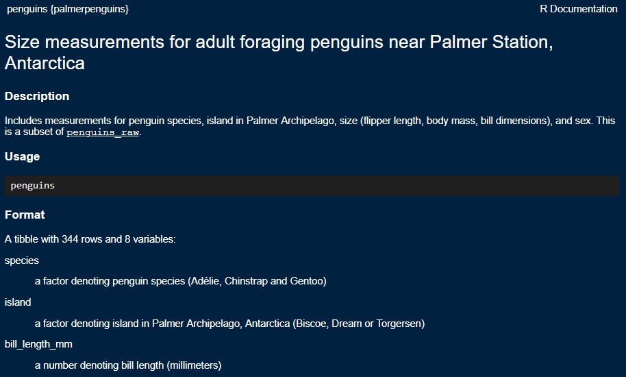
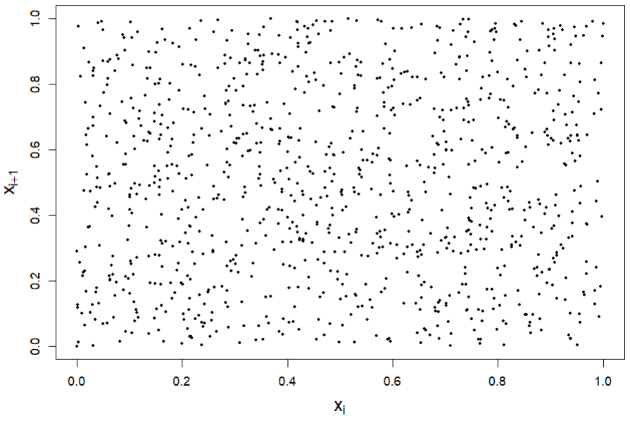

```{r packages, echo=FALSE, message=FALSE, warning=FALSE}
library(tidyverse)
library(magick)
library(xaringanExtra)
library(Tmisc)
library(dsbox) 
library(emo)
xaringanExtra::use_panelset()
```

class: middle

# What is data and datasets?

---

## Dataset
- **Data** are observations or measurements (unprocessed or processed) represented as text, numbers, or multimedia.
- A **dataset** is a structured collection of data generally associated with a unique body of work.
- Majority of datasets are structured in a tabular or rectangular form where:
  - Each row is an **observation**
  - Each column is a **variable**


---

## Data: Palmer Penguins

Measurements for penguin species, island in Palmer Archipelago, size (flipper length, body mass, bill dimensions), and sex.

.pull-left-narrow[
```{r echo=FALSE, out.width="80%"}
knitr::include_graphics("img/penguins.png")
```
]

.pull-right-wide[
```{r eval=FALSE}
library(palmerpenguins)
penguins
```

.small[
```{r echo=FALSE}
library(palmerpenguins)
penguins
```
]
]


---

.question[
How many rows and columns does this dataset have?
What does each row represent?
What does each column represent?
]

Look at the documentation for the dataset

```{r eval = FALSE}
help(penguins)     #or simply ?penguins
```

```{r echo=FALSE, out.width="50%", fig.align='center'}

```

---

.question[
How many rows and columns does this dataset have?
]

```{r}
nrow(penguins) # number of rows
ncol(penguins) # number of columns
dim(penguins)  # dimensions (row column)
```


<br>

Hint: Use `help(<function_name>)` to view the documentation for any `R` function.

---

class: middle

# Exploratory data analysis

---

## What is EDA?

- Exploratory data analysis (EDA) is the first step in **understanding** the main features and structures of a data set.
<br>
- Many statistical tools and techniques are used when performing EDA, but crucially they are **simple** to allow the data __speak__ for itself.
<br>
- Tools that a data scientist may use are:
  - Graphical or visual representations -- this is what we'll focus on first
  - Calculation of simple summary statistics (mean, median, variance, correlation, etc.)
  - Data transformation/wrangling
  - Tabulation
  - etc.

> *"Although we ofter hear that data speak for themselves, their voices can be soft and sly." --- Mosteller et al. (1983)*

---

class: middle

# Data visualization

---

## Data visualization

> *"The simple graph has brought more information to the data analyst's mind than any other device." --- John Tukey*

<br>
- Data visualization is the creation and study of the visual representation of data.
<br>
- There are many tools for visualizing data, `R` is one of them.
<br>
- There are many tools within `R` for making data visualizations
  - The library **ggplot2** is one of them, and that's what we're going to use

---

class: middle

# Why do we visualize?

Three motivating examples:
- Anscombe's quartet.
- Randu random number generation.
- Facebook views.

---

## Anscombe's quartet

Anscombe, F.J. (1973) Graphs in statistical analysis. _The American Statistician_, __27__: 17--21.

```{r quartet-for-show, eval = FALSE, echo = FALSE}
library(Tmisc)
quartet
```

.pull-left[
.pull-left[
```{r quartet-view1, echo = FALSE}
quartet[1:11,]
```
]
.pull-right[
```{r quartet-view2, echo = FALSE}
quartet[12:22,]
```
]
]

.pull-right[
.pull-left[
```{r quartet-view3, echo = FALSE}
quartet[23:33,]
```
]
.pull-right[
```{r quartet-view4, echo = FALSE}
quartet[34:44,]
```
]
]


---

## Summarising Anscombe's quartet


.panelset[
.panel[.panel-name[Plot]
```{r ref.label = "Anscombe_summary", echo = FALSE, warning = FALSE, out.width = "70%", fig.width = 8}
```

<br>

- What is the structure of the 4 datasets?
- Are they the same?


]
.panel[.panel-name[Code]
Code used to calculate summary statistics. Details will be covered later in the course.
```{r Anscombe_summary, fig.show = "hide", eval=FALSE}
library(Tmisc)
quartet %>%
  group_by(set) %>%
  summarise(
    n = n(),
    mean_x = mean(x), 
    mean_y = mean(y),
    sd_x = sd(x),
    sd_y = sd(y),
    r = cor(x, y)
  )
```
]
]

---

## Visualizing Anscombe's quartet

```{r quartet-plot, echo = FALSE, out.width = "70%", fig.asp = 0.5, fig.width=8, fig.align="center"}
ggplot(quartet, aes(x = x, y = y)) +
  geom_point() +
  facet_wrap(~ set, ncol = 4)
```

- Is this what you expected from the summary statistics?

---

## Randu

- Pseudo-random number generators are algorithms that generate a sequence of numbers that satisfy important statistical properties of randomness.
- **Randu** was a popular algorithm for generating random numbers in 1960s & 1970s.
- However, Randu has a major flaw.
  - Do the points look random or do you see any patterns?


```{r echo=FALSE, out.width="40%", fig.align='center'}

```


---

## Randu

- How about now?

```{r echo=FALSE, out.width="30%", fig.align='center'}
knitr::include_graphics("img/randu-3d.png")
```


- Use visualisations to **explore** the data. You may need more than one perspective.

---

## Facebook visits

.question[ 
How many times do you go on Facebook per day?
]

.pull-left[
```{r echo = FALSE, warning = FALSE, fig.width = 8, fig.height = 5}
ggplot(student_survey, aes(x = fb_visits_per_day)) +
  geom_histogram(binwidth = 1) +
  labs(
    title = "How many times do you go on Facebook per day?", 
    x = "Number of times", 
    y = NULL
    )
```
]
.pull-right[
- What insights does this plot give about:
  - how frequent participants are viewing Facebook?
  - how the participants are answering the question?


]

- You may need to iterate between visualisation and data transform.


---

## The good, the bad and the ugly `r emo::ji('cowboy_hat_face')`

<br>


```{r, echo=FALSE, out.width = "100%", fig.align='center'}
knitr::include_graphics("img/good_bad_ugly_plots.png")
```

---

## The Four respects:

1. **Respect the people**
  - Who are the target audience?
  - Respect users perception and cognitive capabilities.
  - Is your visualisation inclusive?
2. **Respect the data**
  - Let the data speak for itself!
  - Use an appropriate visualisation style for the data type.
  - Don't "massage" the data for a particular narrative.
  - Use an informative title and axis labels.
3. **Respect the mathematics**
  - Use of appropriateness geometric attribute (eg, length vs area)
  - Is the geometry of the visualisation correct?
  - Scale and range of the axes.
4. **Respect the computers**
  - Don't overtax the computer

---

class: middle

# ggplot2 

---

## ggplot2 $\in$ tidyverse

.pull-left[
```{r echo=FALSE, out.width="80%"}
knitr::include_graphics("img/ggplot2-part-of-tidyverse.png")
```
] 
.pull-right[ 
- **ggplot2** is tidyverse's data visualization package 
- `gg` in "ggplot2" stands for *Grammar of Graphics* from the book by Leland Wilkinson

```{r echo=FALSE, out.width="100%"}
knitr::include_graphics("img/grammar-of-graphics.png")
```
]

---

## Structure of creating a plot

- `ggplot()` is the main function in ggplot2
- Construct plots by _adding_ (`+`) layers
- Structure of the code for plots can be summarized as:

```{r eval = FALSE}
ggplot(data = [dataset],                                         # Data
       mapping = aes(x = [x-variable], y = [y-variable])) +      # Aesthetics
   geom_[*]() +                                                  # Geometries
   other options                                                 # ...
```


- Many types of geometries:
  - `geom_points()`, `geom_histogram()`, `geom_line()`, `geom_boxplot()`, etc.

- [ggplot2 cheat sheet](https://www.rstudio.com/resources/cheatsheets/)

---

## Example: Penguins dataset


```{r penguins, echo = FALSE, fig.align = "center", fig.width = 6, fig.asp = 1, out.width = "50%", warning = FALSE}
ggplot(data = penguins, 
       mapping = aes(x = bill_depth_mm, y = bill_length_mm,
                     colour = species)) +
  geom_point() +
  labs(title = "Penguin bill depth and length",
       x = "Bill depth (mm)", 
       y = "Bill length (mm)",
       colour = "Species")
```


---

## Coding narative

.midi[
> **Start with the `penguins` data frame,**
> map bill depth to the x-axis
> and map bill length to the y-axis. 
> Represent each observation with a point
> and map species to the colour of each point.
> Title the plot "Penguin bill depth and length", 
> label the x and y axes as "Bill depth (mm)" and "Bill length (mm)", respectively,
> and label the legend "Species".
]

.pull-left[
```{r penguins-0, fig.show = "hide", warning = FALSE}
ggplot(data = penguins) #<<
```
]
.pull-right[
```{r ref.label = "penguins-0", echo = FALSE, warning = FALSE, out.width = "80%", fig.width = 8}
```
]

---

## Coding narative

.midi[
> Start with the `penguins` data frame,
> **map bill depth to the x-axis**
> and map bill length to the y-axis. 
> Represent each observation with a point
> and map species to the colour of each point.
> Title the plot "Penguin bill depth and length", 
> label the x and y axes as "Bill depth (mm)" and "Bill length (mm)", respectively,
> and label the legend "Species".
]

.pull-left[
```{r penguins-1, fig.show = "hide", warning = FALSE}
ggplot(data = penguins,
       mapping = aes(x = bill_depth_mm)) #<<
```
]
.pull-right[
```{r ref.label = "penguins-1", echo = FALSE, warning = FALSE, out.width = "80%", fig.width = 8}
```
]

---

## Coding narative

.midi[
> Start with the `penguins` data frame,
> map bill depth to the x-axis
> **and map bill length to the y-axis.** 
> Represent each observation with a point
> and map species to the colour of each point.
> Title the plot "Penguin bill depth and length", 
> label the x and y axes as "Bill depth (mm)" and "Bill length (mm)", respectively,
> and label the legend "Species".
]

.pull-left[
```{r penguins-2, fig.show = "hide", warning = FALSE}
ggplot(data = penguins,
       mapping = aes(x = bill_depth_mm,
                     y = bill_length_mm)) #<<
```
]
.pull-right[
```{r ref.label = "penguins-2", echo = FALSE, warning = FALSE, out.width = "80%", fig.width = 8}
```
]


---

## Coding narative

.midi[
> Start with the `penguins` data frame,
> map bill depth to the x-axis
> and map bill length to the y-axis. 
> **Represent each observation with a point**
> and map species to the colour of each point.
> Title the plot "Penguin bill depth and length", 
> label the x and y axes as "Bill depth (mm)" and "Bill length (mm)", respectively,
> and label the legend "Species".
]

.pull-left[
```{r penguins-3, fig.show = "hide", warning = FALSE}
ggplot(data = penguins,
       mapping = aes(x = bill_depth_mm,
                     y = bill_length_mm)) + 
  geom_point() #<<
```
]
.pull-right[
```{r ref.label = "penguins-3", echo = FALSE, warning = FALSE, out.width = "80%", fig.width = 8}
```
]

---

## Coding narative

.midi[
> Start with the `penguins` data frame,
> map bill depth to the x-axis
> and map bill length to the y-axis. 
> Represent each observation with a point
> **and map species to the colour of each point.**
> Title the plot "Penguin bill depth and length", 
> label the x and y axes as "Bill depth (mm)" and "Bill length (mm)", respectively,
> and label the legend "Species".
]

.pull-left[
```{r penguins-4, fig.show = "hide", warning = FALSE}
ggplot(data = penguins,
       mapping = aes(x = bill_depth_mm,
                     y = bill_length_mm,
                     colour = species)) + #<<
  geom_point()
```
]
.pull-right[
```{r ref.label = "penguins-4", echo = FALSE, warning = FALSE, out.width = "80%", fig.width = 8}
```
]

---

## Coding narative

.midi[
> Start with the `penguins` data frame,
> map bill depth to the x-axis
> and map bill length to the y-axis. 
> Represent each observation with a point
> and map species to the colour of each point.
> **Title the plot "Penguin bill depth and length", **
> label the x and y axes as "Bill depth (mm)" and "Bill length (mm)", respectively,
> and label the legend "Species".
]

.pull-left[
```{r penguins-5, fig.show = "hide", warning = FALSE}
ggplot(data = penguins,
       mapping = aes(x = bill_depth_mm,
                     y = bill_length_mm,
                     colour = species)) +
  geom_point() +
  labs(title = "Penguin bill depth and length") #<<
```
]
.pull-right[
```{r ref.label = "penguins-5", echo = FALSE, warning = FALSE, out.width = "80%", fig.width = 8}
```
]

---


## Coding narative


.midi[
> Start with the `penguins` data frame,
> map bill depth to the x-axis
> and map bill length to the y-axis. 
> Represent each observation with a point
> and map species to the colour of each point.
> Title the plot "Penguin bill depth and length", 
> **label the x and y axes as "Bill depth (mm)" and "Bill length (mm)", respectively,**
> and label the legend "Species".
]

.pull-left[
```{r penguins-7, fig.show = "hide", warning = FALSE}
ggplot(data = penguins,
       mapping = aes(x = bill_depth_mm,
                     y = bill_length_mm,
                     colour = species)) +
  geom_point() +
  labs(title = "Penguin bill depth and length",
       x = "Bill depth (mm)",  #<<
       y = "Bill length (mm)") #<<
```
]
.pull-right[
```{r ref.label = "penguins-7", echo = FALSE, warning = FALSE, out.width = "80%", fig.width = 8}
```
]

---

## Coding narative


.midi[
> Start with the `penguins` data frame,
> map bill depth to the x-axis
> and map bill length to the y-axis. 
> Represent each observation with a point
> and map species to the colour of each point.
> Title the plot "Penguin bill depth and length", 
> label the x and y axes as "Bill depth (mm)" and "Bill length (mm)", respectively,
> **and label the legend "Species".**
]

.pull-left[
```{r penguins-8, fig.show = "hide", warning = FALSE}
ggplot(data = penguins,
       mapping = aes(x = bill_depth_mm,
                     y = bill_length_mm,
                     colour = species)) +
  geom_point() +
  labs(title = "Penguin bill depth and length",
       x = "Bill depth (mm)", 
       y = "Bill length (mm)",
       colour = "Species") #<<
```
]
.pull-right[
```{r ref.label = "penguins-8", echo = FALSE, warning = FALSE, out.width = "80%", fig.width = 8}
```
]

---


.panelset[
.panel[.panel-name[Plot]
```{r ref.label = "penguins-repeat", echo = FALSE, warning = FALSE, out.width = "45%", fig.align='center', fig.width = 6, fig.asp = 1}
```
]
.panel[.panel-name[Code]

```{r penguins-repeat, fig.show = "hide", warning=FALSE}
ggplot(data = penguins, 
       mapping = aes(x = bill_depth_mm, y = bill_length_mm,
                     colour = species)) +
  geom_point() +
  labs(title = "Penguin bill depth and length",
       x = "Bill depth (mm)", 
       y = "Bill length (mm)",
       colour = "Species")
```


]
]


---


class: middle

# And iterate ...


---

## Aesthetics options

.panelset[
.panel[.panel-name[colour]
.pull-left[
```{r penguins-color, fig.show = "hide", warning = FALSE}
ggplot(data = penguins,
       mapping = aes(x = bill_depth_mm,
                     y = bill_length_mm,
                     colour = species)) + #<<
  geom_point() +
  labs(title = "Penguin bill depth and length",
       x = "Bill depth (mm)", 
       y = "Bill length (mm)",
       colour = "Species")
```
]
.pull-right[
```{r ref.label = "penguins-color", echo = FALSE, warning = FALSE, out.width = "80%", fig.width = 8}
```
]
]

.panel[.panel-name[shape]
.pull-left[
```{r penguins-shape, fig.show = "hide", warning = FALSE}
ggplot(data = penguins,
       mapping = aes(x = bill_depth_mm,
                     y = bill_length_mm,
                     colour = species,
                     shape = sex)) + #<<
  geom_point() +
  labs(title = "Penguin bill depth and length",
       x = "Bill depth (mm)", 
       y = "Bill length (mm)",
       colour = "Species", shape = "Sex")
```
]
.pull-right[
```{r ref.label = "penguins-shape", echo = FALSE, warning = FALSE, out.width = "80%", fig.width = 8}
```
]
]


.panel[.panel-name[size]
.pull-left[
```{r penguins-size, fig.show = "hide", warning = FALSE}
ggplot(data = penguins,
       mapping = aes(x = bill_depth_mm,
                     y = bill_length_mm,
                     colour = species,
                     shape = sex,
                     size = body_mass_g)) + #<<
  geom_point() +
  labs(title = "Penguin bill depth and length",
       x = "Bill depth (mm)", 
       y = "Bill length (mm)",
       colour = "Species", shape = "Sex",
       size = "Body mass (g)")
```
]
.pull-right[
```{r ref.label = "penguins-size", echo = FALSE, warning = FALSE, out.width = "80%", fig.width = 8}
```
]
]


.panel[.panel-name[alpha (transparency)]
.pull-left[
```{r penguins-alpha, fig.show = "hide", warning = FALSE}
ggplot(data = penguins,
       mapping = aes(x = bill_depth_mm,
                     y = bill_length_mm,
                     colour = species,
                     shape = sex,
                     size = body_mass_g,
                     alpha = flipper_length_mm)) + #<<
  geom_point() +
  labs(title = "Penguin bill depth and length",
       x = "Bill depth (mm)", 
       y = "Bill length (mm)",
       colour = "Species", shape = "Sex",
       size = "Body mass (g)",
       alpha = "Flipper length (mm)")
```
]
.pull-right[
```{r ref.label = "penguins-alpha", echo = FALSE, warning = FALSE, out.width = "80%", fig.width = 8}
```
]

- Is this plot easy to understand?! Don't over-burden plots, keep them simple.

]

]

---

## Fix graphical options

- Graphical options can be used within the `geom_[*]()` function to be applied across all cases.  

.pull-left[
```{r penguins-setting, fig.show = "hide", warning = FALSE}
ggplot(data = penguins,
       mapping = aes(x = bill_depth_mm,
                     y = bill_length_mm)) +
  geom_point(colour = "blue",   #<<
             size = 2,          #<<
             shape = "square",  #<<
             alpha = 0.5) +     #<<
  labs(title = "Penguin bill depth and length",
       x = "Bill depth (mm)", 
       y = "Bill length (mm)")
```
]
.pull-right[
```{r ref.label = "penguins-setting", echo = FALSE, warning = FALSE, out.width = "80%", fig.width = 8}
```
]

---

## Co-ordinate limits


.pull-left[
```{r penguins-lims, fig.show = "hide", warning = FALSE}
ggplot(data = penguins,
       mapping = aes(x = bill_depth_mm,
                     y = bill_length_mm,
                     colour = species)) + 
  geom_point() +
  labs(title = "Penguin bill depth and length",
       x = "Bill depth (mm)", 
       y = "Bill length (mm)",
       colour = "Species") + 
  coord_cartesian(xlim = c(10, 25),  #<<
                  ylim = c(30, 60))  #<<
``` 
]
.pull-right[
```{r ref.label = "penguins-lims", echo = FALSE, warning = FALSE, out.width = "80%", fig.width = 8}
```
]


---

## Faceting

- Smaller plots that display different subsets of the data
- Useful for exploring conditional relationships and large data

.panelset[
.panel[.panel-name[grid]
.pull-left[

- 2D grid by stated variables

```{r penguins-grid, fig.show = "hide", warning = FALSE}
ggplot(data = penguins,
       mapping = aes(x = bill_depth_mm,
                     y = bill_length_mm)) + 
  geom_point() +
  facet_grid(species ~ sex) #<<
```
]
.pull-right[
```{r ref.label = "penguins-grid", echo = FALSE, warning = FALSE, out.width = "90%", fig.width = 8, fig.asp = 0.7}
```
]
]

.panel[.panel-name[wrap v1]
.pull-left[
- 1D ribbon

```{r penguins-wrap1, fig.show = "hide", warning = FALSE}
ggplot(data = penguins,
       mapping = aes(x = bill_depth_mm,
                     y = bill_length_mm)) + 
  geom_point() +
  facet_wrap(~ species) #<<
```


- equivalent to:
  - `facet_grid(. ~ species)`

]
.pull-right[
```{r ref.label = "penguins-wrap1", echo = FALSE, warning = FALSE, out.width = "90%", fig.width = 8, fig.asp = 0.7}
```
]


]


.panel[.panel-name[wrap v2]
.pull-left[

- wrapped 1D ribbon according to the specifed number of rows/columns

```{r penguins-wrap2, fig.show = "hide", warning = FALSE}
ggplot(data = penguins,
       mapping = aes(x = bill_depth_mm,
                     y = bill_length_mm)) + 
  geom_point() +
  facet_wrap(~ species, ncol = 2) #<<
```
]
.pull-right[
```{r ref.label = "penguins-wrap2", echo = FALSE, warning = FALSE, out.width = "90%", fig.width = 8, fig.asp = 0.7}
```
]
]


]


---

## Accessibility

- Colours are very useful tool in visualising data, but some people are colour blind.
- `viridis` is one of the colour blind friendly palettes in `ggplot2`.

.pull-left[
```{r penguins-blind, fig.show = "hide", warning = FALSE}
ggplot(data = penguins,
       mapping = aes(x = bill_depth_mm,
                     y = bill_length_mm,
                     colour = species)) +
  geom_point() +
  labs(title = "Penguin bill depth and length",
       x = "Bill depth (mm)", 
       y = "Bill length (mm)",
       colour = "Species") + 
  scale_colour_viridis_d() #<<
```
]
.pull-right[
```{r ref.label = "penguins-blind", echo = FALSE, warning = FALSE, out.width = "80%", fig.width = 8}
```
]


