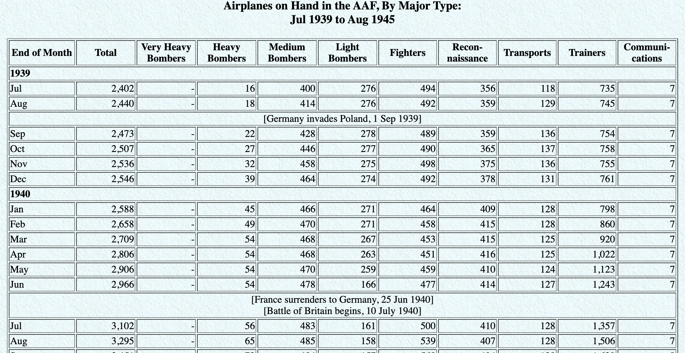

```{r packages, echo=FALSE, message=FALSE, warning=FALSE}
library(tidyverse)
library(fontawesome)
library(emoji)

xaringanExtra::use_panelset()

library(knitr)
hook_output <- knit_hooks$get("output")
knit_hooks$set(output = function(x, options) {
  lines <- options$output.lines
  if (is.null(lines)) {
    return(hook_output(x, options))  # pass to default hook
  }
  x <- unlist(strsplit(x, "\n"))
  more <- "..."
  if (length(lines)==1) {        # first n lines
    if (length(x) > lines) {
      # truncate the output, but add ....
      x <- c(head(x, lines), more)
    }
  } else {
    x <- c(more, x[lines], more)
  }
  # paste these lines together
  x <- paste(c(x, ""), collapse = "\n")
  hook_output(x, options)
})

```


## Tidy data

>Happy families are all alike; every unhappy family is unhappy in its own way. 
>
>Leo Tolstoy


.pull-left[
**Characteristics of tidy data:**

- Each variable forms a column.
- Each observation forms a row.
- Each type of observational unit forms a table.
]

.pull-right[
**Characteristics of untidy data:**

- Merged cells.
- Repeated or non-informative variable/column names.
- Cell comments or superfluous information.
- Empty or total/subtotal rows.
- ... 
]

---

## 

.question[
What makes this data not tidy?
]

```{r hyperwar-airplanes-on-hand, echo=FALSE, out.width="90%", fig.align = "center", caption = "WW2 Army Air Force combat aircraft", out.width = "70%"}

```

.footnote[
Source: [Army Air Forces Statistical Digest, WW II](https://www.ibiblio.org/hyperwar/AAF/StatDigest/aafsd-3.html)
]

---

.question[
What makes this data not tidy?
]

<br>

```{r hiv-est-prevalence-15-49, echo=FALSE, out.width="95%", fig.align = "center", caption = "Estimated HIV prevalence among 15-49 year olds", out.width = "70%"}
knitr::include_graphics("img/hiv-est-prevalence-15-49.png")
```

<!-- .footnote[ 
Source: [Gapminder, Estimated HIV prevalence among 15-49 year olds](https://www.gapminder.org/data)
]
-->
Source: [Gapminder, Estimated HIV prevalence among 15-49 year olds](https://www.gapminder.org/data)


---

## Displaying vs. summarising data


.panelset[
.panel[
.panel-name[Tables]

.pull-left[

| Name | Species | Height | Mass |
|:----|----:|----:|---:|
| Luke Skywalker      | Human |  172 |    77 |
| C-3PO               | Droid |  167 |    75 |
| R2-D2               | Droid |   96 |    32 |
| Darth Vader         | Human |  202 |   136 |
| Leia Organa         | Human |  150 |    49 |
| ... | ... | ... | ... |
]

.pull-right[

| Species | Count | Average Height |
|:----|----:|----:|
| Droid | 6   | 131 |
| Human | 35  | 177 |
| Other | 46  | 178 |


`r fontawesome::fa("fas fa-arrow-turn-up", fill = "none", height = "4em")`

`r fontawesome::fa("fas fa-arrow-turn-up", fill = "white", height = "3em")`

]

]

.panel[
.panel-name[Code]

```{r eval=FALSE}
library(tidyverse)
```

.pull-left[
```{r eval = FALSE}
starwars %>%
  select(species, height, mass)

```
]

.pull-right[
```{r eval = FALSE}
starwars %>%
  select(species, height) %>%
  mutate(species_group = case_when(
    species == "Droid" ~ "Droid",
    species == "Human" ~ "Human",
    TRUE ~ "Other")) %>%
  group_by(species_group) %>%
  summarise(
    count = n(),
    avg_height = mean(height, na.rm = TRUE)
  )

```
]

]

]


---


class: middle

# Grammar of data wrangling

---

## A grammar of data wrangling...

... based on the concepts of functions as verbs that manipulate data frames

.pull-left[
```{r dplyr-part-of-tidyverse, echo=FALSE, out.width="70%", caption = "dplyr is part of the tidyverse"}
knitr::include_graphics("img/dplyr-part-of-tidyverse.png")
```
]
.pull-right[
.midi[
- `select`: pick columns by name
- `arrange`: reorder rows
- `slice`: pick rows using index(es)
- `filter`: pick rows matching criteria
- `distinct`: filter for unique rows
- `mutate`: add new variables
- `summarise`: reduce variables to values
- `group_by`: for grouped operations
- ... (many more)
]

```{r eval=FALSE}
<function_name>(<dataset_name>, ...)
```

```{r eval = FALSE}
help(select)
```
]

---

## `select` specific variables

.pull-left[
```{r starwars_selecting}
select(starwars, name, height, mass)
```
]

.pull-right[
```{r starwars_deleting, R.options = list(width = 40)}
select(starwars, -name)
```
]

---


## Select helper functions

.pull-left[
```{r starwars_selecting_string}
select(starwars, ends_with("color"))
```
]

.pull-right[
<br>
.small[
*   `starts_with()`: Starts with a prefix
*   `ends_with()`: Ends with a suffix
*   `contains()`: Contains a literal string
*   `num_range()`: Match a numerical range like x01, x02, x03
*   `one_of()`: Matches variable names in a character vector
*   `everything()`: Matches all variables
*   `last_col()`: Select last variable, possibly with an offset
*   `matches()`: Matches a regular expression (a sequence of symbols/characters expressing a string/pattern to be searched for within text)

See the help page for more info on these functions.
]
]


---

## `arrange` mass in numerical order

.pull-left[
Ascending order:
```{r starwars_arrange_asc, R.options = list(width = 40), output.lines = 10}
arrange(starwars, mass)
```
]

.pull-right[
Descending order:
```{r starwars_arrange_desc, R.options = list(width = 40), output.lines = 10}
arrange(starwars, desc(mass))
```
]


---

## `slice` for certain row numbers

.pull-left[
```{r starwars_slice_top, R.options = list(width = 40), ouput.lines = 10}
slice(starwars, 1:4)
```
]

.pull-right[
```{r starwars_slice_even, R.options = list(width = 40), ouput.lines = 10}
slice(starwars, c(2,4,6,8))
```
]
---

## `filter` for the droids

```{r starwars_filter, R.options = list(width = 80)}
filter(starwars, species == "Droid")
```


<br>

"These aren't the droids you're looking for!"


---

## Logical operators in R


| Code    | Description           | Example        | Output  |
|:-------:|:----------------------|:---------------|:--------|
| `<`     | Strictly less than    | `1 < 2`        | `TRUE`  |
| `<=`    | Less than or equal to | `2 <= 2`       | `TRUE`  | 
| `>`     | Strictly greater than | `-3 > 3`       | `FALSE` |
| `>=`    | Greater than or equal to | `10 >= 0`      | `TRUE`  |
| `==`    | Exactly equal to      | `pi == 3.14`   | `FALSE` |
| `!=`    | Not equal to          | `pi != 3.14`   | `TRUE`  |
| ` `     | ` `                   | ` `            | ` `     |
| ` `     | ` `                   | ` `            | ` `     |
| ` `     | ` `                   | ` `            | ` `     |
| `x & y` | Logical AND operator  | `TRUE & FALSE` | `FALSE` |
| `x `<span, style="color:#a7a798;">&nbsp;&nbsp;&#124;&nbsp;&nbsp;</span>` y` | Logical OR operator   | `TRUE `<span, style="color:#a7a798;">&nbsp;&nbsp;&#124;&nbsp;&nbsp;</span>` FALSE` | `TRUE`  |
| `!x`    | Logical NOT operator  | `!TRUE `       | `FALSE` |

```{r starwars_filter2, eval=FALSE}
filter(starwars, species == "Droid" & height < 100)
```


---

### `mutate` to compute BMI and species group

.pull-left[
```{r starwars_mutate, eval = FALSE}
mutate(starwars, 
       bmi = 10000 * mass / height^2,
       species_grp = 
         case_when(
           species == "Human" ~ "Human",
           species == "Droid" ~ "Droid",
           TRUE ~ "Other"
         ))
```
]


.pull-right[
```{r starwars_mutate_output, echo = FALSE, R.options=list(width = 40)}
mutate(starwars, 
       bmi = 10000 * mass / height^2,
       species_grp = 
         case_when(
           species == "Human" ~ "Human",
           species == "Droid" ~ "Droid",
           TRUE ~ "Other"
         )) %>% 
  arrange(desc(bmi)) %>%
  relocate(name, bmi, species_grp)
```
]


---

## `count` to make a frequency table

.pull-left[
```{r count_1var}
count(starwars, eye_color, sort = TRUE)
```
]


---

## `summerise` to compute the average height

.pull-left[
`r emoji::emoji("white_check_mark")` Informative variable name
```{r starwars_avg, eval = FALSE}
summarise(starwars, avg_ht = mean(height))
```
```{r starwars_avg2, echo = FALSE}
summarise(na.omit(starwars), avg_ht = mean(height))
```


```{r starwars_summary, eval = FALSE}
summarise(starwars, 
          min_ht = min(height),
          avg_ht = mean(height),
          med_ht = median(height),
          max_ht = max(height),
          sd_ht = sd(height))
```
```{r starwars_summary2, echo = FALSE}
summarise(na.omit(starwars), 
          min_ht = min(height),
          avg_ht = mean(height),
          med_ht = median(height),
          max_ht = max(height),
          sd_ht = sd(height))
```

]


.pull-right[
`r emoji::emoji("x")` Bad/sloppy variable name
```{r starwars_avg_bad, eval = FALSE}
summarise(starwars, mean(height))
```
```{r starwars_avg_bad2, echo = FALSE}
summarise(na.omit(starwars), mean(height))
```

.tip[
`summarise()` changes the data frame entirely, it collapses rows down to a single summary statistic, and removes all columns that are irrelevant to the calculation.
]

]


---

class: middle

# .hand[We...]

.huge[.green[have]] .hand[a single data frame]

.huge[.pink[want]] .hand[to slice it, and dice it, and juice it, and process it]


---

## How to do multiple data wrangling steps?


.pull-left[
**Method 1**: Nesting

```{r bad_combine_nesting, eval = FALSE}
summarise( 
  filter( 
    starwars, 
    species == "Human"
    ), 
  avg_mass = mean(mass, na.rm = TRUE)
  )
```

*ISSUE*: Where do you begin reading the code?!

]

.pull-right[
**Method 2**: Assign to Memory

```{r bad_combine_memory, eval = FALSE}
starwars_humans <-  
  filter(starwars, 
         species == "Human")

summarise(starwars_humans, 
          av_mass = mean(mass, 
                         na.rm = TRUE))
```

*ISSUE*: How good is *your* memory of each object in the computer's memory?!
]

.question[
Which method (if either) produces `tidy` code that is easy to read? Can we do any better?
]


---

class: middle

# Pipes

---

## What is a pipe?

In programming, a pipe is a technique for passing information from one process to another.


The pipe operator is implemented in the package **magrittr**, though we don't need to load this package explicitly since **tidyverse** does this for us.

.pull-left[
```{r magrittr_hex, echo=FALSE, out.width="50%", caption = "magrittr's pipe", fig.align="center"}
knitr::include_graphics("img/magrittr_hex.png")
```
]

.pull-right[

```{r pipeg, eval = FALSE}
data %>% 
  select(variable1, variable2) %>%
  filter(variable1 <= variable2)
```

.center[
`r fontawesome::fa("fas fa-arrow-down", fill = "white")`
]

```{r piping_img, echo=FALSE, out.width="100%", caption = "magrittr's pipe"}

```

]


---

## The piping narrative

.pull-left[

* **Take the `starwars` data set and ...**

]

.pull-right[
.small[
```{r pipe_narrative1, R.options = list(width = 60)}
starwars #<<
```
]
]

---

## The piping narrative

.pull-left[

* Take the `starwars` data set and ...
* **... select the `species` and `height` variables. **

]

.pull-right[
.small[
```{r pipe_narrative2, R.options = list(width = 60)}
starwars %>%
  select(species, height) #<<
```
]
]

---
## The piping narrative

.pull-left[

* Take the `starwars` data set and ...
* ... select the `species` and `height` variables. 
* **Mutate the data to add a new categorical variable called `species_group` that classifies a character's `species` as either "Droid", "Human" or "Other".**

]

.pull-right[
.small[
```{r pipe_narrative3, R.options = list(width = 60)}
starwars %>%
  select(species, height) %>%
  mutate(species_group = case_when(  #<<
    species == "Droid" ~ "Droid",    #<<
    species == "Human" ~ "Human",    #<<
    TRUE ~ "Other"))                 #<<
  
```
]
]

---
## The piping narrative

.pull-left[

* Take the `starwars` data set and ...
* ... select the `species` and `height` variables. 
* Mutate the data to add a new categorical variable called `species_group` that classifies a character's `species` as either "Droid", "Human" or "Other".
* **Next, group the data according to their `species_group`, and ...**

]

.pull-right[
.small[
```{r pipe_narrative4, R.options = list(width = 60)}
starwars %>%
  select(species, height) %>%
  mutate(species_group = case_when(
    species == "Droid" ~ "Droid",
    species == "Human" ~ "Human",
    TRUE ~ "Other")) %>%
  group_by(species_group) #<<
```
]
]

---
## The piping narrative

.pull-left[

* Take the `starwars` data set and ...
* ... select the `species` and `height` variables. 
* Mutate the data to add a new categorical variable called `species_group` that classifies a character's `species` as either "Droid", "Human" or "Other".
* Next, group the data according to their `species_group`, and ...
* **... summarise the data to return ...**

]

.pull-right[
.small[
```{r pipe_narrative5, R.options = list(width = 60)}
starwars %>%
  select(species, height) %>%
  mutate(species_group = case_when(
    species == "Droid" ~ "Droid",
    species == "Human" ~ "Human",
    TRUE ~ "Other")) %>%
  group_by(species_group) %>%
  summarise()    #<<
```
]
]

---
## The piping narrative

.pull-left[

* Take the `starwars` data set and ...
* ... select the `species` and `height` variables. 
* Mutate the data to add a new categorical variable called `species_group` that classifies a character's `species` as either "Droid", "Human" or "Other".
* Next, group the data according to their `species_group`, and ...
* ... summarise the data to return ...
  *   **... the group's sample size and ...**

]

.pull-right[
.small[
```{r pipe_narrative6, R.options = list(width = 60)}
starwars %>%
  select(species, height) %>%
  mutate(species_group = case_when(
    species == "Droid" ~ "Droid",
    species == "Human" ~ "Human",
    TRUE ~ "Other")) %>%
  group_by(species_group) %>%
  summarise(
    count = n()   #<<
  )
```
]
]

---

## The piping narrative

.pull-left[

* Take the `starwars` data set and ...
* ... select the `species` and `height` variables. 
* Mutate the data to add a new categorical variable called `species_group` that classifies a character's `species` as either "Droid", "Human" or "Other".
* Next, group the data according to their `species_group`, and ...
* ... summarise the data to return ...
  *   ... the group's sample size and ...
  *   **... the group's sample mean** 

]

.pull-right[
.small[
```{r pipe_narrative7, R.options = list(width = 60)}
starwars %>%
  select(species, height) %>%
  mutate(species_group = case_when(
    species == "Droid" ~ "Droid",
    species == "Human" ~ "Human",
    TRUE ~ "Other")) %>%
  group_by(species_group) %>%
  summarise(
    count = n(),
    avg_height = mean(height)  #<<
  )
```
]
]

---


## The piping narrative

.pull-left[

* Take the `starwars` data set and ...
* ... select the `species` and `height` variables. 
* Mutate the data to add a new categorical variable called `species_group` that classifies a character's `species` as either "Droid", "Human" or "Other".
* Next, group the data according to their `species_group`, and ...
* ... summarise the data to return ...
  *   ... the group's sample size and ...
  *   ... the group's sample mean **(excluding the rows where data is not available, `NA`).**

]

.pull-right[
.small[
```{r pipe_narrative8, R.options = list(width = 60)}
starwars %>%
  select(species, height) %>%
  mutate(species_group = case_when(
    species == "Droid" ~ "Droid",
    species == "Human" ~ "Human",
    TRUE ~ "Other")) %>%
  group_by(species_group) %>%
  summarise(
    count = n(),
    avg_height = mean(height, na.rm = TRUE)  #<<
  )
```
]
]

---


## A note on piping and layering

- `%>%` is used in data wrangling pipelines. We _pipe_ the output of the previous line of code as the first input of the next line of code.

- Later on you will see another simple command to collocate lines of codes under data visualization

- Namely, `+` is used in **ggplot2** plots for "layering". We will create the plot by _adding_ layers (in Week 4)

- Be aware of how `%>%` and `+` are used differently!

- They can be combined for certain tasks! But we are not allowed to use them interchangeably. 
