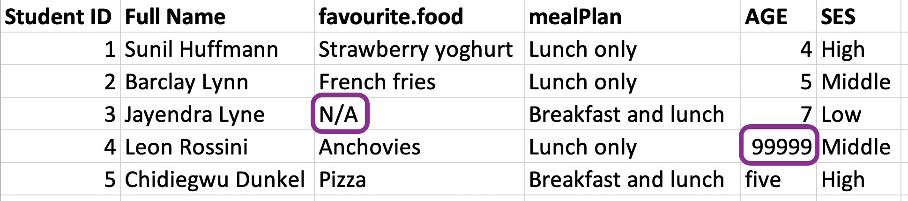
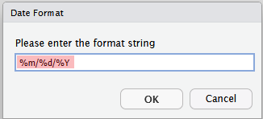

```{r packages, echo=FALSE, message=FALSE, warning=FALSE}
library(tidyverse)
library(readxl)
library(janitor)
library(skimr)
library(knitr)
library(DT)
library(here)
library(emoji)
```


```{r echo=FALSE, eval = FALSE}
read_csv2("data/tube-stations.csv")
read_csv("data/tube-stations2.csv")
read_tsv("data/tube-stations3.csv")
read_fwf("data/tube-stations4.txt", fwf_widths(c(30, 15, 20, 15, 50)))  ##does not support first row headers!

read_excel("data/tube-stations.xlsx")
```


class: middle

# Reading and writing rectangular data

---

## Ways of rectangular data may be stored


.pull-left[
- comma delimitation
```{r echo=FALSE, out.width="100%", fig.align='center'}

```

- semicolon delimitation
```{r echo=FALSE, out.width="100%", fig.align='center'}

```
]

.pull-right[
- tab delimitation
```{r echo=FALSE, out.width="100%", fig.align='center'}

```

- MS Excel encoding
```{r echo=FALSE, out.width="100%", fig.align='center'}
knitr::include_graphics("img/data_structures/excel.png")
```
]

---


## Reading data

.pull-left[
**readr** - part of tidyverse
- `read_csv()` - comma delimited files
- `read_csv2()` - semicolon separated files (common in countries where , is used as the decimal place)
- `read_tsv()` - tab delimited files
- `read_delim()` - reads in files with any delimiter
- ...

**readxl** - _not_ part of tidyverse
- `read_excel()` - read xls or xlsx files
- ...

]

.pull-right[
```{r echo=FALSE, out.width="35%", fig.align='center'}
knitr::include_graphics("img/readr.png")
```
<br>
```{r echo=FALSE, out.width="35%", fig.align='center'}
knitr::include_graphics("img/readxl.png")
```
]

---

## Reading data (skipping first few lines)

.pull-left[
```{r message = FALSE, R.options=list(width = 40)}
library(readxl)
tube <- read_excel(
  path = "data/tube-stations.xlsx")
glimpse(tube)
```
]

.pull-right[
```{r message = FALSE, R.options=list(width = 40)}
tube <- read_excel(
  path = "data/tube-stations.xlsx", 
  skip = 2)
glimpse(tube)
```
]

---

## Writing data to file

Most read functions have a corresponding write function.

```{r}
write_csv(tube, file = "data/tube-station-comma.csv")
write_csv2(tube, file = "data/tube-station-semicolon.txt")
write_tsv(tube, file = "data/tube-station-tab.txt")
```

Note, a file write is a quiet function (it does return anything to R!)

```{r message = FALSE}
glimpse( read_tsv("data/tube-station-tab.txt") )
```


---

class: middle

# Variable names

---

## Data with bad names

```{r message=FALSE}
edibnb_badnames <- read_csv("data/edibnb-badnames.csv")
names(edibnb_badnames)
```


... but R doesn't allow spaces in variable names

```{r error=TRUE}
ggplot(edibnb_badnames, aes(x = Number of bathrooms, y = Price)) +
  geom_point()
```


---

## Option 1 - Manual edit

-   Edit the column names in the raw data file to `snake_name` style
-   OK, provided that you are only ever working with one file
-   Method is not _reproducible_ if developing a data flow where your data file may be updated
-   Can this be done in the code?


---

## Option 2 - Define column names

```{r}
edibnb_col_names <- read_csv("data/edibnb-badnames.csv", skip = 1,
                             col_names = c("id", "price", "neighbourhood", "accommodates", 
                                           "bathroom", "bedroom", "bed", 
                                           "review_scores_rating", "n_reviews", "url"))

names(edibnb_col_names)
```

---

## Option 3 - `clean_names` to snake_case

```{r warning=FALSE, message=FALSE}
library(janitor)       #may need to run: install.packages("janitor")
```
```{r warning=FALSE}
edibnb_clean_names <- read_csv("data/edibnb-badnames.csv") %>%
  clean_names()

names(edibnb_clean_names)
```

---

class: middle

# Variable types

---

## Which type is variable `x`?

.pull-left[
```{r echo=FALSE, out.width="100%"}
knitr::include_graphics("img/df-na.png")
```
]
.pull-right[
```{r eval=FALSE, R.options=list(width = 50)}
read_csv("data/df-na.csv")
```

```{r echo=FALSE, R.options=list(width = 50)}
read_csv("data/df-na.csv") %>% print(n = 10)
```
]

---

## Option 1. Explicit NAs

```{r eval=FALSE}
read_csv("data/df-na.csv", 
         na = c("", "NA", ".", "9999", "Not applicable"))
```

.pull-left[
```{r echo=FALSE, out.width="100%"}
knitr::include_graphics("img/df-na.png")
```
]
.pull-right[
```{r echo=FALSE,message=FALSE}
read_csv("data/df-na.csv", 
  na = c("", "NA", ".", "9999",
         "Not applicable")) %>% 
  print(n = 10)
```
]

---

## Option 2. Specify column types

```{r eval=FALSE}
read_csv("data/df-na.csv", col_types = list(col_double(), 
                                            col_character(), 
                                            col_character()))
```

```{r echo=FALSE, warning = FALSE}
read_csv("data/df-na.csv", col_types = list(col_double(), 
                                            col_character(), 
                                            col_character())) %>%
  print(n = 10)
```

---

## Column types

.small[
**type function**  | **data type**
------------------ | -------------
`col_character()`  | character
`col_date()`       | date
`col_datetime()`   | POSIXct (date-time)
`col_double()`     | double (numeric)
`col_factor()`     | factor
`col_guess()`      | let readr guess (default)
`col_integer()`    | integer
`col_logical()`    | logical
`col_number()`     | numbers mixed with non-number characters
`col_numeric()`    | double or integer
`col_skip()`       | do not read
`col_time()`       | time
]

---


class:middle

# Case study: Favourite foods

---

## Favourite foods

```{r echo=FALSE, out.width="80%", fig.align='center'}

```


```{r}
fav_food <- read_excel("data/favourite-food.xlsx") #<<
fav_food
```

---

## Variable names

```{r echo=FALSE, out.width="80%", fig.align='center'}

```


```{r warning=FALSE}
fav_food <- read_excel("data/favourite-food.xlsx") %>%
  clean_names() #<<
fav_food 
```

---

## Handling NAs

```{r echo=FALSE, out.width="80%", fig.align='center'}

```


```{r warning=FALSE}
fav_food <- read_excel("data/favourite-food.xlsx",
                       na = c("N/A", "99999")) %>% #<<
  clean_names()
fav_food 
```

---

## Make `age` numeric

.pull-left-wide[
```{r warning=FALSE, R.options=list(width = 60)}
fav_food <- fav_food %>%
  mutate( #<<
    age = if_else(age == "five", "5", age), #<<
    age = as.numeric(age) #<<
    ) #<<

glimpse(fav_food) 
```
]
.pull-right-narrow[
```{r echo=FALSE}

```
]

---

## Socio-economic status

.pull-left-wide[
```{r}
fav_food %>%
  count(ses)
```
]
.pull-right-narrow[
```{r echo=FALSE, out.width="75%", fig.align='center'}

```
]


.question[
Does the order of the `ses` categories make sense?
]


---

## Make `ses` factor

.pull-left-wide[
```{r warning=FALSE}
fav_food <- fav_food %>%
  mutate(ses = fct_relevel(ses, "Low", "Middle", "High")) #<<

fav_food %>%
  count(ses)
```
]

---

## Putting it altogether

```{r warning=FALSE}
fav_food <- read_excel("data/favourite-food.xlsx", na = c("N/A", "99999")) %>%
  clean_names() %>%
  mutate(
    age = if_else(age == "five", "5", age), 
    age = as.numeric(age),
    ses = fct_relevel(ses, "Low", "Middle", "High")
  )

fav_food
```


---

## Out and back in

```{r message = FALSE}
write_csv(fav_food, file = "data/fav-food-clean.csv")

fav_food_clean <- read_csv("data/fav-food-clean.csv")
```

```{r}
fav_food_clean %>%
  count(ses)
```

.question[
What happened to the order of `ses` categories?
]

---

## `read_rds()` and `write_rds()`

- CSVs can be unreliable for saving interim results if there is specific variable type information you want to hold on to.
- An alternative is RDS files ('R data single'), you can read and write them with `read_rds()` and `write_rds()`, respectively.

```{r message = FALSE}
write_rds(fav_food, file = "data/fav-food-clean.rds")
fav_food_clean <- read_rds("data/fav-food-clean.rds")
fav_food_clean %>%
  count(ses)
```


---

class: middle

# Other types of data

---

## Other types of data importing

- **googlesheets4:** Google Sheets
- **haven**: SPSS, Stata, and SAS files
- **DBI**, along with a database specific backend (e.g. RMySQL, RSQLite, RPostgreSQL etc): allows you to run SQL queries against a database and return a data frame
- **jsonline**: JSON
- **xml2**: xml
- **rvest**: web scraping
- **httr**: web APIs
- **sparklyr**: data loaded into spark

<br>

`r emoji::emoji("down_arrow")` You may need to install specialised R packages to read data from a specific format


---

class: middle

# Using RStudio GUI (Graphical User Interface)


---

## Importing CSV data

- We've talked about the `read_csv` function

- The options are a little bit fiddly, especially for wide datasets with many variables
  
- You have to inspect the dataset manually to get it right


```{r read-csv, echo = T}
tube <- read_csv("data/tube-stations.csv")
```

Well, this doesn't seem to have worked!  Let's look at the dataset…

---
## Tube stations data

```{r show-data, echo = T}
tube
```
- The separators are semicolons, not commas!
- So we could use `read_csv2` - but we have to remember that!
- Is there an easier way?
---

class: inverse
background-image: url("img/GUI/From-text-readr.png")

## The "Import Dataset" menu
-   **Environment** tab (top-right pane)
-   Several options!  Choose **From Text (readr)...**.

---
class: inverse
background-image: url("img/GUI/Import-box.png")
background-size: contain

---
class: inverse
background-image: url("img/GUI/Preview-1.png")
background-size: contain
---
class: inverse
background-image: url("img/GUI/Preview-2.png")
background-size: contain
---

## Choosing a data type from drop-down menu


.pull-left[
For the "Zone" column

.center[]
]


.pull-right[
For the "Opened" column

.center[]
]

---

## Date formats

The default isn't right!

Our dates are of the form `01-JAN-1900`, so we need to type `%d-%b-%Y` into the box. 

(`%b` encondes 3 character months, run `help(col_date)` for more on syntax)

.pull-left[
.center[]

]

.pull-right[
.center[]
]

---

## Importing from a CSV using the GUI

.center[]

- All the data types are correct
- Note the non-integer Zone has become an `NA` …
- … but not all NAs have been removed!
---
## Importing from a CSV using the GUI

.center[]

- We can run the code directly from the dialogue box, but that won't help with reproducibility/portability of the code
- Instead, click the clipboard button (`r emoji::emoji("clipboard")`) to copy the code into yout editor.

---
## Importing from a CSV using the GUI


```{r csv-data-import, echo = T}
#library(readr)
tube_stations <- read_delim("data/tube-stations.csv", 
    delim = ";", escape_double = FALSE, col_types = cols(Zone = col_integer(), 
        Opened = col_date(format = "%d-%b-%Y")), 
    trim_ws = TRUE)
```
It gives us the `readr` library, but if we've already imported the tidyverse we don't need to include that line, and can delete it.

The warning message here is fine---it's telling us that "`not in a zone`" is not an integer, which we already know!
---

## Importing from a CSV using the GUI

Let's prove it worked!


```{r csv-summary, echo =T}
tube_stations %>%
  summarise(mean_date = mean(Opened), med_zone = median(Zone, na.rm = T))
```

- The mean date is in the future because we haven't corrected that Year 3000 date yet!
- .small[FYI, Battersea underground station opened in 20-SEP-2021.]
---

## Our data in an Excel file


.center[]

---
class: inverse
background-image: url("img/GUIxl/From-text-readr.png")

## The "Import Dataset" menu

-   **Environment** tab (top-right pane)
-   Now we want **From Excel...**.

---

class: inverse
background-image: url("img/GUIxl/Import-box.png")
background-size: contain

---
class: inverse
background-image: url("img/GUIxl/Preview-1.png")
background-size: contain
---

## Importing from Excel using the GUI

.center[]

- We need to specify the range of cells in which the data are stored (or use the **Skip:** field)
- The **Name:** field is the name under which we'll store the data once imported
  - Choose something different to avoid overwriting!

---

## Importing from Excel using the GUI

.center[]


- Check and edit the data types for each variable
- We don't get separate **double** and **integer** options here: all we can choose is **numeric** (we can fix that later)

---

## Importing from Excel using the GUI

.center[]

- Again, let's copy this out using the clipboard icon…

```{r excel-code, echo = T, warning = F}
library(readxl)
tube_stations_excel <- read_excel("data/tube-stations.xlsx", 
    range = "A3:E11", col_types = c("text", 
        "text", "numeric", "text", "numeric"))
```
- I've suppressed the warnings (`warning = F` in the code chunk label) because it gives lots, for every time it changes the data type in a cell
