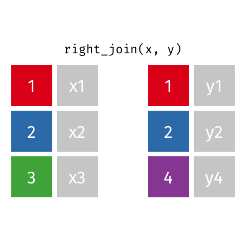

```{r packages, echo=FALSE, message=FALSE, warning=FALSE}
library(tidyverse)
library(knitr)
options(
  dplyr.print_min = 10, 
  dplyr.print_max = 10
  )
xaringanExtra::use_panelset()
```

class: middle

# .hand[We...]

.huge[.green[have]] .hand[a single data frame]

.huge[.pink[want]] .hand[to slice it, and dice it, and juice it, and process it]

---

## Reminder

.pull-left[

The **grammar** of data wrangling
- `select`: pick columns by name
- `arrange`: reorder rows
- `slice`: pick rows using index(es)
- `filter`: pick rows matching criteria
- `distinct`: filter for unique rows
- `mutate`: add new variables
- `summarise`: reduce variables to values
- `group_by`: for grouped operations
- ... (many more)
]

--

.pull-right[
**Pipe** the steps together
```{r reminder, eval = FALSE}
starwars %>%
  select(species, height) %>%
  mutate(species_group = case_when(
    species == "Droid" ~ "Droid",
    species == "Human" ~ "Human",
    TRUE ~ "Other")) %>%
  group_by(species_group) %>%
  summarise(
    count = n(),
    avg_height = mean(height, na.rm = TRUE)
  )
```
]

---

class: middle

# .hand[We...]

.huge[.green[have]] .hand[multiple data frames]

.huge[.pink[want]] .hand[to bring them together]

---

```{r include=FALSE}
professions <- read_csv("data/scientists/professions.csv")
dates <- read_csv("data/scientists/dates.csv")
works <- read_csv("data/scientists/works.csv")
```

## Data: Women in science 

Information on 10 women in science who changed the world

.small[
```{r echo=FALSE}
professions %>% select(name) %>% kable()
```
]


.footnote[
Source: [Discover Magazine](https://www.discovermagazine.com/the-sciences/meet-10-women-in-science-who-changed-the-world)
]

---

## Reading the data*

Project directory structure

<ul>
  <li> Lecture6.Rmd </li>
  <li> Lecture6.html </li>
  <li> data/ </li>
  <ul>
    <li> scientists/ </li>
    <ul>
      <li> professions.csv </li>
      <li> dates.csv </li>
      <li> works.csv </li>
    </ul>
  </ul>
</ul>


```{r eval=FALSE}
professions <- read_csv("data/scientists/professions.csv")
dates <- read_csv("data/scientists/dates.csv")
works <- read_csv("data/scientists/works.csv")
```

.small[
*Check w03-L05 slides about data importing!
]

---

## A closer look

.panelset[

.panel[.panel-name[professions]
```{r}
professions
```
]

.panel[.panel-name[dates]
```{r}
dates
```
]

.panel[.panel-name[works]
```{r}
works
```
]

]

---

## Desired joined output

```{r echo=FALSE}
professions %>%
  left_join(dates, by = "name") %>%
  left_join(works, by = "name")
```

---

## Inputs, reminder

.pull-left[
```{r}
names(professions)
names(dates)
names(works)
```
]
.pull-right[
```{r}
nrow(professions)
nrow(dates)
nrow(works)
```
]

Observations:
* `dates` and `works` have missing rows
* variable `name` is common for all data sets

---

class: middle

# Joining data frames

---

## Joining data frames

```{r eval=FALSE}
something_join(x, y)
```

- `left_join()`: all rows from x
- `right_join()`: all rows from y
- `full_join()`: all rows from both x and y
- `semi_join()`: all rows from x where there are matching values in y, keeping just columns from x
- `inner_join()`: all rows from x where there are matching values in y, return 
all combination of multiple matches in the case of multiple matches
- `anti_join()`: return all rows from x where there are not matching values in y, never duplicate rows of x
- ...
 
---

## Setup

Let's keep things simple. For the next few slides...

.pull-left[
```{r echo=FALSE}
x <- tibble(
  id = c(1, 2, 3),
  value_x = c("x1", "x2", "x3")
  )
```
```{r}
x
```
]
.pull-right[
```{r echo=FALSE}
y <- tibble(
  id = c(1, 2, 4),
  value_y = c("y1", "y2", "y4")
  )
```
```{r}
y
```
]

---

## `left_join()`

.pull-left[
```{r echo=FALSE, out.width="80%", out.extra ='style="background-color: #FDF6E3"'}
include_graphics("img/left-join.gif")
```
]
.pull-right[
```{r}
left_join(x, y, by = "id")
```

```{r}
x %>% left_join(y, by = "id")
```
]

---

## `left_join()`

```{r}
professions %>%
  left_join(dates, by = "name") #<<
```


---

## `right_join()`

.pull-left[
```{r echo=FALSE, out.width="80%", out.extra ='style="background-color: #FDF6E3"'}

```
]
.pull-right[
```{r}
right_join(x, y, by = "id")
```

```{r}
x %>% right_join(y, by = "id")
```

]

---

## `right_join()`


```{r}
professions %>%
  right_join(dates, by = "name") #<<
```

.question[
Would `left_join(x, y, by="id")` and `right_join(y, x, by = "id")` produce the same result?
]


---

## `full_join()`

.pull-left[
```{r echo=FALSE, out.width="80%", out.extra ='style="background-color: #FDF6E3"'}
include_graphics("img/full-join.gif")
```
]
.pull-right[
```{r}
full_join(x, y, by = "id")  
```


]

---

## `full_join()`

```{r}
dates %>%
  full_join(works, by = "name") #<<
```

---

## `inner_join()`

.pull-left[
```{r echo=FALSE, out.width="80%", out.extra ='style="background-color: #FDF6E3"'}
include_graphics("img/inner-join.gif")
```
]
.pull-right[
```{r}
inner_join(x, y, by = "id")
```
]

---

## `inner_join()`

```{r}
dates %>%
  inner_join(works, by = "name") #<<
```

.question[
For `full_join()` and `inner_join()`, does the order of `x` and `y` matter?
]


---

## `semi_join()`

.pull-left[
```{r echo=FALSE, out.width="80%", out.extra ='style="background-color: #FDF6E3"'}
include_graphics("img/semi-join.gif")
```
]
.pull-right[
```{r}
semi_join(x, y, by = "id")
```
]

---

## `semi_join()`

```{r}
dates %>%
  semi_join(works, by = "name") #<<
```

---

## `anti_join()`

.pull-left[
```{r echo=FALSE, out.width="80%", out.extra ='style="background-color: #FDF6E3"'}
include_graphics("img/anti-join.gif")
```
]
.pull-right[
```{r}
anti_join(x, y, by = "id")
```
]

---

## `anti_join()`

```{r}
dates %>%
  anti_join(works, by = "name") #<<
```

---

## Putting it altogether

```{r}
professions %>%
  left_join(dates, by = "name") %>%
  left_join(works, by = "name")
```

---

class: middle

# Case study: Student records

---

## Student records

- Have:
  - Enrolment: official university enrolment records
  - Survey: Student provided info missing students who never filled it out and including students who filled it out but dropped the class
- Want: Survey info for all enrolled in class 


.pull-left-narrow[
Directory structure:
.small[
<ul>
  <li> Lecture6.Rmd </li>
  <li> Lecture6.html </li>
  <li> data/ </li>
  <ul>
    <li> scientists/ </li>
    <li> students/ </li>
    <ul>
      <li> enrolment.csv </li>
      <li> survey.csv </li>
    </ul>
  </ul>
</ul>
]
]
.pull-right-wide[
Importing the data:
```{r eval = FALSE}
enrolment <- read_csv("data/students/enrolment.csv")
survey <- read_csv("data/students/survey.csv")
```
```{r include=FALSE}
enrolment <- read_csv("data/students/enrolment.csv")
survey <- read_csv("data/students/survey.csv")
```
]

---

## Student records

.pull-left[
```{r message = FALSE}
enrolment
```
]
.pull-right[
```{r message = FALSE}
survey
```
]

* Common variable: `id`

---

## Student records

.panelset[

.panel[.panel-name[In class]
```{r}
enrolment %>% 
  left_join(survey, by = "id") #<<
```
]

.panel[.panel-name[Survey missing]
```{r}
enrolment %>% 
  anti_join(survey, by = "id") #<<
```
]

.panel[.panel-name[Dropped]
```{r}
survey %>% 
  anti_join(enrolment, by = "id") #<<
```
]

]

---

class: middle

# Case study: Grocery sales

---

## Grocery sales

- Have:
  - Purchases: One row per customer per item, listing purchases they made
  - Prices: One row per item in the store, listing their prices
- Want: Total revenue

.pull-left-narrow[
Directory structure:
.small[
<ul>
  <li> Lecture6.Rmd </li>
  <li> Lecture6.html </li>
  <li> data/ </li>
  <ul>
    <li> scientists/ </li>
    <li> students/ </li>
    <li> sales/ </li>
    <ul>
      <li> purchases.csv </li>
      <li> prices.csv </li>
      <li> customers.csv </li>
    </ul>
  </ul>
</ul>
]
]
.pull-right-wide[
Importing the data:
```{r eval=FALSE}
purchases <- read_csv("data/sales/purchases.csv")
prices <- read_csv("data/sales/prices.csv")
customers <- read_csv("data/sales/customers.csv")  #(for later)
```
```{r include = FALSE}
purchases <- read_csv("data/sales/purchases.csv")
prices <- read_csv("data/sales/prices.csv")
customers <- read_csv("data/sales/customers.csv")
```
]

---

## Grocery sales

.pull-left[
```{r message = FALSE}
purchases
```
]
.pull-right[
```{r message = FALSE}
prices
```
]

* Common variable: `item`

---

## Grocery sales

.panelset[

.panel[.panel-name[Total revenue]
.pull-left[
```{r}
purchases %>% 
  left_join(prices, by = "item") #<<
```
]
.pull-right[
```{r}
purchases %>% 
  left_join(prices, by = "item") %>%
  summarise(total_revenue = sum(price)) #<<
```
]
]

.panel[.panel-name[Revenue per customer]

.pull-left[
```{r}
purchases %>% 
  left_join(prices, by = "item")
```
]
.pull-right[
```{r}
purchases %>% 
  left_join(prices, by = "item") %>%
  group_by(customer_id) %>% #<<
  summarise(total_revenue = sum(price))
```
]

]

]

---

class: middle

# .hand[We...]

.huge[.green[have]] .hand[data organised in an unideal way for our analysis]

.huge[.pink[want]] .hand[to reorganise the data to carry on with our analysis]

---

## Data: Sales

```{r include=FALSE}
customers <- read_csv("data/sales/customers.csv")
prices <- read_csv("data/sales/prices.csv")
```


<br>

.pull-left[
### .green[We have...]

One row per customer (.green[wide format])

```{r echo=FALSE}
customers
```
]

--
.pull-right[
### .pink[We want...]

One row per item sold (.green[long format])

```{r echo=FALSE}
customers %>%
  pivot_longer(cols = item_1:item_3, names_to = "item_no", values_to = "item")
```
]

---

## A grammar of data tidying

.pull-left[
```{r dplyr-part-of-tidyverse, echo=FALSE, out.width="60%", caption = "tidyr is part of the tidyverse"}
include_graphics("img/tidyr-part-of-tidyverse.png")
```
]
.pull-right[
The goal of tidyr is to help you tidy your data via

- pivoting for going between wide and long data
- splitting and combining character columns
- nesting and unnesting columns
- clarifying how `NA`s should be treated
]


---

## Pivoting data

.center[
```{r echo=FALSE, out.width="45%", out.extra ='style="background-color: #FDF6E3"'}
include_graphics("img/tidyr-longer-wider.gif")
```
]

---

## `pivot_longer()` $~~~~~~~~~~~~$ `pivot_wider()`

.pull-left[
```{r eval=FALSE}
pivot_longer(
  data, 
  cols, 
  names_to = "name", 
  values_to = "value"
  )
```


- `data` (as usual)
- `cols`: columns to pivot into longer format 
- `names_to`: name of the column where column names of pivoted variables go (character string)
- `values_to`: name of the column where data in pivoted variables go (character string)
]
.pull-right[
```{r eval=FALSE}
pivot_wider(
  data, 
  names_from = "name", 
  values_from = "value"
  )
```


- `data` (as usual)
- `names_from`: which column in the long format contains the what should be column names in the wide format
- `values_from`: which column in the long format contains the what should be values in the new columns in the wide format
]

---

## Customers $\rightarrow$ purchases

```{r}
purchases <- customers %>%
  pivot_longer( #<<
    cols = item_1:item_3,  # variables item_1 to item_3 #<<
    names_to = "item_no",  # column names -> new column called item_no #<<
    values_to = "item"     # values in columns -> new column called item #<<
    ) #<<

purchases
```

---

## Why pivot?

Most likely, because the next step of your analysis needs it

.pull-left[
```{r}
prices
```
]
.pull-right[
```{r}
purchases %>%
  left_join(prices) #<<
```
]

---

## Purchases $\rightarrow$ customers


```{r}
purchases %>%
  pivot_wider( #<<
    names_from = item_no, #<<
    values_from = item #<<
  ) #<<
```
