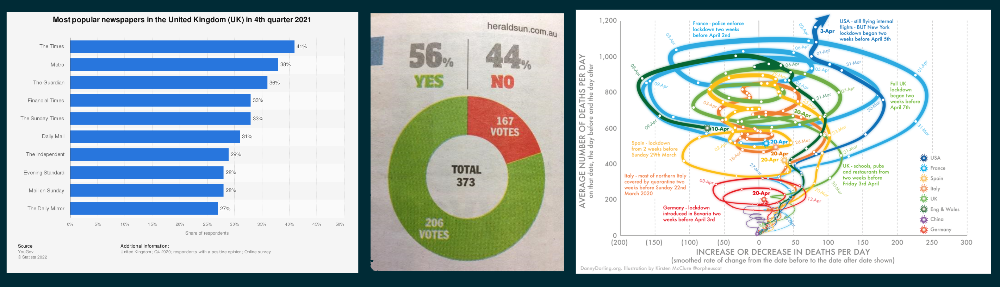

```{r packages, echo=FALSE, message=FALSE, warning=FALSE}
library(tidyverse)
library(magick)
library(xaringanExtra)
library(Tmisc)
library(dsbox) 
library(emoji)
xaringanExtra::use_panelset()
```


## The story so far...

- **Data** are observations or measurements (unprocessed or processed) of various data types: numbers, characters, factors, dates, etc.

- A **dataset** is a structured collection of data associated with a unique body of work.

- Majority of datasets are structured in a 'tidy' tabular/rectangular form where:
  - Each row is an **observation**
  - Each column is a **variable**
  

---

## The story so far...

It may be necessary to clean and **wrangle** the dataset in preparation for analysis by...
- Extracting: `select()` and `filter()`
- Ordering: `arrange()`
- Transforming: `mutate()`
- Combine: `left_join()`, `right_join()` and `full_join()`
- Arrangement: `pivot_wide()` and `pivot_long()`

  
Then the cleaned data is **summarised** for investigation and communication via...

- Grouping: `group_by()`
- Tabulation: `count()`
- Summarising: `summarise()`
  - `sum()`, `n()`
  - `mean()`, `var()`, `sd()`, `cor()`
  - `median()`, `min()`, `max()`, `quantile()`, `IQR()`

---


class: middle

# Exploratory data analysis

---

## What is EDA?

- Exploratory data analysis (EDA) is the first step in **understanding** the main features and structures of a data set.
<br>
- Many statistical tools and techniques are used when performing EDA, but crucially they are **simple** to allow the data __speak__ for itself.
<br>
- Tools that a data scientist may use are:
  - Data transformation/wrangling
  - Calculation of simple summary statistics (mean, median, variance, correlation, etc.)
  - Tabulation
  - Graphical or visual representations
  - etc.

> *"Although we often hear that data speak for themselves, their voices can be soft and sly." --- Mosteller et al. (1983)*

---

## Common statistics

.panelset[
.panel[.panel-name[Measures of location]

.pull-left[
* **Mean**: The averaged value, data's centre of mass

$$\bar{x} = \frac{1}{n}\sum_{i=1}^n x_i$$

* **Median**: The mid-point that splits the data in a lower 50% and an upper 50%.

* **Mode**: The most frequent/likely value.
]

.pull-right[

```{r location, echo=FALSE, fig.height = 5, fig.align='center'}
stats <- tibble(style = c("Right / Positive Skew", "Symmetric","Left / Negative Skew"),
       shape1 = c(2,5,5), shape2 = c(5,5,2) ) %>%
  mutate(avg = shape1/(shape1+shape2), med=qbeta(0.5,shape1,shape2),
         mode = (shape1-1)/(shape1+shape2-2)) %>%
    mutate(style = fct_relevel(style,"Left / Negative Skew","Symmetric", "Right / Positive Skew"))

vals <- tibble(x=seq(0,1,by=0.01)) %>%
    mutate(
      `Right / Positive Skew` = dbeta(x, stats$shape1[1], stats$shape2[1]),
      `Symmetric` = dbeta(x, stats$shape1[2], stats$shape2[2]),
      `Left / Negative Skew` = dbeta(x, stats$shape1[3], stats$shape2[3])
      ) %>%
    pivot_longer(cols = c("Left / Negative Skew","Symmetric", "Right / Positive Skew"),
                 names_to = "style", values_to = "y") %>%
    mutate(style = fct_relevel(style,"Right / Positive Skew","Symmetric", "Left / Negative Skew"))
  
vals %>%
  ggplot(mapping = aes(x=x,y=y,fill=style)) + 
    geom_line() + 
    geom_vline(data = stats, mapping = aes(
      xintercept=avg), col = "red",lwd=2) +
    geom_vline(data = stats, mapping = aes(
      xintercept=med), col = "green3",lty=2,lwd=2) +
    geom_vline(data = stats, mapping = aes(
      xintercept=mode), col="blue", lty=3, lwd = 2) +
    facet_wrap(~style, ncol = 1) +
    coord_cartesian(ylim=c(0,3),xlim=c(0,1)) +
  labs(x="",y="density")


```

.small[
 Note: Skewness indicates the direction of the longer tail.
 ]
]


]

.panel[.panel-name[Measures of spread]

.pull-left[
* **Standard deviation**: How far, on average, the data is from the mean. $s = \sqrt{\frac{1}{n-1}\sum_{i=1}^n (x_i-\bar{x})^2}$


```{r spread1, echo=FALSE, fig.height = 3}
dnorm_one_sd <- function(x){ifelse(abs(x)<=1, dnorm(x), 0)}
dnorm_two_sd <- function(x){ifelse(abs(x)<=2, dnorm(x), 0)}
dnorm_three_sd <- function(x){ifelse(abs(x)<=3, dnorm(x), 0)}

ggplot(data=data.frame(xvalues=c(-4,4)), mapping = aes(x = xvalues)) +
  stat_function(fun = dnorm, n=512) + 
  stat_function(fun = dnorm_three_sd, n=512, geom = "area", fill = "green",alpha = 0.3) + 
  stat_function(fun = dnorm_two_sd, n=512, geom = "area", fill = "blue", alpha = 0.3) + 
  stat_function(fun = dnorm_one_sd, n=512, geom = "area", fill = "yellow", alpha = 0.3) +
  scale_x_continuous(breaks = c(-3:4)) +
  geom_text(x = 0 , y = 0.2, size = 4, fontface = "bold", label = paste("<------",round((pnorm(1)-pnorm(-1))*100,1),"%","------>"))+
  geom_text(x = 0 , y = 0.05, size = 4, fontface = "bold", label = paste("<-------------",round((pnorm(2)-pnorm(-2))*100,1),"%","------------->"))+
  geom_text(x = 0 , y = 0.015, size = 4, fontface = "bold", label = paste("<--------------------------",round((pnorm(3)-pnorm(-3))*100,1),"%","-------------------------->")) +
  labs(x = "", y = "density")
```

]

.pull-right[

* **Inter-quartile range**: The width of the middle 50% of the data.
$IQR = Q_3 - Q_1\phantom{s = \sqrt{\frac{1}{n-1}\sum_{i=1}^n (x_i-\bar{x})^2}}$

```{r spread2, echo=FALSE, fig.height = 3}
dbeta48 <- function(x){dbeta(x,4,8)}
dbeta_IQR <- function(x){ifelse(pbeta(x,4,8)<=0.75 & pbeta(x,4,8)>=0.25,dbeta(x,4,8),0)}
ggplot(data=data.frame(x=c(0,1)), mapping = aes(x = x)) +
  stat_function(fun = dbeta48, n=512) + 
  stat_function(fun = dbeta_IQR, n=512, geom = "area", fill = "red",alpha = 0.3) + 
  geom_vline(xintercept = qbeta(c(0.25,0.75),4,8)) + 
  geom_text(x = 1/3, y = 0.5*dbeta(1/3,4,8), label = "50%") + 
  geom_text(x = 1/6, y = 0.5*dbeta(0.14172,4,8), label = "25%") +
  geom_text(x = 1/2, y = 0.5*dbeta(1/2,4,8), label = "25%") +
  labs(x = "", y= "density")

```
]
]

.panel[.panel-name[Measure of dependence]

.pull-left[
* **Correlation**: The degree of _linear_ dependence between two variables.
]
.pull-right[
$r = \frac{\sum_{i=1}^n (x_i - \bar{x})(y_i - \bar{y})}{\sqrt{\sum_{i=1}^n (x_i - \bar{x})^2}\sqrt{\sum_{i=1}^n (y_i - \bar{y})^2}}$
]

```{r, echo=FALSE, fig.height=4, fig.width=15}
set.seed(1)
tibble(x = rnorm(1000), err = rnorm(1000)) %>%
  mutate(
    `r=-1.0` = -x,
    `r=-0.7` = -0.7*x + sqrt(1-(-0.7)^2)*err,
    `r=+0.0` = err,
    `r=+0.7` = 0.7*x + sqrt(1-(0.7)^2)*err,
    `r=+1.0` = x
  ) %>%
  select(-err) %>%
  mutate(    
    `r=-1.0` = `r=-1.0` /sd(`r=-1.0`),
    `r=-0.7` = `r=-0.7` /sd(`r=-0.7`),
    `r=+0.0` = `r=+0.0` /sd(`r=+0.0`),
    `r=+0.7` = `r=+0.7` /sd(`r=+0.7`),
    `r=+1.0` = `r=+1.0` /sd(`r=+1.0`)
)%>%
  pivot_longer(cols = c("r=-1.0","r=-0.7","r=+0.0","r=+0.7","r=+1.0"),
               names_to = "type",values_to = "y") %>%
  mutate(type=as_factor(type),
         type=fct_relevel(type, "r=-1.0", "r=-0.7", "r=+0.0", 
                          "r=+0.7", "r=+1.0"))%>%
  ggplot(mapping=aes(x=x,y=y)) +
  geom_point() +
  facet_wrap(~type, ncol=5)


```

]
]


---

## Simulated example


.panelset[
.panel[.panel-name[Data]

* File `simulated_datasets.csv` contains two sets of data, labelled `"A"` and `"B"`
* Each data set consists 1000 samples of two numerical variables, `x` and `y`.


```{r load-data, message=FALSE}
data <- read_csv("data/simulated_datasets.csv")
```


.pull-left[
```{r show-data-head}
data %>% filter(set == "A") %>% head(n = 3)
```
]
.pull-right[
```{r show-data-tail}
data %>% filter(set == "B") %>% head(n = 3)
```
]

]

.panel[.panel-name[Statistics]

```{r stats, R.options = list(width = 100)}
data %>% 
  group_by(set) %>%
  summarise(
    avg_x = mean(x), sd_x = sd(x), med_x = median(x),
    min_x = min(x),  max_x = max(x), IQR_x = IQR(x),
    
    avg_y = mean(y), sd_y = sd(y),   med_y = median(y),
    min_y = min(y),  max_y = max(y), IQR_y = IQR(y),
    
    cor_xy = cor(x, y)
  )
```

]

.panel[.panel-name[Histogram of `x`]
.pull-left[
```{r hist_code, eval=FALSE}
ggplot(data, 
       mapping = aes(x = x, 
                     fill = set)) + 
  geom_histogram(bins = 30) + 
  facet_wrap(~set)
```
]
.pull-right[
```{r hist_image, echo=FALSE, fig.height=5}
ggplot(data, mapping = aes(x = x, fill = set)) + 
  geom_histogram(bins = 30) + 
  facet_wrap(~set)
```
]

]


.panel[.panel-name[Scatterplot of `x` & `y`]
.pull-left[
```{r scatter_code, eval=FALSE}
ggplot(data, 
       mapping = aes(x = x, 
                     y = y, 
                     col = set)) + 
  geom_point() + 
  facet_wrap(~set)
```
]
.pull-right[
```{r scatter_image, echo=FALSE, fig.height=5}
ggplot(data, mapping = aes(x = x, y = y, col = set)) + 
  geom_point() + 
  facet_wrap(~set)
```
]

]

]


---


class: middle

# Data visualization

---

## Data visualization

> *"The simple graph has brought more information to the data analyst's mind than any other device." --- John Tukey*

- Data visualization is the creation and study of the visual representation of data.

- The purpose is to literally *see* what your data seems to say.

- Human brains are very good at identifying complex patterns ...
  - ... and similarly they can easily be fooled!
  
- Visualising the data can help identify unusual shapes and structures that are not intuitive and difficult to examine numerically.


---

## Example: RANDU

- Pseudo-random number generators are algorithms that generate a sequence of numbers that satisfy important statistical properties of randomness.

- **Randu** was a popular algorithm for generating random numbers in 1960s & 1970s.

- Numbers are generated via the recursion:
$$V_{j+1} = (65539~ V_j) \mod 2^{31}$$
- Typically, these numbers are scaled to the $[0, 1]$ interval: $X_j = V_j / 2^{31}$.

- **Question**: What are the desired properties you want from (uniform) random numbers?


---

## Example: RANDU plots

```{r randu_setup, echo = FALSE}
cur <- 1
vals <- NULL
two_31 <- 2^31
n <- 1000
while(length(vals) < 3*n){
  cur <- (65539*cur) %% two_31
  vals <- c(vals, cur/two_31)
}
RANDU <- tibble(x = vals[seq(1, 3*n, by=3)], y = vals[seq(2, 3*n, by=3)], z = vals[seq(3, 3*n, by=3)])

```


.pull-left[
```{r randu_hist, echo = FALSE}

ggplot(RANDU, mapping = aes(x=x)) +
  geom_histogram(breaks = (0:10)/10, colour = "blue4", fill="blue") +
  labs(x = "RANDU Values", y = "Frequency", title = "Histogram of RANDU values.")
```
]
.pull-right[
```{r randu_scatter, echo = FALSE}
ggplot(RANDU, mapping = aes(x = x, y = y)) +
  geom_point() + 
  labs(x = "Previous Value", y = "Next Value", title = "Scatter plot of consecutive RANDU points.")
```
]

---

## Example: RANDU

* But, if we create a 3D scatter plot with three consecutive RANDU values and rotate ...


```{r echo=FALSE, out.width="40%", fig.align='center'}
knitr::include_graphics("img/3dRANDUAnimation_loop.gif")
```

* Use visualisations to **explore** the data. You may need more than one perspective.

---


## Example: Facebook visits

.question[ 
How many times do you go on Facebook per day?
]

.pull-left[
```{r echo = FALSE, warning = FALSE, fig.width = 8, fig.height = 5}
ggplot(student_survey, aes(x = fb_visits_per_day)) +
  geom_histogram(binwidth = 1) +
  labs(
    title = "How many times do you go on Facebook per day?", 
    x = "Number of times", 
    y = NULL
    )
```
]
.pull-right[
- What insights does this plot give about:
  - how frequent participants are viewing Facebook?
  - how the participants are answering the question?
]

- You may need to iterate between visualisation and data transform.


---

## The good, the bad and the ugly `r emoji::emoji('cowboy_hat_face')`

* Not all data visualisations are designed equally in their informativeness. 

```{r, echo=FALSE, out.width = "100%", fig.align='center'}

```

* Be cautions of data visualisations that are designed to mislead! `r emoji::emoji('imp')`

---

## The Four respects:

1. **Respect the people**
  - Who are the target audience?
  - Respect users perception and cognitive capabilities.
  - Is your visualisation inclusive?
2. **Respect the data**
  - Let the data speak for itself!
  - Use an appropriate visualisation style for the data type.
  - Don't "massage" the data for a particular narrative.
  - Use an informative title and axis labels.
3. **Respect the mathematics**
  - Use of appropriateness geometric attribute (eg, length vs area)
  - Is the geometry of the visualisation correct?
  - Scale and range of the axes.
4. **Respect the computers**
  - Don't overtax the computer

---

class: middle

# ggplot2 

---

## ggplot2 $\in$ tidyverse

.pull-left[
```{r echo=FALSE, out.width="80%"}
knitr::include_graphics("img/ggplot2-part-of-tidyverse.png")
```
] 
.pull-right[ 
- **ggplot2** is tidyverse's data visualization package 
- `gg` in "ggplot2" stands for *Grammar of Graphics* from the book by Leland Wilkinson

```{r echo=FALSE, out.width="100%"}
knitr::include_graphics("img/grammar-of-graphics.png")
```
]

---

## Structure of creating a plot

- `ggplot()` is the main function in ggplot2
- Construct plots by _adding_ (`+`) layers -- **Not** the `%>%` pipe!
- Structure of the code for plots can be summarized as:

```{r eval = FALSE}
ggplot(data = [dataset],                                         # Data
       mapping = aes(x = [x-variable], y = [y-variable])) +      # Aesthetics
   geom_[*]() +                                                  # Geometries
   other options                                                 # ...
```


- Many types of geometries:
  - `geom_points()`, `geom_histogram()`, `geom_line()`, `geom_boxplot()`, etc.

- [ggplot2 cheat sheet](https://www.rstudio.com/resources/cheatsheets/)

---

## Example: Palmer Penguins

Measurements for penguin species, island in Palmer Archipelago, size (flipper length, body mass, bill dimensions), and sex.

.pull-left-narrow[
```{r echo=FALSE, out.width="80%"}
knitr::include_graphics("img/penguins.png")
```
]

.pull-right-wide[
```{r eval=FALSE}
library(palmerpenguins)
penguins
```

.small[
```{r echo=FALSE}
library(palmerpenguins)
penguins
```
]
]

---

## Example: Penguins dataset


```{r penguins, echo = FALSE, fig.align = "center", fig.width = 6, fig.asp = 1, out.width = "50%", warning = FALSE}
ggplot(data = penguins, 
       mapping = aes(x = bill_depth_mm, y = bill_length_mm,
                     colour = species)) +
  geom_point() +
  labs(title = "Penguin bill depth & length",
       x = "Bill depth (mm)", 
       y = "Bill length (mm)",
       colour = "Species")
```


---

## Coding narative

.midi[
> **Start with the `penguins` data frame,**
> map bill depth to the x-axis
> and map bill length to the y-axis. 
> Represent each observation with a point
> and map species to the colour of each point.
> Title the plot "Penguin bill depth & length", 
> label the x and y axes as "Bill depth (mm)" and "Bill length (mm)", respectively,
> and label the legend "Species".
]

.pull-left[
```{r penguins-0, fig.show = "hide", warning = FALSE}
ggplot(data = penguins) #<<
```
]
.pull-right[
```{r ref.label = "penguins-0", echo = FALSE, warning = FALSE, out.width = "80%", fig.width = 8}
```
]

---

## Coding narative

.midi[
> Start with the `penguins` data frame,
> **map bill depth to the x-axis**
> and map bill length to the y-axis. 
> Represent each observation with a point
> and map species to the colour of each point.
> Title the plot "Penguin bill depth & length", 
> label the x and y axes as "Bill depth (mm)" and "Bill length (mm)", respectively,
> and label the legend "Species".
]

.pull-left[
```{r penguins-1, fig.show = "hide", warning = FALSE}
ggplot(data = penguins,
       mapping = aes(x = bill_depth_mm)) #<<
```
]
.pull-right[
```{r ref.label = "penguins-1", echo = FALSE, warning = FALSE, out.width = "80%", fig.width = 8}
```
]

---

## Coding narative

.midi[
> Start with the `penguins` data frame,
> map bill depth to the x-axis
> **and map bill length to the y-axis.** 
> Represent each observation with a point
> and map species to the colour of each point.
> Title the plot "Penguin bill depth & length", 
> label the x and y axes as "Bill depth (mm)" and "Bill length (mm)", respectively,
> and label the legend "Species".
]

.pull-left[
```{r penguins-2, fig.show = "hide", warning = FALSE}
ggplot(data = penguins,
       mapping = aes(x = bill_depth_mm,
                     y = bill_length_mm)) #<<
```
]
.pull-right[
```{r ref.label = "penguins-2", echo = FALSE, warning = FALSE, out.width = "80%", fig.width = 8}
```
]


---

## Coding narative

.midi[
> Start with the `penguins` data frame,
> map bill depth to the x-axis
> and map bill length to the y-axis. 
> **Represent each observation with a point**
> and map species to the colour of each point.
> Title the plot "Penguin bill depth & length", 
> label the x and y axes as "Bill depth (mm)" and "Bill length (mm)", respectively,
> and label the legend "Species".
]

.pull-left[
```{r penguins-3, fig.show = "hide", warning = FALSE}
ggplot(data = penguins,
       mapping = aes(x = bill_depth_mm,
                     y = bill_length_mm)) + 
  geom_point() #<<
```
]
.pull-right[
```{r ref.label = "penguins-3", echo = FALSE, warning = FALSE, out.width = "80%", fig.width = 8}
```
]

---

## Coding narative

.midi[
> Start with the `penguins` data frame,
> map bill depth to the x-axis
> and map bill length to the y-axis. 
> Represent each observation with a point
> **and map species to the colour of each point.**
> Title the plot "Penguin bill depth & length", 
> label the x and y axes as "Bill depth (mm)" and "Bill length (mm)", respectively,
> and label the legend "Species".
]

.pull-left[
```{r penguins-4, fig.show = "hide", warning = FALSE}
ggplot(data = penguins,
       mapping = aes(x = bill_depth_mm,
                     y = bill_length_mm,
                     colour = species)) + #<<
  geom_point()
```
]
.pull-right[
```{r ref.label = "penguins-4", echo = FALSE, warning = FALSE, out.width = "80%", fig.width = 8}
```
]

---

## Coding narative

.midi[
> Start with the `penguins` data frame,
> map bill depth to the x-axis
> and map bill length to the y-axis. 
> Represent each observation with a point
> and map species to the colour of each point.
> **Title the plot "Penguin bill depth & length", **
> label the x and y axes as "Bill depth (mm)" and "Bill length (mm)", respectively,
> and label the legend "Species".
]

.pull-left[
```{r penguins-5, fig.show = "hide", warning = FALSE}
ggplot(data = penguins,
       mapping = aes(x = bill_depth_mm,
                     y = bill_length_mm,
                     colour = species)) +
  geom_point() +
  labs(title = "Penguin bill depth & length") #<<
```
]
.pull-right[
```{r ref.label = "penguins-5", echo = FALSE, warning = FALSE, out.width = "80%", fig.width = 8}
```
]

---


## Coding narative


.midi[
> Start with the `penguins` data frame,
> map bill depth to the x-axis
> and map bill length to the y-axis. 
> Represent each observation with a point
> and map species to the colour of each point.
> Title the plot "Penguin bill depth & length", 
> **label the x and y axes as "Bill depth (mm)" and "Bill length (mm)", respectively,**
> and label the legend "Species".
]

.pull-left[
```{r penguins-7, fig.show = "hide", warning = FALSE}
ggplot(data = penguins,
       mapping = aes(x = bill_depth_mm,
                     y = bill_length_mm,
                     colour = species)) +
  geom_point() +
  labs(title = "Penguin bill depth & length",
       x = "Bill depth (mm)",  #<<
       y = "Bill length (mm)") #<<
```
]
.pull-right[
```{r ref.label = "penguins-7", echo = FALSE, warning = FALSE, out.width = "80%", fig.width = 8}
```
]

---

## Coding narative


.midi[
> Start with the `penguins` data frame,
> map bill depth to the x-axis
> and map bill length to the y-axis. 
> Represent each observation with a point
> and map species to the colour of each point.
> Title the plot "Penguin bill depth & length", 
> label the x and y axes as "Bill depth (mm)" and "Bill length (mm)", respectively,
> **and label the legend "Species".**
]

.pull-left[
```{r penguins-8, fig.show = "hide", warning = FALSE}
ggplot(data = penguins,
       mapping = aes(x = bill_depth_mm,
                     y = bill_length_mm,
                     colour = species)) +
  geom_point() +
  labs(title = "Penguin bill depth & length",
       x = "Bill depth (mm)", 
       y = "Bill length (mm)",
       colour = "Species") #<<
```
]
.pull-right[
```{r ref.label = "penguins-8", echo = FALSE, warning = FALSE, out.width = "80%", fig.width = 8}
```
]

---


.panelset[
.panel[.panel-name[Plot]
```{r ref.label = "penguins-repeat", echo = FALSE, warning = FALSE, out.width = "45%", fig.align='center', fig.width = 6, fig.asp = 1}
```
]
.panel[.panel-name[Code]

```{r penguins-repeat, fig.show = "hide", warning=FALSE}
ggplot(data = penguins, 
       mapping = aes(x = bill_depth_mm, y = bill_length_mm,
                     colour = species)) +
  geom_point() +
  labs(title = "Penguin bill depth & length",
       x = "Bill depth (mm)", 
       y = "Bill length (mm)",
       colour = "Species")
```


]
]


---


# And iterate ...

* Editing the aesthetic options: Point colour, size, shape, etc.

* Incorporate more variables from the data set.

* Specify the limits of the co-ordinate axes to zoom in or out.

* Include additional descriptive information: sub-title, caption, data source citation, etc.

* Add other graphical information: line/curve of best fit, arrows, estimation intervals, etc.

* Faceting/panelling multiple plots into a grid.

* Changing the colour pallet that is more accessible for colour blindness.

* ...

**However**, more is not necessarily good - Remember the 4 respects.


<!-- --- -->

<!-- ## Aesthetics options -->

<!-- .panelset[ -->
<!-- .panel[.panel-name[colour] -->
<!-- .pull-left[ -->
<!-- ```{r penguins-color, fig.show = "hide", warning = FALSE} -->
<!-- ggplot(data = penguins, -->
<!--        mapping = aes(x = bill_depth_mm, -->
<!--                      y = bill_length_mm, -->
<!--                      colour = species)) + #<< -->
<!--   geom_point() + -->
<!--   labs(title = "Penguin bill depth & length", -->
<!--        x = "Bill depth (mm)", -->
<!--        y = "Bill length (mm)", -->
<!--        colour = "Species") -->
<!-- ``` -->
<!-- ] -->
<!-- .pull-right[ -->
<!-- ```{r ref.label = "penguins-color", echo = FALSE, warning = FALSE, out.width = "80%", fig.width = 8} -->
<!-- ``` -->
<!-- ] -->
<!-- ] -->

<!-- .panel[.panel-name[shape] -->
<!-- .pull-left[ -->
<!-- ```{r penguins-shape, fig.show = "hide", warning = FALSE} -->
<!-- ggplot(data = penguins, -->
<!--        mapping = aes(x = bill_depth_mm, -->
<!--                      y = bill_length_mm, -->
<!--                      colour = species, -->
<!--                      shape = sex)) + #<< -->
<!--   geom_point() + -->
<!--   labs(title = "Penguin bill depth & length", -->
<!--        x = "Bill depth (mm)", -->
<!--        y = "Bill length (mm)", -->
<!--        colour = "Species", shape = "Sex") -->
<!-- ``` -->
<!-- ] -->
<!-- .pull-right[ -->
<!-- ```{r ref.label = "penguins-shape", echo = FALSE, warning = FALSE, out.width = "80%", fig.width = 8} -->
<!-- ``` -->
<!-- ] -->
<!-- ] -->


<!-- .panel[.panel-name[size] -->
<!-- .pull-left[ -->
<!-- ```{r penguins-size, fig.show = "hide", warning = FALSE} -->
<!-- ggplot(data = penguins, -->
<!--        mapping = aes(x = bill_depth_mm, -->
<!--                      y = bill_length_mm, -->
<!--                      colour = species, -->
<!--                      shape = sex, -->
<!--                      size = body_mass_g)) + #<< -->
<!--   geom_point() + -->
<!--   labs(title = "Penguin bill depth & length", -->
<!--        x = "Bill depth (mm)", -->
<!--        y = "Bill length (mm)", -->
<!--        colour = "Species", shape = "Sex", -->
<!--        size = "Body mass (g)") -->
<!-- ``` -->
<!-- ] -->
<!-- .pull-right[ -->
<!-- ```{r ref.label = "penguins-size", echo = FALSE, warning = FALSE, out.width = "80%", fig.width = 8} -->
<!-- ``` -->
<!-- ] -->
<!-- ] -->


<!-- .panel[.panel-name[alpha (transparency)] -->
<!-- .pull-left[ -->
<!-- ```{r penguins-alpha, fig.show = "hide", warning = FALSE} -->
<!-- ggplot(data = penguins, -->
<!--        mapping = aes(x = bill_depth_mm, -->
<!--                      y = bill_length_mm, -->
<!--                      colour = species, -->
<!--                      shape = sex, -->
<!--                      size = body_mass_g, -->
<!--                      alpha = flipper_length_mm)) + #<< -->
<!--   geom_point() + -->
<!--   labs(title = "Penguin bill depth & length", -->
<!--        x = "Bill depth (mm)", -->
<!--        y = "Bill length (mm)", -->
<!--        colour = "Species", shape = "Sex", -->
<!--        size = "Body mass (g)", -->
<!--        alpha = "Flipper length (mm)") -->
<!-- ``` -->
<!-- ] -->
<!-- .pull-right[ -->
<!-- ```{r ref.label = "penguins-alpha", echo = FALSE, warning = FALSE, out.width = "80%", fig.width = 8} -->
<!-- ``` -->
<!-- ] -->

<!-- - Is this plot easy to understand?! Don't over-burden plots, keep them simple. -->

<!-- ] -->

<!-- ] -->

<!-- --- -->

<!-- ## Fix graphical options -->

<!-- - Graphical options can be used within the `geom_[*]()` function to be applied across all cases. -->

<!-- .pull-left[ -->
<!-- ```{r penguins-setting, fig.show = "hide", warning = FALSE} -->
<!-- ggplot(data = penguins, -->
<!--        mapping = aes(x = bill_depth_mm, -->
<!--                      y = bill_length_mm)) + -->
<!--   geom_point(colour = "blue",   #<< -->
<!--              size = 2,          #<< -->
<!--              shape = "square",  #<< -->
<!--              alpha = 0.5) +     #<< -->
<!--   labs(title = "Penguin bill depth & length", -->
<!--        x = "Bill depth (mm)", -->
<!--        y = "Bill length (mm)") -->
<!-- ``` -->
<!-- ] -->
<!-- .pull-right[ -->
<!-- ```{r ref.label = "penguins-setting", echo = FALSE, warning = FALSE, out.width = "80%", fig.width = 8} -->
<!-- ``` -->
<!-- ] -->

<!-- --- -->

<!-- ## Co-ordinate limits -->


<!-- .pull-left[ -->
<!-- ```{r penguins-lims, fig.show = "hide", warning = FALSE} -->
<!-- ggplot(data = penguins, -->
<!--        mapping = aes(x = bill_depth_mm, -->
<!--                      y = bill_length_mm, -->
<!--                      colour = species)) + -->
<!--   geom_point() + -->
<!--   labs(title = "Penguin bill depth & length", -->
<!--        x = "Bill depth (mm)", -->
<!--        y = "Bill length (mm)", -->
<!--        colour = "Species") + -->
<!--   coord_cartesian(xlim = c(10, 25),  #<< -->
<!--                   ylim = c(30, 60))  #<< -->
<!-- ``` -->
<!-- ] -->
<!-- .pull-right[ -->
<!-- ```{r ref.label = "penguins-lims", echo = FALSE, warning = FALSE, out.width = "80%", fig.width = 8} -->
<!-- ``` -->
<!-- ] -->


<!-- --- -->

<!-- ## Faceting -->

<!-- - Smaller plots that display different subsets of the data -->
<!-- - Useful for exploring conditional relationships and large data -->

<!-- .panelset[ -->
<!-- .panel[.panel-name[grid] -->
<!-- .pull-left[ -->

<!-- - 2D grid by stated variables -->

<!-- ```{r penguins-grid, fig.show = "hide", warning = FALSE} -->
<!-- ggplot(data = penguins, -->
<!--        mapping = aes(x = bill_depth_mm, -->
<!--                      y = bill_length_mm)) + -->
<!--   geom_point() + -->
<!--   facet_grid(species ~ sex) #<< -->
<!-- ``` -->
<!-- ] -->
<!-- .pull-right[ -->
<!-- ```{r ref.label = "penguins-grid", echo = FALSE, warning = FALSE, out.width = "90%", fig.width = 8, fig.asp = 0.7} -->
<!-- ``` -->
<!-- ] -->
<!-- ] -->

<!-- .panel[.panel-name[wrap v1] -->
<!-- .pull-left[ -->
<!-- - 1D ribbon -->

<!-- ```{r penguins-wrap1, fig.show = "hide", warning = FALSE} -->
<!-- ggplot(data = penguins, -->
<!--        mapping = aes(x = bill_depth_mm, -->
<!--                      y = bill_length_mm)) + -->
<!--   geom_point() + -->
<!--   facet_wrap(~ species) #<< -->
<!-- ``` -->


<!-- - equivalent to: -->
<!--   - `facet_grid(. ~ species)` -->

<!-- ] -->
<!-- .pull-right[ -->
<!-- ```{r ref.label = "penguins-wrap1", echo = FALSE, warning = FALSE, out.width = "90%", fig.width = 8, fig.asp = 0.7} -->
<!-- ``` -->
<!-- ] -->


<!-- ] -->


<!-- .panel[.panel-name[wrap v2] -->
<!-- .pull-left[ -->

<!-- - wrapped 1D ribbon according to the specifed number of rows/columns -->

<!-- ```{r penguins-wrap2, fig.show = "hide", warning = FALSE} -->
<!-- ggplot(data = penguins, -->
<!--        mapping = aes(x = bill_depth_mm, -->
<!--                      y = bill_length_mm)) + -->
<!--   geom_point() + -->
<!--   facet_wrap(~ species, ncol = 2) #<< -->
<!-- ``` -->
<!-- ] -->
<!-- .pull-right[ -->
<!-- ```{r ref.label = "penguins-wrap2", echo = FALSE, warning = FALSE, out.width = "90%", fig.width = 8, fig.asp = 0.7} -->
<!-- ``` -->
<!-- ] -->
<!-- ] -->


<!-- ] -->


<!-- --- -->

<!-- ## Accessibility -->

<!-- - Colours are very useful tool in visualising data, but some people are colour blind. -->
<!-- - `viridis` is one of the colour blind friendly palettes in `ggplot2`. -->

<!-- .pull-left[ -->
<!-- ```{r penguins-blind, fig.show = "hide", warning = FALSE} -->
<!-- ggplot(data = penguins, -->
<!--        mapping = aes(x = bill_depth_mm, -->
<!--                      y = bill_length_mm, -->
<!--                      colour = species)) + -->
<!--   geom_point() + -->
<!--   labs(title = "Penguin bill depth & length", -->
<!--        x = "Bill depth (mm)", -->
<!--        y = "Bill length (mm)", -->
<!--        colour = "Species") + -->
<!--   scale_colour_viridis_d() #<< -->
<!-- ``` -->
<!-- ] -->
<!-- .pull-right[ -->
<!-- ```{r ref.label = "penguins-blind", echo = FALSE, warning = FALSE, out.width = "80%", fig.width = 8} -->
<!-- ``` -->
<!-- ] -->


