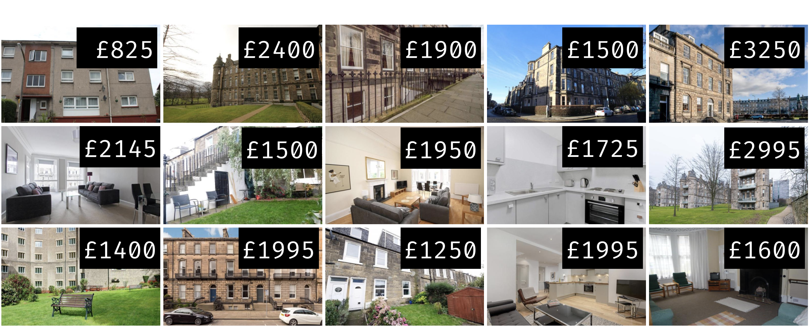

```{r packages, echo = FALSE, message=FALSE, warning=FALSE}
library(tidyverse)
# library(magick)
library(dplyr)
library(tidymodels)
# library(ggtext)
library(knitr)
# library(kableExtra)
library(xaringanExtra)
# library(Tmisc)
# library(emo)
library(openintro)
library(ggridges)
library(patchwork)
library(skimr)
# library(webshot)

library(NHANES)

set.seed(1234)
options(
  warnPartialMatchArgs = FALSE,
  warnPartialMatchAttr = FALSE, 
  warnPartialMatchDollar = FALSE,
  width = 100
)

xaringanExtra::use_panelset()

# elmhurst_boot <- bootstraps(elmhurst, times = 1000)

```

```{r setup, include=FALSE}
# R options
options(
  htmltools.dir.version = FALSE,
  dplyr.print_min = 6, 
  dplyr.print_max = 6,
  tibble.width = 65,
  width = 65
  )
# figure height, width, dpi
knitr::opts_chunk$set(echo = TRUE, 
                      fig.width = 8, 
                      fig.asp = 0.618,
                      out.width = "60%",
                      fig.align = "center",
                      dpi = 300,
                      message = FALSE)
# ggplot2
ggplot2::theme_set(ggplot2::theme_gray(base_size = 16))
# set seed
set.seed(1234)
# fontawesome
htmltools::tagList(rmarkdown::html_dependency_font_awesome())
# magick
dev.off <- function(){
  invisible(grDevices::dev.off())
}
# output number of lines
hook_output <- knitr::knit_hooks$get("output")
knitr::knit_hooks$set(output = function(x, options) {
  lines <- options$output.lines
  if (is.null(lines)) {
    return(hook_output(x, options))  # pass to default hook
  }
  x <- unlist(strsplit(x, "\n"))
  more <- "..."
  if (length(lines)==1) {        # first n lines
    if (length(x) > lines) {
      # truncate the output, but add ....
      x <- c(head(x, lines), more)
    }
  } else {
    x <- c(more, x[lines], more)
  }
  # paste these lines together
  x <- paste(c(x, ""), collapse = "\n")
  hook_output(x, options)
})

```

layout: true
  
<div class="my-footer">
<span>
University of Edinburgh
</span>
</div> 

---
## Topics

- Why is quantification of uncertainty important?
- Confidence intervals
- Bootstrapping for confidence intervals
- Bootstrapping with Tidymodels
- Precision vs Accuracy

---

class: middle

# Motivation

---

## Data: Rent in Edinburgh

.question[
Take a guess! How much did a typical 3 BR flat in Edinburgh rent for in 2020?
]

--

Fifteen 3 BR flats in Edinburgh were randomly selected on rightmove.co.uk.
```{r message=FALSE}
library(tidyverse)
edi_3br <- read_csv2("data/edi-3br.csv") # ; separated
```

.small[
```{r, echo=FALSE}
edi_3br
```
]

---

## Observed sample

```{r message=FALSE, echo=FALSE, out.width="70%"}
ggplot(data = edi_3br, mapping = aes(x = rent)) +
  geom_histogram(binwidth = 200,fill = "springgreen4") +
  labs(title = "Rent of 3 BR flats in Edinburgh")
```

---

## Observed sample

Sample mean ≈ £`r edi_3br %>% summarise(med_rent = mean(rent)) %>% pull() %>% round()`.

<br>

```{r echo=FALSE, out.width="90%"}

```

---

class: middle

.hand[
.light-blue[
Is the mean price of all 3 BR flats in Edinburgh exactly £`r edi_3br %>% summarise(med_rent = mean(rent)) %>% pull() %>% round()`??
]
]


---

class: middle

# Inference

---

## Statistical inference 

... is the process of using sample data to make conclusions about the underlying population the sample came from

```{r echo=FALSE, out.width="60%"}

```

---

## Estimation

So far we have done some estimation (mean, median, proportion, etc.), i.e.
- used data from samples to calculate sample statistics
- which can then be used as estimates for population parameters

---

.question[
If you want to catch a fish, do you prefer a spear or a net?
]

<br>

.pull-left[
```{r echo=FALSE, out.width="80%"}
knitr::include_graphics("img/spear.png")
```
]
.pull-right[
```{r echo=FALSE, out.width="80%"}
knitr::include_graphics("img/net.png")
```
]

---

.question[
If you want to estimate a population parameter, do you prefer to report a range of values the parameter might be in, or a single value?
]

<br>

--

- If we report a point estimate, we probably won’t hit the exact population parameter
- If we report a range of plausible values we have a good shot at capturing the parameter

---

.center[
```{r echo=FALSE, out.width="80%"}

```
]

.footnote[
.midi[
Source: Gallup. [Britons' Satisfaction With Healthcare, Transportation Falters](https://news.gallup.com/poll/505682/britons-satisfaction-healthcare-transportation-falters.aspx), 23/11/23.
]
]

---

class: middle

# Confidence intervals

---

## Confidence intervals

A plausible range of values for the population parameter is a **confidence interval**.

--
- In order to construct a confidence interval we need to quantify the variability of our sample statistic

--
- For example, if we want to construct a confidence interval for a population mean, we need to come up with a plausible range of values around our observed sample mean

--
- This range will depend on how precise and how accurate our sample mean is as an estimate of the population mean

--
- Quantifying this requires a measurement of how much we would expect the sample population to vary from sample to sample

---

.question[
Suppose we split the class in half down the middle of the classroom and ask each student their heights. Then, we calculate the mean height of students on each side of the classroom. Would you expect these two means to be exactly equal, close but not equal, or wildly different?
]

--

<br>

.question[
Suppose you randomly sample 50 students and 5 of them are left handed. If you were to take another random sample of 50 students, how many would you expect to be left handed? Would you be surprised if only 3 of them were left handed? Would you be surprised if 40 of them were left handed?
]

---

## Quantifying the variability of estimators

We can quantify the variability of sample statistics using

- simulation: via bootstrapping (now)

or

- theory: via Central Limit Theorem (future stat courses!)

---

class: middle

# Bootstrapping

---

## Bootstrapping

.pull-left-wide[
- _"pulling oneself up by one’s bootstraps"_: accomplishing an impossible task without any outside help
- **Impossible task:** estimating a population parameter using data from only the given sample
- **Note:** Notion of saying something about a population parameter using only information from an observed sample is the crux of statistical inference
]
.pull-right-narrow[
.huge[
🥾
]
]

---

## Observed sample

```{r echo=FALSE}
ggplot(data = edi_3br, mapping = aes(x = rent)) +
  geom_histogram(binwidth = 200,fill = "springgreen4", alpha = 0.5) +
  labs(title = "Rent of 3 BR flats in Edinburgh") +
  geom_vline(xintercept = edi_3br %>% summarise(med_rent = mean(rent)) %>% pull(), color = "springgreen4", lty = 2, linewidth = 1) 
```


---

## Observed sample

```{r echo=FALSE, out.width="90%"}

```

---

## Bootstrap population

```{r echo=FALSE}
edi_3br_boot <- bootstraps(edi_3br, times = 1000)
```

Generated assuming there are more flats like the ones in the observed sample...

```{r echo=FALSE, warning=FALSE}
set.seed(12)
edi_3br_boot %>%
  slice_head(n = 50) %>%
  mutate(data = map(splits, "data")) %>%
  select(-1) %>%
  unnest(data) %>%
  mutate(rent = rent + rnorm(n(), mean = 0, sd = 200)) %>%
  ggplot(aes(x = rent)) +
  geom_histogram(aes(y=after_stat(density)), 
                 binwidth = 50, alpha = 0.7) +
  geom_histogram(data = edi_3br, mapping = aes(x = rent, y = after_stat(density)),
                 binwidth = 200, fill = "springgreen4", alpha = 0.3)+
  labs(
    title = "Rent of 3 BR flats in Edinburgh",
    subtitle = "(Simulated) population of 3 BR flats in Edinburgh") +
  annotate("text", x = 2700, y = 0.0008, label = paste("mean = ?"), size = 6, hjust = 0)  
```

---

## Bootstrap population

Generated assuming there are more flats like the ones in the observed sample... 

Population mean = ??

```{r echo=FALSE, out.width="65%"}
knitr::include_graphics("img/rent-bootpop.png")
```

---

## Bootstrapping scheme

1. Take a bootstrap sample - a random sample taken **with replacement** from the original sample, of the same size as the original sample

2. Calculate the bootstrap statistic - a statistic such as mean, median, proportion, etc. computed on the bootstrap samples

3. Repeat steps (1) and (2) many times to create a bootstrap distribution - a distribution of bootstrap statistics

4. Calculate the bounds of the XX% confidence interval as the middle XX% of the bootstrap distribution

---

```{r echo = FALSE}
color1 = "#E48957"
color2 = "red4"
color3 = "#e6b0e7"
color4 = "cyan4"
```


## Bootstrap sample 1

```{r}
edi_3br_boot_1 <- edi_3br %>%
  slice_sample(n = 15, replace = TRUE)
```


```{r echo=FALSE}
edi_3br_boot_1_mean <- edi_3br_boot_1 %>% 
  summarise(med_rent = mean(rent)) %>% 
  pull() %>% round(4)

ggplot(data = edi_3br_boot_1, mapping = aes(x = rent)) +
  geom_histogram(binwidth = 200,fill = color1, alpha = 0.5) +
  labs(title = "Rent of 3 BR flats in Edinburgh", subtitle = "Bootstrap sample 1", y = "density") +
  geom_vline(xintercept = edi_3br_boot_1_mean, color = color1, lty = 2, linewidth = 1) 
```

---

## Bootstrap sample 2


```{r}
edi_3br_boot_2 <- edi_3br %>%
  slice_sample(n = 15, replace = TRUE)
```


```{r echo=FALSE}
edi_3br_boot_2_mean <- edi_3br_boot_2 %>% 
  summarise(med_rent = mean(rent)) %>% 
  pull() %>% round(4)

ggplot(data = edi_3br_boot_2, mapping = aes(x = rent)) +
  geom_histogram(binwidth = 200,fill = color2, alpha = 0.5) +
  labs(title = "Rent of 3 BR flats in Edinburgh", subtitle = "Bootstrap sample 2", y = "density") +
  geom_vline(xintercept = edi_3br_boot_2_mean, color = color2, lty = 2, linewidth = 1) 
```

---

## Bootstrap sample 3

```{r}
edi_3br_boot_3 <- edi_3br %>%
  slice_sample(n = 15, replace = TRUE)
```

```{r echo=FALSE}
edi_3br_boot_3_mean <- edi_3br_boot_3 %>% 
  summarise(med_rent = mean(rent)) %>% 
  pull() %>% round(4)

ggplot(data = edi_3br_boot_3, mapping = aes(x = rent)) +
  geom_histogram(binwidth = 200,fill = color3,alpha = 0.5) +
  labs(title = "Rent of 3 BR flats in Edinburgh", subtitle = "Bootstrap sample 3", y = "density") +
  geom_vline(xintercept = edi_3br_boot_3_mean, color = color3, lty = 2, linewidth = 1) 
```

---

## Bootstrap sample 4

```{r}
edi_3br_boot_4 <- edi_3br %>%
  slice_sample(n = 15, replace = TRUE)
```

```{r echo=FALSE}
edi_3br_boot_4_mean <- edi_3br_boot_4 %>% 
  summarise(med_rent = mean(rent)) %>% 
  pull() %>% round(4)

ggplot(data = edi_3br_boot_4, mapping = aes(x = rent)) +
  geom_histogram(binwidth = 200,fill = color4, alpha = 0.5) +
  labs(title = "Rent of 3 BR flats in Edinburgh", subtitle = "Bootstrap sample 4", y = "density") +
  geom_vline(xintercept = edi_3br_boot_4_mean, color = color4, lty = 2, linewidth = 1) 
```

---

## Bootstrap samples 1 - 4


```{r echo=FALSE}
ggplot() +
  geom_histogram(data = edi_3br_boot_1, mapping = aes(x = rent),
                 binwidth = 200,fill = color1, alpha = 0.5) +
  geom_vline(xintercept = edi_3br_boot_1_mean, color = color1, lty = 2, linewidth = 1) +
  geom_histogram(data = edi_3br_boot_2, mapping = aes(x = rent),
                 binwidth = 200,fill = color2, alpha = 0.5) +
  geom_vline(xintercept = edi_3br_boot_2_mean, color = color2, lty = 2, linewidth = 1) +
  geom_histogram(data = edi_3br_boot_3, mapping = aes(x = rent),
                 binwidth = 200,fill = color3, alpha = 0.5) +
  geom_vline(xintercept = edi_3br_boot_3_mean, color = color3, lty = 2, linewidth = 1) +
  geom_histogram(data = edi_3br_boot_4, mapping = aes(x = rent),
                 binwidth = 200,fill = color4, alpha = 0.5) +
  geom_vline(xintercept = edi_3br_boot_4_mean, color = color4, lty = 2, linewidth = 1) +
  labs(title = "Rent of 3 BR flats in Edinburgh", subtitle = "Bootstrap samples", y = "density") 
```

---

class: middle

.hand[
.light-blue[
we could keep going...
]
]

---

## Many many samples...

```{r echo=FALSE}
set.seed(834782)
boot_df <- edi_3br %>%
  specify(response = rent) %>% 
  generate(reps = 15000, type = "bootstrap") %>% 
  calculate(stat = "mean")

boot_df_subset <- boot_df %>%
  slice_sample(n=1000)

# edi_3br_means <- edi_3br_boot %>%
#   mutate(rent = map_dbl(splits, ~ mean(as.data.frame(.)$rent))) 
  
ggplot(edi_3br, aes(x = rent)) +
  geom_vline(
    data = boot_df_subset,
    aes(xintercept = stat), 
    color = "darkgrey", alpha = 0.3
  ) +
  geom_histogram(aes(y = after_stat(density)), binwidth = 200, 
                 fill = "springgreen4", alpha = 0.5) +
  labs(
    x = "Rent",
    y = "Density",
    title = "Bootstrap Samples"
  )
```

---

## Distribution of bootstrap means

```{r echo=FALSE, warning = FALSE}
boot_df %>%
  ggplot(aes(stat)) +
  geom_histogram(aes(y = after_stat(density)), binwidth = 20, alpha = 1, fill = "gray") +
  xlim(range(edi_3br$rent)) +
  labs(title = "Distribution of bootstrap means")
```

---

## 95% confidence interval

```{r echo=FALSE, warning = FALSE}
intervals <- boot_df %>%
  summarize(lower = quantile(stat, 0.025),
            upper = quantile(stat, 0.975))

edi_3bd_mean <- edi_3br %>% summarise(med_rent = mean(rent)) %>% pull()

boot_df %>%
  ggplot(aes(stat)) +
  geom_histogram(aes(y = after_stat(density)), 
                 binwidth = 20, alpha = 1, fill = "gray") +
  xlim(range(edi_3br$rent)) +
  labs(title = "Distribution of bootstrap means") + 
  geom_segment( data = data.frame(xst = intervals %>% pull(lower),
                                  xed = intervals %>% pull(lower),
                                  yst = 0,
                                  yed = 0.001),
    mapping = aes(x = xst, xend = xed, y = yst, yend = yed),
    linetype = "dashed"
  ) +
  annotate("text", x = intervals %>% pull(lower), y = 0.0012,
           label = as.character(intervals %>% pull(lower) %>% round()),
           size = 6) +
  geom_segment( data = data.frame(xst = intervals %>% pull(upper),
                                  xed = intervals %>% pull(upper),
                                  yst = 0,
                                  yed = 0.001),
    mapping = aes(x = xst, xend = xed, y = yst, yend = yed),
    linetype = "dashed"
  ) +
  annotate("text", x = intervals %>% pull(upper), y = 0.0012,
           label = as.character(intervals %>% pull(upper) %>% round()), size = 6) +
  geom_segment( data = data.frame(xst = edi_3bd_mean,
                                  xed = edi_3bd_mean,
                                  yst = 0,
                                  yed = 0.001),
    mapping = aes(x = xst, xend = xed, y = yst, yend = yed),
    colour = "springgreen4",
    linetype = "dashed"
  ) +
  annotate("text", x = edi_3bd_mean, y = 0.0012,
    label = as.character(round(edi_3bd_mean)), size = 6, color = "springgreen4"
  )
```

---

## Interpreting the estimate, with uncertainty

<br>

*We are 95% confident that the mean rent of all three bedroom flats is between £1603 and £2213.*

---

class: middle

# Bootstrapping with tidymodels

---

## Generate bootstrap means

```{r eval=FALSE}
edi_3br %>%
  # specify the variable of interest
  specify(response = rent)
```

---

## Generate bootstrap means

```{r eval=FALSE}
edi_3br %>%
  # specify the variable of interest
  specify(response = rent)
  # generate 15000 bootstrap samples
  generate(reps = 15000, type = "bootstrap")
```

---

## Generate bootstrap means

```{r eval=FALSE}
edi_3br %>%
  # specify the variable of interest
  specify(response = rent)
  # generate 15000 bootstrap samples
  generate(reps = 15000, type = "bootstrap")
  # calculate the mean of each bootstrap sample
  calculate(stat = "mean")
```

---

## Generate bootstrap means

```{r include=FALSE}
set.seed(834782)
```


```{r eval=FALSE}
# save resulting bootstrap distribution
boot_df <- edi_3br %>%
  # specify the variable of interest
  specify(response = rent) %>%
  # generate 15000 bootstrap samples
  generate(reps = 15000, type = "bootstrap") %>%
  # calculate the mean of each bootstrap sample
  calculate(stat = "mean")
```

---

## The bootstrap sample

.question[
How many observations are there in `boot_df`? What does each observation represent?
]

```{r}
boot_df
```

---

## Visualize the bootstrap distribution

```{r}
ggplot(data = boot_df, mapping = aes(x = stat)) +
  geom_histogram(binwidth = 100) +
  labs(title = "Bootstrap distribution of means")
```

---

## Calculate the confidence interval

A 95% confidence interval is bounded by the middle 95% of the bootstrap distribution.

```{r}
boot_df %>%
  summarize(lower = quantile(stat, 0.025),
            upper = quantile(stat, 0.975))
```

---

## Visualize the confidence interval

```{r include=FALSE}
# for using these values later
lower_bound <- boot_df %>% summarize(lower_bound = quantile(stat, 0.025)) %>% pull() %>% round()
upper_bound <- boot_df %>% summarize(upper_bound = quantile(stat, 0.975)) %>% pull() %>% round()
```

```{r echo=FALSE, out.width="70%"}
ggplot(data = boot_df, mapping = aes(x = stat)) +
  geom_histogram(binwidth = 100) +
  geom_vline(xintercept = c(lower_bound, upper_bound), color = "#A7D5E8", linewidth = 2) +
  labs(title = "Bootstrap distribution of means",
       subtitle = "and 95% confidence interval")
```

---

## Interpret the confidence interval

.question[
The 95% confidence interval for the mean rent of three bedroom flats in Edinburgh was calculated as (`r lower_bound`, `r upper_bound`). Which of the following is the correct interpretation of this interval?

**(a)** 95% of the time the mean rent of three bedroom flats in this sample is between £`r lower_bound` and £`r upper_bound`.

**(b)** 95% of all three bedroom flats in Edinburgh have rents between £`r lower_bound` and £`r upper_bound`.

**(c)** We are 95% confident that the mean rent of all three bedroom flats is between £`r lower_bound` and £`r upper_bound`.

**(d)** We are 95% confident that the mean rent of three bedroom flats in this sample is between £`r lower_bound` and £`r upper_bound`.
]

---

class: middle

# Comparison of drug efficiency

---

## Data: Diabetes drug efficiency

This data comes from a clinical trial, where 10-17 year olds patients with type 2 diabetes were randomly assigned to receive either a new drug (metformin with rosiglitazone) or the standard drug (metformin).
The `outcome` measures whether there patient still needs insulin (`failure`) or met a basic positive outcome bar (`success`).

```{r echo=FALSE}
diabetes2_orig <- diabetes2
diabetes2 <- diabetes2 %>%
  filter(treatment !=  "lifestyle") %>%
  mutate(treatment = factor(treatment))
```


```{r}
head(diabetes2, n = 3)
```


.footnote[
.small[
The data actually includes an additional treatment (a lifestyle intervention), but we will ignore it for simplicity.
The data come from the openintro package: [`diabetes2`](http://openintrostat.github.io/openintro/reference/diabetes2.html).
]
]

---

## Is one drug better than the other?

```{r}
diabetes2 %>%
  mutate(outcome = ifelse(outcome == "success", 1, 0)) %>%
  group_by(treatment) %>%
  summarise(prop_success = mean(outcome))
```

.question[
The new drug seems to be better, but is the difference just due to random change?
]

---

## Is one drug better than the other?

We can frame the same question by looking at the difference in proportions of success:

```{r echo = FALSE}
diabetes2 %>%
  mutate(outcome = ifelse(outcome == "success", 1, 0)) %>%
  group_by(treatment) %>%
  summarise(prop_success = mean(outcome)) %>%
  summarize(diff = diff(prop_success)) %>%
  pull()
```

.question[
The difference is not zero, but is this due to random chance? What is the uncertainty around this estimate? 
]

--

Let's calculate a confidence interval.

---

## Bootstrap for difference in proportions

```{r eval=FALSE}
diabetes2 %>%
  # specify the variable of interest as a "formula"
  # specify which factor level corresponds to success
  specify(formula = outcome ~ treatment, success = "success")  
```

---

## Bootstrap for difference in proportions

```{r eval=FALSE}
diabetes2 %>%
  # specify the variable of interest as a "formula"
  # specify which factor level corresponds to success
  specify(formula = outcome ~ treatment, success = "success") %>%   
  # generate 15000 bootstrap samples
  generate(reps = 15000, type = "bootstrap") 
```

---

## Bootstrap for difference in proportions

```{r eval=FALSE}
diabetes2 %>%
  # specify the variable of interest as a "formula"
  # specify which factor level corresponds to success
  specify(formula = outcome ~ treatment, success = "success") %>%   
  # generate 15000 bootstrap samples
  generate(reps = 15000, type = "bootstrap") %>%
  # calculate the difference in proportions of success
  calculate(stat = "diff in props", order = c("rosi", "met"))  
```

---

## Bootstrap for difference in proportions

```{r echo=FALSE}
set.seed(21025)
```


```{r}
# save resulting bootstrap distribution
bootstrap_dist <-
  diabetes2 %>%
  # specify the variable of interest as a "formula"
  # specify which factor level corresponds to success
  specify(formula = outcome ~ treatment, success = "success") %>%   
  # generate 15000 bootstrap samples
  generate(reps = 15000, type = "bootstrap") %>%
  # calculate the difference in proportions of success
  calculate(stat = "diff in props", order = c("rosi", "met"))  
```

---

## Bootstrap distribution of difference in proportions

```{r echo = FALSE}
ggplot(data = bootstrap_dist, mapping = aes(x = stat)) +
  geom_histogram() +
  labs(title = "Bootstrap distribution of difference in proportions")
```

---

## Bootstrap confidence interval

```{r}
bootstrap_dist %>%
  summarize(lower = quantile(stat, 0.025),
            upper = quantile(stat, 0.975))
```

---

## Bootstrap confidence interval

```{r include=FALSE}
lower_bound <- bootstrap_dist %>% summarize(lower_bound = quantile(stat, 0.025)) %>% pull() %>% round(3)
upper_bound <- bootstrap_dist %>% summarize(upper_bound = quantile(stat, 0.975)) %>% pull() %>% round(3)
```

The confidence interval for the difference in proportions is (`r lower_bound`, `r upper_bound`).

```{r echo=FALSE}
ggplot(data = bootstrap_dist, mapping = aes(x = stat)) +
  geom_histogram() +
  geom_vline(xintercept = c(lower_bound, upper_bound), color = "#A7D5E8", linewidth = 2) +
  labs(title = "Bootstrap distribution of difference in proportions")
```

---

## Interpretation

We can say that we are 95% confident that the proportion of patients who respond positively to the new drug is between `r lower_bound` and `r upper_bound` higher than the proportion of patients who respond positively to the standard drug.

--

This also means that we are 95% confident that the difference in proportion is different from 0, i.e. that the two drugs are not equally effective.

---

class: middle

# Accuracy vs. precision

---

## Confidence level

**We are 95% confident that ...**

- Suppose we took many samples from the original population and built a 95% confidence interval based on each sample.
- Then about 95% of those intervals would contain the true population parameter.

--

```{r echo=FALSE, out.width="30%"}
knitr::include_graphics("img/ci-1.gif")
```

.footnote[
.small[
Source: Minitab blog [Understanding Hypothesis Tests: Confidence Intervals and Confidence Levels](https://blog.minitab.com/en/adventures-in-statistics-2/understanding-hypothesis-tests-confidence-intervals-and-confidence-levels), 22 Nov 2023.
]
]

---

## Commonly used confidence levels

.question[
Which line (orange dash/dot, blue dash, green dot) represents which confidence level?
]

```{r echo=FALSE}
l90 <- boot_df %>% summarize(lower_bound = quantile(stat, 0.05)) %>% round(2) %>% pull()
u90 <- boot_df %>% summarize(lower_bound = quantile(stat, 0.95)) %>% round(2) %>% pull()

l99 <- boot_df %>% summarize(lower_bound = quantile(stat, 0.005)) %>% round(2) %>% pull()
u99 <- boot_df %>% summarize(lower_bound = quantile(stat, 0.995)) %>% round(2) %>% pull()

ggplot(data = boot_df, mapping = aes(x = stat)) +
  geom_histogram(binwidth = 100) +
  geom_vline(xintercept = c(lower_bound, upper_bound), color = "#A7D5E8", lty = 2, linewidth = 2) +
  geom_vline(xintercept = c(l90, u90), color = "chartreuse4", lty = 3, linewidth = 2) +
  geom_vline(xintercept = c(l99, u99), color = "orange", lty = 6, linewidth = 2) +
  labs(title = "Bootstrap distribution of means",
       subtitle = "and various confidence intervals")
```

---

## Precision vs. accuracy

.question[
If we want to be very certain that we capture the population parameter, should we use a wider or a narrower interval? What drawbacks are associated with using a wider interval?
]

--

```{r echo=FALSE, out.width="60%"}
knitr::include_graphics("img/garfield.png")
```

--

.question[
How can we get best of both worlds -- high precision and high accuracy?
]

---

## Changing confidence level

.question[
How would you modify the following code to calculate a 90% confidence interval?
How would you modify it for a 99% confidence interval?
]

```{r eval=FALSE}
edi_3br %>%
  specify(response = rent) %>%
  generate(reps = 15000, type = "bootstrap") %>%
  calculate(stat = "mean") %>%
  summarize(lower = quantile(stat, 0.025),
            upper = quantile(stat, 0.975))
```

---

## Recap

- Sample statistic $\ne$ population parameter, but if the sample is good, it can be a good estimate
- We report the estimate with a confidence interval, and the width of this interval depends on the variability of sample statistics from different samples from the population
- Since we can't continue sampling from the population, we bootstrap from the one sample we have to estimate sampling variability
- We can do this for any sample statistic:
  - For a mean: `calculate(stat = "mean")`
  - Learn about calculating bootstrap intervals for other statistics in the quiz


