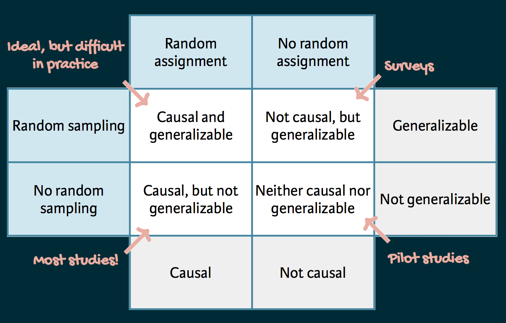

```{r packages, echo = FALSE, message=FALSE, warning=FALSE}
library(tidyverse)
library(scales)
library(kableExtra)
library(dsbox)
library(xaringanExtra)
xaringanExtra::use_panelset()
```


class: middle

# What's in a data analysis?

---

## Five core activities of data analysis

1.    Stating and refining the question
2.    Exploring the data
3.    Building formal statistical models
4.    Interpreting the results
5.    Communicating the results

.footnote[
Roger D. Peng and Elizabeth Matsui. "The Art of Data Science." A Guide for Anyone Who Works with Data. Skybrude Consulting, LLC (2015).
]

---

## Stating and refining the question

Six types of questions

1. **Descriptive:** summarize a characteristic of a set of data
2. **Exploratory:** analyse to see if there are patterns, trends, or relationships between variables (hypothesis generating)
3. **Inferential:** analyse patterns, trends, or relationships in representative data from a population
4. **Predictive:** make predictions for individuals or groups of individuals
5. **Causal:** whether changing one factor will change another factor, on average, in a population
6. **Mechanistic:** explore "how" as opposed to whether

.footnote[
Jeffery T. Leek and Roger D. Peng. "What is the question?." Science 347.6228 (2015): 1314-1315.
]

---

## Eg: COVID-19 and Vitamin D

1. **Descriptive:** frequency of hospitalisations due to COVID-19 in a set of data collected from a group of individuals

2. **Exploratory:** examine relationships between a range of dietary factors and COVID-19 hospitalisations

3. **Inferential:** examine whether any relationship between taking Vitamin D supplements and COVID-19 hospitalisations found in the sample hold for the population at large

4. **Predictive:** what types of people will take Vitamin D supplements during the next year

5. **Causal:** whether people with COVID-19 who were randomly assigned to take Vitamin D supplements or those who were not are hospitalised

6. **Mechanistic:** how increased vitamin D intake leads to a reduction in the number of viral illnesses

---

## Questions to data science problems

- Do you have appropriate data to answer your question?

<br>

- Do you have information on confounding variables? 
  -   Other variables that may explain the relationship seen between the two key variables.

<br>

- Was the data you're working with collected in a way that introduces bias?
  -   Attempting to make conclusions about a wider group when the data is collected from a typically non-representative cohort.


---

## Is my data biased?

.question[
Suppose I want to estimate the average number of children in households in Edinburgh. I conduct a survey at an elementary school in Edinburgh and ask students at this elementary school how many children, including themselves, live in their house. Then, I take the average of the responses. 
]

---

## Is my data biased?

.question[
Suppose I want to estimate the average number of children in households in Edinburgh. I conduct a survey at an elementary school in Edinburgh and ask students at this elementary school how many children, including themselves, live in their house. Then, I take the average of the responses. 
]

-   **Target**: average number of children in households in Edinburgh
-   **Data**: an elementary school
-   **Potential biases**:
  -   Do all households have a child at elementary school?
  -   Will *AN* elementary school be representative for across Edinburgh?
  -   Could there be double counting? "...how many children, including themselves, ..."


---

## Exploratory data analysis

Checklist:

- Formulate your question
- Read in your data
- Check the dimensions
- Look at the data: 
  -   The top few rows
  -   The bottom few rows
  -   Some random rows in the middle
- Validate with at least one external data source
- Make a plot
- _Try the easy solution first_

---

## Formulate your question/hypothesis

- Examples of questions/hypothesis:
  - Are air pollution levels higher in Scotland compared to elsewhere in the United Kingdom?
  - Are daily average temperatures in Edinburgh higher than what they are in Glasgow? Is this relationship true throughout the year?
  - Are people's opinion about political statement X the same across the country or does it differ between between different regions or perhaps different social-economic status?
- Most importantly: "Do I have the right data to answer this question?"
  -   What is the format of the data
  -   How do I import it into RStudio
  -   Does it need cleaning? (Most certainly Yes!)

---

## Final advice

When doing the data analysis:

-   Find some data, any data! 
-   *Look* at the data! 
-   Do some *simple* exploratory data analysis (data visualisations/summary statistics)
-   Formulate your investigation question/hypothesis
-   Iterate, iterate and iterate
-   **Let the data speak for itself!**

--

When communicating with your audience:

- Avoid jargon, uninterpreted results and lengthy output
- Pay attention to organization, presentation and flow
- Don't forget about coding best practices (make it readable)
- Be open to suggestions and feedback
- **Write as you go, don't leave it for the end!**

---

class: middle

# Scientific studies

---

## Scientific studies

.pull-left[
**Observational**  
- Collect data in a way that does not interfere with how the data arise ("observe")
- Establish associations/correlations
]
.pull-right[
**Experimental**  
- Randomly assign subjects to treatments
- Establish causal connections
]

---

##  Case study: Breakfast cereal keeps girls slim

.midi[
> *Girls who ate breakfast of any type had a lower average body mass index (BMI), a common obesity gauge, than those who said they didn't. The index was even lower for girls who said they ate cereal for breakfast, according to findings of the study conducted by the Maryland Medical Research Institute with funding from the National Institutes of Health (NIH) and cereal-maker General Mills.* [...]
>
> *The results were gleaned from a larger NIH survey of 2,379 girls in California, Ohio, and Maryland who were tracked between the ages of 9 and 19.* [...]
>
>*As part of the survey, the girls were asked once a year what they had eaten during the previous three days.* [...]
]

.footnote[
Source: [Study: Cereal Keeps Girls Slim](https://www.cbsnews.com/news/study-cereal-keeps-girls-slim/), Retrieved Sep 13, 2018.
]

---

## Explanatory and response variables

- **Response variable**
  -   The key variable of interest
  -   Example: BMI of the participant

<br>

- **Explanatory variable(s)**
  -   The variable(s) that _may_ help to describe or explain the response variable
  -   Example: Whether the participant ate breakfast or not


---

## Three possible explanations


1. Eating breakfast causes girls to be slimmer 
<br>
2. Being slim causes girls to eat breakfast
<br>
3. A third variable is responsible for both -- a **confounding** variable: an extraneous variable that affects both the explanatory and the response variable, and that makes it seem like there is a relationship between them


```{r echo=FALSE, out.height="50%", out.width="100%", fig.align='center'}

```


---

## Correlation != Causation

```{r echo=FALSE, out.width="45%", fig.align='center'}

```


---

## Studies and conclusions

```{r echo=FALSE, out.height="50%", out.width="80%", fig.align='center'}

```

---

class: middle

# Case study: Climate change survey

---

## The survey

>A July 2019 [YouGov survey](https://d25d2506sfb94s.cloudfront.net/cumulus_uploads/document/epjj0nusce/YouGov%20-%20International%20climate%20change%20survey.pdf) asked 1633 GB and 1333 USA randomly selected adults 
which of the following statements about the global environment best describes 
their view:
>- The climate is changing and human activity is mainly responsible  
>- The climate is changing and human activity is partly responsible, together with other factors  
>- The climate is changing but human activity is not responsible at all  
>- The climate is not changing  


.small[
```{r echo=FALSE, message=FALSE}
yougov_climate_table <- read_csv("data/yougov-climate.csv")

response_levels <- names(yougov_climate_table)[-1]

yougov_climate <- yougov_climate_table %>%
  pivot_longer(cols = -country, names_to = "response", values_to = "count") %>%
  uncount(count) %>%
  mutate(response = fct_relevel(response, response_levels))
```

```{r climate-table, echo=FALSE}
table(yougov_climate) %>% 
  stats::addmargins() %>%
  knitr::kable(format = "html", booktabs = TRUE) %>%
  kableExtra::column_spec(column = 2:5, width = "0.5 in")
```
]

---

## Investigation question

.question[

  Is the proportion of respondents who said "The climate is changing and human activity is mainly responsible" in Great Briton and the United States the same?

]


---

## Probability 101

- What is the probability that a respondent says "The climate is changing and human activity is mainly responsible"?
  -   Unconditional probability, $P(A)$

- What is the probability that a respondent says "The climate is changing and human activity is mainly responsible", given that the respondent is from Great Briton?
  -   Conditional probability, $P(A|B)$

- If knowing that event $B$ happened, then does it change the probability of event $A$ happening?
  -   If yes, then events $A$ and $B$ are said to be _dependant_
  -   If not, then the two events are said to be _independent_, $P(A | B) = P(A)$

---

## Simple calcualtions

.question[
Based on the response proportions for all respondents and within each country, does there appear to be a relationship between country and beliefs about climate change?
]

.pull-left[
```{r}
all <- 1340 / 2966
all
```
]
.pull-right[
```{r}
gb <- 833 / 1633
gb
us <- 507 / 1333
us
```
]

.question[
Is the relationship causal or associative? Can it be explained via another variable?
]

---

class: middle

# Case study: Berkeley admission data

---

## Berkeley admission data

- Study carried out by the Graduate Division of the University of California, Berkeley in the early 70’s to evaluate whether there was a gender bias in graduate admissions.
- The data come from six departments (labelled A--F). 
- We have information on whether the applicant was male or female and whether they were admitted or rejected. 
- First, we will evaluate whether the percentage of males admitted is indeed higher than females, overall. Next, we will calculate the same percentage for each department.

---

## Data

.pull-left[
```{r message=FALSE, echo=FALSE}
ucbadmit %>%
  print(n = 15)
```
]

.pull-right[
```{r message=FALSE, echo=FALSE}
ucbadmit %>%
  count(gender)

ucbadmit %>%
  count(dept)

ucbadmit %>%
  count(admit)
```
]


---

.question[
What can you say about the overall gender distribution? Hint: Calculate the following probabilities: $P(\text{Admit} | \text{Male})$ and $P(\text{Admit} | \text{Female})$.
]

.pull-left[
```{r}
ucbadmit %>%
  count(gender, admit)
```
]

.pull-right[
```{r ucbadmit-overall-prop}
ucbadmit %>%
  count(gender, admit) %>%
  group_by(gender) %>%
  mutate(prop_admit = n / sum(n))
```

- $P(\text{Admit} | \text{Female}) = 0.304$
- $P(\text{Admit} | \text{Male}) = 0.445$

]

---

## Overall gender distribution

.pull-left[
```{r ref.label="gender-admit", echo = FALSE, out.width="90%",fig.align='center'}
```
]

.pull-right[
```{r gender-admit, fig.show = "hide"}
ggplot(ucbadmit, aes(y = gender, 
                     fill = admit)) +
  geom_bar(position = "fill") + 
  labs(title = "Admit proportion by gender",
       x = "Proportion", 
       y = NULL,
       fill = "Admission")
```

]


---

.question[
What can you say about the gender distribution by department ?
]

.panelset[
.panel[.panel-name[Long]
```{r}
ucbadmit %>%
  count(dept, gender, admit)
```
]

.panel[.panel-name[Wide]
```{r}
ucbadmit %>%
  count(dept, gender, admit) %>%
  pivot_wider(names_from = dept, values_from = n)
```
]

.panel[.panel-name[Proportions]
```{r}
ucbadmit %>%
  count(dept, gender, admit) %>%
  group_by(dept, gender) %>%
  mutate(prop_admit = n / sum(n)) %>%
  select(-n) %>%
  pivot_wider(names_from = dept, values_from = prop_admit)
```
]

]


---

## Gender distribution, by department

.panelset[

.panel[.panel-name[Plot]
```{r ref.label="gender-dept-admit", echo = FALSE, out.width="80%", fig.width = 16, fig.height = 8, fig.align='center'}
```
]

.panel[.panel-name[Code]
```{r gender-dept-admit, fig.show = "hide"}
ggplot(ucbadmit, aes(y = gender, fill = admit)) +
  geom_bar(position = "fill") +
  facet_wrap(. ~ dept, nrow = 1) +
  labs(title = "Admissions by gender and department",
       x = "Proportion", 
       y = NULL,
       fill = "Admission")
```
]

]

---

## Case for gender discrimination?

**Overall:**
- $P(\text{Admit} | \text{Female}) = 0.304$ and $P(\text{Admit} | \text{Male}) = 0.445$
- The proportion of applicants begin admitted is higher given that the applicant is male compared to the applicant being female.

**Within departments:**
- Department A: 
  - $P(\text{Admit} | \text{A}, \text{Female}) = 0.824$ and $P(\text{Admit} | \text{A}, \text{Male}) = 0.621$
- Department E:
  - $P(\text{Admit} | \text{E}, \text{Female}) = 0.239$ and $P(\text{Admit} | \text{E}, \text{Male}) = 0.277$
- 4 out of 6 departments have higher admission proportions given the applicant is female.


---

class: middle

# Simpson's paradox

---

## Simpson's paradox

- Not considering an important variable when studying a relationship can result in **Simpson's paradox**
- Simpson's paradox illustrates the effect that omission of an explanatory variable can have on the measure of association between another explanatory variable and a response variable
- The inclusion of a third variable in the analysis can change the apparent relationship between the other two variables

---

## Relationship between two variables

.pull-left[
```{r echo = FALSE, message = FALSE}
df <- tribble(
  ~x, ~y, ~z,
  2,   4.1,  "A",
  3,   2.9,  "A",
  4,   2.1,  "A",
  5,   0.9,  "A",
  6,   10.9, "B",
  7,   10.1, "B",
  8,   8.9,  "B",
  9,   8.1,  "B"
)
```

```{r}
df
```

]

.pull-right[
```{r echo=FALSE, out.width="100%"}
ggplot(df, mapping = aes(x = x, y = y)) +
  geom_point(color = "black", size = 5) +
  geom_smooth(formula = y~x, 
              method = "lm",
              se = FALSE,
              color = "black") +   #Line of best fit
   labs(
    x = "x",
    y = "y",
    title = "Line of best fit"
  )
```
]

---

## Considering a third variable

.pull-left[
```{r}
df %>% 
  summarise(cor_x_y = cor(x, y))
```

```{r}
df %>% 
  group_by(z) %>%   #<<
  summarise(cor_x_y = cor(x, y))
```
]

.pull-right[
```{r echo=FALSE, out.width="100%"}
ggplot(df, mapping = aes(x = x, y = y, colour = z)) +
  geom_point(size = 5) +
  geom_smooth(formula = y~x, 
              method = "lm",
              se = FALSE) +   #Within group lines of best fit
  geom_smooth(mapping = aes(x = x, y = y),
              formula = y~x, 
              method = "lm",
              se = FALSE,
              colour = "black")+    #Overall line of best fit
  labs(
    x = "x",
    y = "y",
    z = "Group",
    title = "Simpson's Paradox"
  )
```
]


