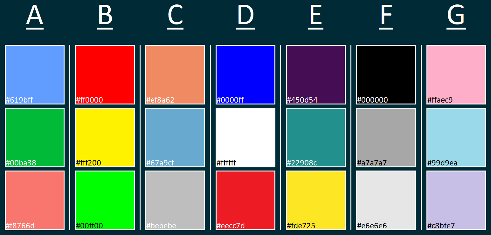

```{r packages, echo = FALSE, message=FALSE, warning=FALSE}
library(tidyverse)
library(scales)
library(kableExtra)
library(dsbox)
library(xaringanExtra)
xaringanExtra::use_panelset()
brexit <- read_csv("data/brexit.csv")

```

## Let's have a discussion

.pull-left[
```{r pie-3d, echo = FALSE, out.width="100%"}
knitr::include_graphics("img/pie-3d.jpg")
```
]
.pull-right[
```{r pie-to-bar, echo = FALSE, out.width="80%",fig.align='center'}
d <- tribble(
  ~category, ~value,
  "Cutting tools", 0.03,
  "Buildings and administration", 0.22,
  "Labor", 0.31,
  "Machinery", 0.27,
  "Workplace materials", 0.17
) %>% 
  mutate(category = fct_reorder(category, value))

text <- paste0(d$category, " ", d$value*100, "%", ifelse(d$category=="Cutting tools","\n",""))
ggplot(data = d, mapping = aes(x = "", y = value, fill = category)) +
    geom_col(show.legend = FALSE) +
    geom_text(mapping = aes(label = text),
              position = position_stack(vjust = 0.5),
              colour = c("black",rep("white",4)), size = 8) +
    scale_fill_manual( values = c("#1869a7","#32a143","#ad1928","#e7d803","#db821c")) +
    labs(x = NULL, y = NULL) +
    theme(axis.ticks.x = element_blank(),
          axis.text.x = element_blank(),
          axis.ticks.y = element_blank(),
          axis.text.y = element_blank(),
          panel.background = element_rect(fill = "white",
                                          colour = "white"))+
  coord_cartesian(ylim = c(0, 1.1))
```
]

---

##  Let's have a discussion

.pull-left[
```{r echo = FALSE, out.width="100%", fig.align='center'}
d %>%
  mutate(category = str_replace(category, " ", "\n")) %>%
  ggplot(aes(x = category, y = value, fill = category)) +
  geom_col() +
  theme_minimal() +
  labs(x = "", y = "") +
  theme(legend.position = "none")
```
]

.pull-right[
```{r echo = FALSE, out.width="100%", fig.align='center'}
ggplot(d, aes(x = fct_reorder(category, value), y = value, fill = category)) +
  geom_col() +
  theme_minimal() +
  coord_flip() +
  labs(x = "", y = "") +
  scale_fill_manual(values = c("gray", "gray", "red", "gray", "gray")) +
  theme(legend.position = "none")
```
]

---

## Let's have a discussion

```{r echo = FALSE, out.width = "90%", fig.align='center'}
knitr::include_graphics("img/time-series-story.png")
```

.footnote[
Credit: Angela Zoss and Eric Monson, Duke DVS
]

---

## Principles	for	effective	visualizations

- Think about the four respects:
  - Data
  - Mathematics
  - People
  - Computers


- Logical order for a categorical variable
- Ensure everything is readable (long categories names on the y-axis)
- Are there other important variables?
- Select clear and meaningful colours
- Use meaningful title and labels
- Be selective over redundant information

---

## Data

In September 2019, YouGov survey asked 1,639 GB adults the following question:

.pull-left[

> In hindsight, do you think Britain was right/wrong to vote to leave EU?
>
>- Right to leave  
>- Wrong to leave  
>- Don't know

.small[ 
Source: [YouGov Survey Results](https://d25d2506sfb94s.cloudfront.net/cumulus_uploads/document/x0msmggx08/YouGov%20-%20Brexit%20and%202019%20election.pdf), retrieved Oct 7, 2019
]
]

.pull-left[
```{r message = FALSE}
brexit <- read_csv("data/brexit.csv")
brexit %>% head(n = 2)
brexit %>% tail(n = 2)
```
]

---

## Visualise the data

.panelset[
.panel[.panel-name[Plots]

.pull-left[
```{r ref.label="plot-1", echo = FALSE, fig.align='center', out.width="80%", fig.width = 4, fig.height=4}
```
]
.pull-right[
```{r ref.label="plot-2", echo = FALSE, fig.align='center', out.width="80%", fig.width = 4, fig.height=4}
```

]
]

.panel[.panel-name[Code]
.pull-left[
```{r plot-1, fig.show = "hide"}
ggplot(brexit, aes(x = opinion)) +
  geom_bar()
```
]
.pull-right[
```{r plot-2, fig.show = "hide"}
ggplot(brexit, aes(x = region)) +
  geom_bar()
```
]
]
]

---

## Question

.pull-left[
<br>
.question[
Are people's opinion about Brexit the same or different for each region?
]

```{r plot-3, fig.show='hide'}
ggplot(brexit, aes(x = region, 
                   fill = opinion)) +
  geom_bar()
```
]

.pull-right[
```{r ref.label="plot-3", echo = FALSE, fig.align='center', out.width="80%", fig.width = 4, fig.height=4}
```
]

Are we done? Can we do any better?


---

## Ensure text is readable


```{r plot-5, echo = FALSE, fig.show='hide', message = FALSE, warning=FALSE}
brexit <- brexit %>%
  mutate(
    region = fct_recode(  
      region,
      London = "london",
      `Rest of South` = "rest_of_south",
      `Midlands / Wales` = "midlands_wales",
      North = "north",
      Scotland = "scot"
    )
  )

ggplot(brexit, aes(y = region,  
                   fill = opinion)) +
  geom_bar()
```


.panelset[
.panel[.panel-name[Output]
```{r ref.label="plot-5", echo = FALSE, fig.align='center', out.width="60%", fig.width = 6, fig.height=4, message = FALSE, warning=FALSE}
```
]
.panel[.panel-name[Code: Wrangling]
```{r wrangle-txt,  eval = FALSE, message = FALSE, warning=FALSE}
brexit <- brexit %>%
  mutate(
    region = fct_recode(  #<<
      region,
      London = "london",
      `Rest of South` = "rest_of_south",
      `Midlands / Wales` = "midlands_wales",
      North = "north",
      Scotland = "scot"
    )
  )
```
]
.panel[.panel-name[Code: Visualisation]

```{r plot-txt, fig.show='hide', eval = FALSE}
ggplot(brexit, aes(y = region,  #<<
                   fill = opinion)) +
  geom_bar()
```
]
]


---

## Is there a better ording


```{r plot-6, echo = FALSE, fig.show='hide', message = FALSE, warning=FALSE}
brexit <- brexit %>%
  mutate(
    region = fct_relevel(   #<<
      region,   #<<
      "Scotland", "North", "Midlands / Wales", "Rest of South", "London"  #<<
    )  #<<
  )
  

ggplot(brexit, aes(y = region,  
                   fill = opinion)) +
  geom_bar()
```


.panelset[
.panel[.panel-name[Output]
```{r ref.label="plot-6", echo = FALSE, fig.align='center', out.width="60%", fig.width = 6, fig.height=4, message = FALSE, warning=FALSE}
```
]
.panel[.panel-name[Code: Wrangling]
```{r wrangle-txt6,  eval = FALSE, message = FALSE, warning=FALSE}
brexit <- brexit %>%
  mutate(
    region = fct_recode(
      region,  
      London = "london",  `Rest of South` = "rest_of_south",
      `Midlands / Wales` = "midlands_wales", North = "north", Scotland = "scot"
    ),
    
    region = fct_relevel(   #<<
      region,   #<<
      "Scotland", "North", "Midlands / Wales", "Rest of South", "London"  #<<
    ), #<<
  )
  
```
]
.panel[.panel-name[Code: Visualisation]

```{r plot-txt6, fig.show='hide', eval = FALSE}
ggplot(brexit, aes(y = region,
                   fill = opinion)) +
  geom_bar()
```
]
]


---


## Faceting rather than stacked


```{r plot-7, echo = FALSE, fig.show='hide', message = FALSE, warning=FALSE}
ggplot(brexit, aes(y = opinion,    #<<
                   fill = opinion)) +
  geom_bar() +
  facet_grid(~region) #<<
```


.panelset[
.panel[.panel-name[Output]
```{r ref.label="plot-7", echo = FALSE, fig.align='center', out.width="70%", fig.width = 8, fig.height=4, message = FALSE, warning=FALSE}
```
]

.panel[.panel-name[Code: Wrangling]
```{r wrangle-txt7,  eval = FALSE, message = FALSE, warning=FALSE}
brexit <- brexit %>%
  mutate(
    region = fct_recode(
      region,  
      London = "london",  `Rest of South` = "rest_of_south",
      `Midlands / Wales` = "midlands_wales", North = "north", Scotland = "scot"
    ),
    
    region = fct_relevel(   
      region, 
      "Scotland", "North", "Midlands / Wales", "Rest of South", "London"  
    ), 
  )
  
```
]

.panel[.panel-name[Code: Visualisation]

```{r plot-txt7, fig.show='hide', eval = FALSE}
ggplot(brexit, aes(y = opinion,    #<<
                   fill = opinion)) +
  geom_bar() +
  facet_grid(~region) #<<
```
]
]


---

## Be selective with redundancy


```{r plot-8, echo = FALSE, fig.show='hide', message = FALSE, warning=FALSE}
ggplot(brexit, aes(y = opinion,    
                   fill = opinion)) +
  geom_bar() +
  facet_grid(~region) +
  labs(
    y = NULL   #<<
  ) +
  guides(fill = "none")  #Removes legend #<<
```


.panelset[
.panel[.panel-name[Output]
```{r ref.label="plot-8", echo = FALSE, fig.align='center', out.width="70%", fig.width = 8, fig.height=4, message = FALSE, warning=FALSE}
```
]

.panel[.panel-name[Code: Wrangling]
```{r wrangle-txt8,  eval = FALSE, message = FALSE, warning=FALSE}
brexit <- brexit %>%
  mutate(
    region = fct_recode(
      region,  
      London = "london",  `Rest of South` = "rest_of_south",
      `Midlands / Wales` = "midlands_wales", North = "north", Scotland = "scot"
    ),
    
    region = fct_relevel(   
      region, 
      "Scotland", "North", "Midlands / Wales", "Rest of South", "London"  
    ), 
  )
  
```
]

.panel[.panel-name[Code: Visualisation]

```{r plot-txt8, fig.show='hide', eval = FALSE}
ggplot(brexit, aes(y = opinion,    
                   fill = opinion)) +
  geom_bar() +
  facet_grid(~region) +
  labs(
    y = NULL   #<<
  ) +
  guides(fill = "none")  #Removes legend #<<
```
]
]


---

## Use informative labels


```{r plot-9, echo = FALSE, fig.show='hide', message = FALSE, warning=FALSE}
ggplot(brexit, aes(y = opinion,    
                   fill = opinion)) +
  geom_bar() +
  facet_grid(~region) +
  labs(
    title = "Was Britain right or wrong to leave the EU?",  #<<
    subtitle = "YouGov Survey Results, 2-3 September 2019", #<<
    x = "Frequency", #<<
    y = NULL
  ) +
  guides(fill = "none")
```


.panelset[
.panel[.panel-name[Output]
```{r ref.label="plot-9", echo = FALSE, fig.align='center', out.width="70%", fig.width = 8, fig.height=4, message = FALSE, warning=FALSE}
```
]

.panel[.panel-name[Code: Wrangling]

```{r wrangle-txt9,  eval = FALSE, message = FALSE, warning=FALSE}
brexit <- brexit %>%
  mutate(
    region = fct_recode(
      region,  
      London = "london",  `Rest of South` = "rest_of_south",
      `Midlands / Wales` = "midlands_wales", North = "north", Scotland = "scot"
    ),
    
    region = fct_relevel(   
      region, 
      "Scotland", "North", "Midlands / Wales", "Rest of South", "London"  
    ), 
  )
  
```
]

.panel[.panel-name[Code: Visualisation]

```{r plot-txt9, fig.show='hide', eval = FALSE}
ggplot(brexit, aes(y = opinion,    
                   fill = opinion)) +
  geom_bar() +
  facet_grid(~region) +
  labs(
    title = "Was Britain right or wrong to leave the EU?",  #<<
    subtitle = "YouGov Survey Results, 2-3 September 2019", #<<
    x = "Frequency", #<<
    y = NULL
  ) +
  guides(fill = "none")
```
]
]

---

## Selection of colours

```{r echo = FALSE, out.width = "80%",fig.align='center'}

```


[colorbrewer2.org](https://colorbrewer2.org/) - Help with selecting a colour pallet


---


## Selection of colours


```{r plot-10, echo = FALSE, fig.show='hide', message = FALSE, warning=FALSE}
ggplot(brexit, aes(y = opinion,    
                   fill = opinion)) +
  geom_bar() +
  facet_grid(~region) +
  labs(
    y = NULL  
  ) +
  guides(fill = "none") +
  scale_fill_manual(values = c(
    "Wrong" = "#ef8a62", #<<
    "Right" = "#67a9cf", #<<
    "Don't know" = "gray" #<<
  ))
```


.panelset[
.panel[.panel-name[Output]
```{r ref.label="plot-10", echo = FALSE, fig.align='center', out.width="70%", fig.width = 8, fig.height=4, message = FALSE, warning=FALSE}
```
]

.panel[.panel-name[Code: Wrangling]

```{r wrangle-txt10,  eval = FALSE, message = FALSE, warning=FALSE}
brexit <- brexit %>%
  mutate(
    region = fct_recode(
      region,  
      London = "london",  `Rest of South` = "rest_of_south",
      `Midlands / Wales` = "midlands_wales", North = "north", Scotland = "scot"
    ),
    
    region = fct_relevel(   
      region, 
      "Scotland", "North", "Midlands / Wales", "Rest of South", "London"  
    ), 
  )
  
```
]

.panel[.panel-name[Code: Visualisation]

```{r plot-txt10, fig.show='hide', eval = FALSE}
ggplot(brexit, aes(y = opinion,    
                   fill = opinion)) +
  geom_bar() +
  facet_grid(~region) +
  labs(
    title = "Was Britain right or wrong to leave the EU?",  
    subtitle = "YouGov Survey Results, 2-3 September 2019", 
    x = "Frequency",
    y = NULL
  ) +
  guides(fill = "none") +
  scale_fill_manual(values = c(
    "Wrong" = "#ef8a62", #<<
    "Right" = "#67a9cf", #<<
    "Don't know" = "gray" #<<
  ))
```
]
]

---

## Iterate...


.pull-left[
Reminder:
.question[
Are people's opinion about Brexit the same or different for each region?
]
- Has the data visualisation answered this question?
- Is there anything that is unclear?
- What further edits are needed?
- Is this the only visualisation that can answer the question?
- Can you create a better data visualisation?
]

.pull-right[
```{r ref.label="plot-10", echo = FALSE, fig.align='center', out.width="100%", fig.width = 8, fig.height=4, message = FALSE, warning=FALSE}
```
]

