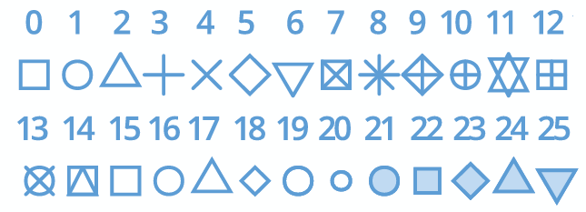
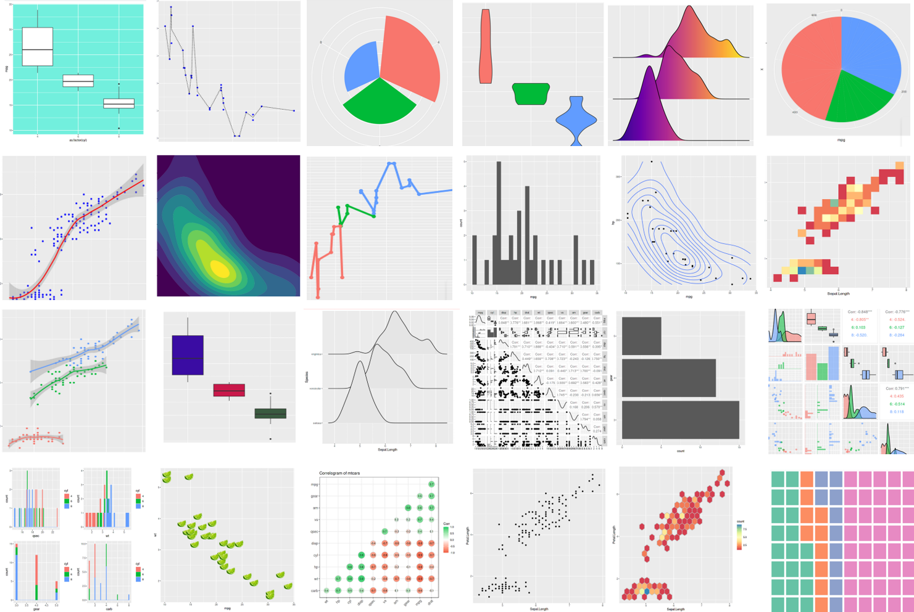

```{r packages, echo=FALSE, message=FALSE, warning=FALSE}
library(tidyverse)
library(magick)
library(xaringanExtra)
xaringanExtra::use_panelset()
```

class: middle

# Understanding your data

* There are many types of data visualisation, each designed with a particular purpose.
* To determine which visualisation style is appropriate, consider:

  1. What are the properties of variables?
  2. How many variables to include in the data visualisation?
  3. What aspect of the data do you want to explore, investigate and communicate?


---

## Types of variables

- **Quantitative variables** are variables whose data are numerical values.
  - **Discrete variables** describes count data, typically non-negative integer values. <br />
    &emsp; Eg, Number of IDS students or number of election votes.
  - **Continuous variables** are typically real-valued measurements, rounded to a specified number of decimal places or significant figures. <br />
    &emsp; Eg, Penguin bill length, body mass and flipper length.


- **Qualitative variable** are variables that are descriptive.
  - **Categorical (factor) variables** usually identify one option from a small set of cases. <br />
    &emsp; Eg, Penguin breeds (Adelie, Chinstrap or Gentoo).
  - **Ordinal variables** are categorical variables that have a natural ordering. <br />
    &emsp; Degree grades: First, upper-second, lower-second and third.


---

## Number of variables involved

How many variables do you want to use in your data visualisation?

- One variable (Univariate data analysis)
  <!-- - Investigating a single variable -->
  - What is the _location_, _spread_ and _shape_ of the data?
  - Types of visualisations:**histogram**, **box plot**, **bar chart**, etc.
- Two variables (Bivariate data analysis)
  - Investigating the relationship between two variables
  - Positive/negative correlation? Linear or non-linear relationship?
  - Types of visualisations: **scatter plot**, **box plots**, **segmented bar plot**, etc.
- Three or more variables (Multivariate data analysis)
  - Investigating the relationship between many variables simultaneously.
  - Does the structure of the relationship between two variables change depending on the value of a third?
  - Use of **colour**, **style** and **faceting** - be creative!
  - YouTube: Hans Rosling, The Joy of Stats, BBC - [`r fontawesome::fa("youtube", fill="red")`](https://www.youtube.com/watch?v=jbkSRLYSojo)

---

## ggplot2 package

.pull-left-wide[ 
- **ggplot2** is tidyverse's data visualization package 
- All visualisations begin with the `ggplot()` command
- The plot is then constructed by _adding_ (`+`) layers
]
.pull-right-narrow[
```{r echo=FALSE, out.width="50%"}
knitr::include_graphics("img/ggplot2-logo.png")
```
] 

```{r eval = FALSE}
ggplot(data = [dataset],                                         # Data
       mapping = aes(x = [x-variable], y = [y-variable])) +      # Aesthetics
   geom_[*]() +                                                  # Geometries
   [other options]                                               # ...
```

- Today we will examine many of the commonly used features.
- More information can be found on the [ggplot2 cheat sheet](https://www.rstudio.com/resources/cheatsheets/)


---

## Motivating Data Set: Bats `r emoji::emoji('bat')`

* Extracted from the [Atlantic Mammal Traits](https://esajournals.onlinelibrary.wiley.com/doi/10.1002/ecy.2106) survey on animal morphology.
* Data contains information about 4334 Neotropical fruit bats (_Aribeus_) from South America between 2010-2017.

```{r load-data, message = FALSE}
bat_data <- read_csv("data/bats.csv")
glimpse(bat_data)
```

---

## Data Dictionary

<br>

<br>

| Variable    | Description | Type |
|:------------|:------------|:-----|
| `species`   | Name of bat species | Categorical (5 cases) |
| `body_mass` | Body mass (in grams)| Numerical, continuous |
| `forearm`   | Forearm length (in mm) | Numerical, continuous |
| `age`       | Adult or Juvenile | Categorical (2 cases) |
| `sex`       | Female or Male | Categorical (2 cases) |
| `year`      | Year of measurement | Numerical, discrete |


---

class: middle

# Visualising numerical data

---

class: middle

# Histogram - `geom_histogram()`

---


## Histogram

```{r message = TRUE, out.width = "50%", fig.height = 5, fig.width = 8, fig.align='center'}
ggplot(data = bat_data, 
       mapping = aes(x = body_mass)) +
  geom_histogram()
```
* Message specifies the use of default/assumed values

---


## Number of bins

.panelset[


.panel[.panel-name[Recommended]

.pull-left[
```{r ref.label = "hist-30", echo = FALSE, warning = FALSE, out.width = "80%"}
```
]
.pull-right[
```{r hist-30, fig.show = "hide", warning = FALSE}
ggplot(data = bat_data, 
       mapping = aes(x = body_mass)) +
  geom_histogram(bins = 30) #<<
```
]
]


.panel[.panel-name[More bins]

.pull-left[
```{r ref.label = "hist-80", echo = FALSE, warning = FALSE, out.width = "80%"}
```
]
.pull-right[
```{r hist-80, fig.show = "hide", warning = FALSE}
ggplot(data = bat_data, 
       mapping = aes(x = body_mass)) +
  geom_histogram(bins = 80)  #<<
```
]

]


.panel[.panel-name[Fewer bins]
.pull-left[
```{r ref.label = "hist-10", echo = FALSE, warning = FALSE, out.width = "80%"}
```
]
.pull-right[
```{r hist-10, fig.show = "hide", warning = FALSE}
ggplot(data = bat_data, 
       mapping = aes(x = body_mass)) +
  geom_histogram(bins = 10) #<<
```
]
]
]

---

## Customizing options

.panelset[

.panel[.panel-name[Labels]
.pull-left[
```{r ref.label = "hist-labs", echo = FALSE, warning = FALSE, out.width = "80%"}
```
]
.pull-right[
```{r hist-labs, fig.show = "hide", warning = FALSE}
ggplot(data = bat_data, 
       mapping = aes(x = body_mass)) +
  geom_histogram(bins = 30) +
  labs( #<<
    x = "Body mass (in grams)", #<<
    y = "Frequency", #<<
    title = "Body mass of fruit bats",  #<<
    subtitle = "(2010-2017)" #<<
  ) #<<
```
]
]


.panel[.panel-name[Theme]
.pull-left[
```{r ref.label = "hist-theme", echo = FALSE, warning = FALSE, out.width = "80%"}
```
]
.pull-right[
```{r hist-theme, fig.show = "hide", warning = FALSE}
ggplot(data = bat_data, 
       mapping = aes(x = body_mass)) +
  geom_histogram(bins = 30) +   
  labs(
    x = "Body mass (in grams)",
    y = "Frequency",
    title = "Body mass of fruit bats",
    subtitle = "(2010-2017)"
  ) +
  theme_bw() #<<
```

* See [here](https://ggplot2.tidyverse.org/reference/ggtheme.html) for more theme defaults.

]
]


.panel[.panel-name[Colour]
.pull-left[
```{r ref.label = "hist-col", echo = FALSE, warning = FALSE, out.width = "80%"}
```
]
.pull-right[
```{r hist-col, fig.show = "hide", warning = FALSE}
ggplot(data = bat_data, 
       mapping = aes(x = body_mass)) +
  geom_histogram(
    bins = 30,
    fill = "darkcyan", #<<
    colour = "darkblue"   #<<
    ) +     
  labs(
    x = "Body mass (in grams)",
    y = "Frequency",
    title = "Body mass of fruit bats",
    subtitle = "(2010-2017)"
    ) +
  theme_bw()
```

]
]

]

---

class: middle

# Density plot - `geom_density()`

---

## Density plot

.pull-left[
```{r ref.label = "density", echo = FALSE, warning = FALSE, out.width = "80%"}
```

]
.pull-right[
```{r density, fig.show = "hide", warning = FALSE}
ggplot(data = bat_data, 
       mapping = aes(x = body_mass)) +
  geom_density()  #<<
```


Construction:
```{r eg_den, warning = FALSE, fig.width = 6, fig.height = 3, fig.align='center', echo = FALSE}
data <- tibble(
  x = seq(-3,3,by=0.01),
  y1 = dnorm(x, mean = -1, sd = 0.5)/3,
  y2 = dnorm(x, mean = -0.5, sd = 0.5)/3,
  y3 = dnorm(x, mean = 1, sd = 0.5)/3,
  y = y1 + y2 + y3
) 
ggplot() +
  geom_point(data = data.frame(x = c(-1,-0.5,1), y = c(0,0,0)),
             mapping = aes(x = x, y = y), cex = 3) + 
  geom_line(data=data, mapping = aes(x = x, y = y), lwd=2) +
  geom_line(data=data, mapping = aes(x = x, y = y1), lty=2, col = "blue") + 
  geom_line(data=data, mapping = aes(x = x, y = y2), lty=2, col = "blue") + 
  geom_line(data=data, mapping = aes(x = x, y = y3), lty=2, col = "blue") + 
  geom_hline(yintercept = 0) +
  geom_vline(xintercept = -3) + 
  labs(x = "x", y = "Density") + 
  theme_minimal() +
  theme(axis.text.x=element_blank(), axis.text.y=element_blank())
```

]


---


## Customizing options


.pull-left[
```{r ref.label = "density-custom", echo = FALSE, warning = FALSE, out.width = "80%"}
```
]
.pull-right[

```{r density-custom, fig.show = "hide", warning = FALSE}
ggplot(data = bat_data, 
       mapping = aes(x = body_mass)) + 
  geom_density(
    fill = "darkcyan"
    ) +   
  labs(
    x = "Body mass (in grams)",
    y = "Density",
    title = "Body mass of fruit bats",
    subtitle = "(2010-2017)"
    ) +
  theme_bw()
```
]

---

class: middle

# Box plot - `geom_boxplot()`

---

## Box plot

.pull-left[
```{r ref.label = "boxplot", echo = FALSE, warning = FALSE, out.width = "80%"}
```
]
.pull-right[
```{r boxplot, fig.show = "hide", warning = FALSE}
ggplot(data = bat_data, 
       mapping = aes(x = body_mass)) + 
  geom_boxplot( ) +   #<<
  labs(
    x = "Body mass (in grams)",
    title = "Body mass of fruit bats",
    subtitle = "(2010-2017)"
    ) +
  theme_bw()
```


Construction:
```{r boxplot_description, echo = FALSE, fig.align='center', fig.width=8, fig.height=3}
ggplot() +
  geom_polygon(data = data.frame(x = c(-1,-1,1,1), y=c(0,1,1,0)),
               mapping = aes(x = x, y = y), fill = "grey60", col="black") +
  geom_segment(mapping = aes(x = 0, y = 0, xend = 0, yend = 1), lwd = 3) + 
  geom_segment(mapping = aes(x = 1, y = 0.5, xend = 2.5, yend = 0.5)) + 
  geom_segment(mapping = aes(x = -1, y = 0.5, xend = -2.5, yend = 0.5)) +
  geom_text(mapping = aes(x = 0, y = 17/16, label = "Median"), size=5) + 
  geom_text(mapping = aes(x = 1, y = 13/16, label = "Upper Quartile"), nudge_x = 0.55, size=5)  + 
  geom_text(mapping = aes(x = -1, y = 13/16, label = "Lower Quartile"), nudge_x = -0.55, size=5) + 
  geom_text(mapping = aes(x = -2.5, y = 7/16, label = "Minimum"), nudge_x = 0.35, size=5) + 
  geom_text(mapping = aes(x = 2.5, y = 7/16, label = "Maximum"), nudge_x = -0.35, size=5)  +
    geom_text(mapping = aes(x = 0, y = -1/16, label = "<-------------- IQR -------------->"), size=5)  +
    theme_bw() + 
    theme(axis.text.x=element_blank(), 
          axis.text.y=element_blank(),
          axis.ticks.x=element_blank(),
          axis.ticks.y=element_blank(),
          panel.grid.major = element_blank(), 
          panel.grid.minor = element_blank())+
  labs(x = "", y = "")

```

]

---

## Customizing options

.panelset[

.panel[.panel-name[Orientation]
.pull-left[
```{r ref.label = "box-y", echo = FALSE, warning = FALSE, out.width = "80%"}
```
]
.pull-right[
```{r box-y, fig.show = "hide", warning = FALSE}
ggplot(data = bat_data, 
       mapping = aes(y = body_mass)) +  #<<
  geom_boxplot( ) +   
  labs(
    y = "Body mass (in grams)",
    title = "Body mass of fruit bats",
    subtitle = "(2010-2017)"
    ) +
  theme_bw()
```
]
]


.panel[.panel-name[Whisker Length]
.pull-left[
```{r ref.label = "box-coef", echo = FALSE, warning = FALSE, out.width = "80%"}
```
]
.pull-right[
```{r box-coef, fig.show = "hide", warning = FALSE}
ggplot(data = bat_data, 
       mapping = aes(y = body_mass)) + 
  geom_boxplot(coef = 1) + # default: 1.5  #<<
  labs(
    y = "Body mass (in grams)",
    title = "Body mass of fruit bats",
    subtitle = "(2010-2017)"
    ) +
  theme_bw()
```


]
]


.panel[.panel-name[More Styles]
.pull-left[
```{r ref.label = "hist-style", echo = FALSE, warning = FALSE, out.width = "80%"}
```
]
.pull-right[
```{r hist-style, fig.show = "hide", warning = FALSE}
ggplot(data = bat_data, 
       mapping = aes(y = body_mass)) + 
  geom_boxplot(coef = 1,
    fill = "darkcyan",      #<<
    colour = "darkblue", #<<
    lwd = 1.5,          # line width scaling #<<
    outlier.shape = 4,  # see below #<<
    outlier.colour = "darkred") +  #<<
  labs(
    y = "Body mass (in grams)",
    title = "Body mass of fruit bats",
    subtitle = "(2010-2017)" ) +
  theme_bw()
```
```{r echo=FALSE, out.width="50%",fig.align='center'}

```


]
]

]

---

class: middle

# Adding a categorical variable...

---

## ...via aesthetics

.panelset[
.panel[.panel-name[Histogram]
.pull-left[
```{r ref.label = "hist-cat", echo = FALSE, warning = FALSE, out.width = "80%"}
```
]
.pull-right[
```{r hist-cat, fig.show = "hide", warning = FALSE}
ggplot(data = bat_data, 
       mapping = aes(
         x = body_mass,
         fill = species   #<<
         )) +
  geom_histogram(
    bins = 30,
    position = "identity", #<<
    alpha = 0.5  # opacity #<<
    ) +
  labs(
    x = "Body mass (in grams)",
    y = "Frequency",
    title = "Body mass of fruit bats,",
    subtitle = "by species" ) 
```
]
]

.panel[.panel-name[Density]
.pull-left[
```{r ref.label = "density-cat", echo = FALSE, warning = FALSE, out.width = "80%"}
```
]
.pull-right[
```{r density-cat, fig.show = "hide", warning = FALSE}
ggplot(data = bat_data, 
       mapping = aes(
         x = body_mass,
         fill = species   #<<
         )) +
  geom_density(
    alpha = 0.5 #<<
    ) +
  labs(
    x = "Body mass (in grams)",
    y = "Density",
    title = "Body mass of fruit bats,",
    subtitle = "by species" ) 
```
]
]


.panel[.panel-name[Box plot]
.pull-left[
```{r ref.label = "box-cat", echo = FALSE, warning = FALSE, out.width = "80%"}
```
]
.pull-right[
```{r box-cat, fig.show = "hide", warning = FALSE}
ggplot(data = bat_data, 
       mapping = aes(
         x = body_mass, 
         y = species    #<<
         )) +
  geom_boxplot() +
  labs(
    x = "Body mass (in grams)",
    y = "Species",
    title = "Body mass of fruit bats",
    subtitle = "(2010-2017)" ) 
```
]
]


]

---

## ...via faceting


.panelset[
.panel[.panel-name[Wrap (same axes)]
.pull-left[
```{r ref.label = "facet-wrap", echo = FALSE, warning = FALSE, out.width = "80%"}
```
]
.pull-right[
```{r facet-wrap, fig.show = "hide", warning = FALSE}
ggplot(data = bat_data, 
       mapping = aes(x = body_mass)) +
  geom_histogram(bins = 30) +
  labs(
    x = "Body mass (in grams)",
    y = "Frequency",
    title = "Body mass of fruit bats,",
    subtitle = "by species" )  +
  facet_wrap(~ species, #<<
             ncol = 3) #<<
```
]
]

.panel[.panel-name[Wrap (free axes)]
.pull-left[
```{r ref.label = "facet-scale", echo = FALSE, warning = FALSE, out.width = "80%"}
```
]
.pull-right[
```{r facet-scale, fig.show = "hide", warning = FALSE}
ggplot(data = bat_data, 
       mapping = aes(x = body_mass)) +
  geom_histogram(bins = 30) +
  labs(
    x = "Body mass (in grams)",
    y = "Frequency",
    title = "Body mass of fruit bats,",
    subtitle = "by species" )  +
  facet_wrap(~ species, 
             ncol = 3,
             scales = "free") #<<

```
]
]


.panel[.panel-name[Grid]
.pull-left[
```{r ref.label = "grid", echo = FALSE, warning = FALSE, out.width = "80%"}
```
]
.pull-right[
```{r grid, fig.show = "hide", warning = FALSE}
ggplot(data = bat_data, 
       mapping = aes(x = body_mass)) +
  geom_histogram(bins = 30) +
  labs(
    x = "Body mass (in grams)",
    y = "Frequency",
    title = "Body mass of fruit bats,",
    subtitle = "by age and sex" )  +
  facet_grid(age ~ sex,       #<<
             scale = "free")  #<<

```
]
]

]


---

class: middle

# Relationships numerical variables - `geom_point()` and `geom_bin_2d()`

---

## Scatterplot

.pull-left[
```{r ref.label = "scatter1", echo = FALSE, warning = FALSE, out.width = "80%"}
```
]
.pull-right[
```{r scatter1, fig.show = "hide", warning = FALSE}
ggplot(data = bat_data, 
       mapping = aes(
         x = forearm,   #<<
         y = body_mass #<<
         )) +
  geom_point() +   #<<
  labs(
    x = "Forearm length (in mm)",
    y = "Body mass (in grams)",
    title = "Forearm & Mass Relationship,",
    subtitle = "(2010-2017)" )  
```
]

---

## Customise

.panelset[

.panel[.panel-name[Best fit line]
.pull-left[
```{r ref.label = "scatter_line", echo = FALSE, warning = FALSE, out.width = "80%", message = FALSE}
```
]
.pull-right[
```{r scatter_line, fig.show = "hide", warning = FALSE, message = FALSE}
ggplot(data = bat_data, 
       mapping = aes(
         x = forearm,   
         y = body_mass
         )) +
  geom_point() +  
  geom_smooth(method = lm) +  #<<
  labs(
    x = "Forearm length (in mm)",
    y = "Body mass (in grams)",
    title = "Forearm & Mass Relationship",
    subtitle = "(2010-2017)" )  
```
]
]


.panel[.panel-name[Add variables via style]
.pull-left[
```{r ref.label = "scatter3rd", echo = FALSE, warning = FALSE, out.width = "80%"}
```
]
.pull-right[
```{r scatter3rd, fig.show = "hide", warning = FALSE}
ggplot(data = bat_data, 
       mapping = aes(
         x = forearm,   
         y = body_mass,
         colour = species,  #<<
         shape = age #<<
         )) +
  geom_point() +  
  labs(
    x = "Forearm length (in mm)",
    y = "Body mass (in grams)",
    title = "Forearm & Mass Relationship,",
    subtitle = "by species and age" )  
```
]
]

.panel[.panel-name[Zoom]
.pull-left[
```{r ref.label = "scatter_zoom", echo = FALSE, warning = FALSE, out.width = "80%"}
```
]
.pull-right[
```{r scatter_zoom, fig.show = "hide", warning = FALSE}
ggplot(data = bat_data, 
       mapping = aes( 
         x = forearm, y = body_mass, 
         colour = species, shape = age)) +
  geom_point() +  
  labs(
    x = "Forearm length (in mm)",
    y = "Body mass (in grams)",
    title = "Forearm & Mass Relationship,",
    subtitle = "by bat species and age" )  +
  coord_cartesian(    #<<
    xlim = c(30, 50),  #<<
    ylim = c(0, 30))    #<<
```
]]

]

---

## 2D histogram colour map

.pull-left[
```{r ref.label = "hist2d", echo = FALSE, warning = FALSE, out.width = "80%"}
```
]
.pull-right[
```{r hist2d, fig.show = "hide", warning = FALSE}
ggplot(data = bat_data, 
       mapping = aes( 
         x = forearm, 
         y = body_mass
         )) +
  geom_bin_2d() +  #<<
  labs(
    x = "Forearm length (in mm)",
    y = "Body mass (in grams)",
    title = "Forearm & Mass Relationship,",
    subtitle = "(2010-2017)" )  
```
]

---

class: middle

# Bar plot - `geom_bar()`

Visualizing qualitative/categorical data 

---

## Bar plot

.pull-left[
```{r ref.label = "barchart", echo = FALSE, warning = FALSE, out.width = "80%"}
```

]
.pull-right[
```{r barchart, fig.show = "hide", warning = FALSE}
ggplot(bat_data, aes(
    y = species  # y => Horizontal #<<
    )) +
  geom_bar() +  #<<
  labs(
    x = "Count",
    y = "Species",
    title = "Bar plot of bat species",
    subtitle = "(2010-2017)")
```
]
---

## Bar plot variations


.panelset[
.panel[.panel-name[Segmented]

.pull-left[
```{r ref.label = "segmented", echo = FALSE, warning = FALSE, out.width = "80%"}
```
]

.pull-right[
```{r segmented, fig.show = "hide", warning = FALSE}
ggplot(bat_data, aes(
    y = species,  
    fill = age      #<<
    )) +
  geom_bar() +  
  labs(
    x = "Count",
    y = "Species",
    title = "Bar plot of bat species,",
    subtitle = "segmented by age")
```
]]

.panel[.panel-name[Proportions]

.pull-left[
```{r ref.label = "bar_prop", echo = FALSE, warning = FALSE, out.width = "80%"}
```
]

.pull-right[
```{r bar_prop, fig.show = "hide", warning = FALSE}
ggplot(bat_data, aes(
    y = species,  
    fill = age      
    )) +
  geom_bar(position = "fill") +   #<<
  labs(
    x = "Count",
    y = "Species",
    title = "Age proportion per bat species",
    subtitle = "(2010-2017)")
```
]
]


.panel[.panel-name[Pie chart]

.pull-left[
```{r ref.label = "pie", echo = FALSE, warning = FALSE, out.width = "80%"}
```
]

.pull-right[
```{r pie, fig.show = "hide", warning = FALSE}
ggplot(bat_data, aes(
    x = "", #<<
    fill = species  #<<  
    )) +
  geom_bar(position = "fill") +   #<<
  coord_polar("y", start = 0) +   #<<
  theme_void() + #<<
  labs(
    title = "Bat sepcies pie chart",
    subtitle = "(2010-2017)")
```
]
]

]

---


<!-- Add final discussion slide on 'there is no right image', emphasis on the communication message and the 4 respects -->


## Data visualisation gallery

.pull-left[
* `ggplot2` is used to create a wide variety of data visualisation styles.
* It has many customisation tools to support your communication.
* Use `ggplot2` manual pages (and online searches) to support your creation.


* **But**, excessive customisation can be distracting.
* Remember the 4 respects:
  1. Respect the **people**
  2. Respect the **data**
  3. Respect the **mathematics**
  4. Respect the **computers**

]
.pull-right[

<br>

```{r echo=FALSE, out.width="100%", fig.align='center'}

```
]