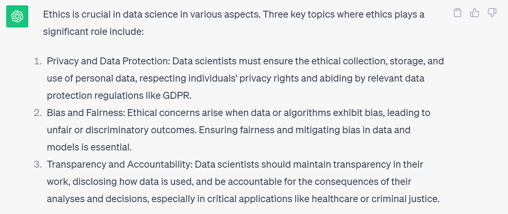
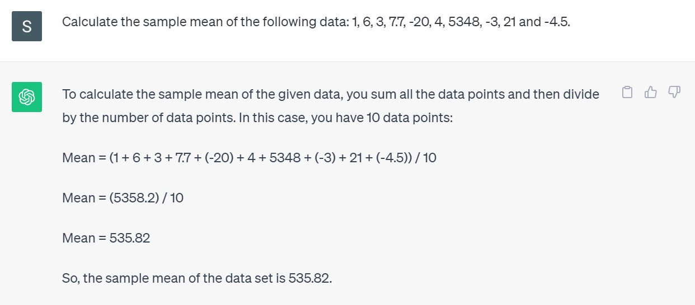

```{r packages, echo=FALSE, message=FALSE, warning=FALSE}
library(tidyverse)
library(magick)
library(xaringanExtra)
library(Tmisc)
library(dsbox)
xaringanExtra::use_panelset()
```


class: middle
# Case Study: Amazon's hiring algorithm

---

## Amazon's experimental hiring algorithm

- Used AI to give job candidates scores ranging from one to five stars -- much like shoppers rate products on Amazon
- Amazon's system was not rating candidates for software developer jobs and other technical posts in a gender-neutral way; it taught itself that male candidates were preferable

.pull-left-wide[
>Gender bias was not the only issue. Problems with the data that underpinned the models’ judgments meant that unqualified candidates were often recommended for all manner of jobs, the people said.
]

.footnote[
Jeffrey Dastin. [Amazon scraps secret AI recruiting tool that showed bias against women](https://reut.rs/2Od9fPr).  
Reuters. 10 Oct 2018.
]

---

## Where is the bias?

```{r out.width="60%", echo=FALSE, fig.align='center'}
knitr::include_graphics("img/modelling-process.PNG")
```


---

## Modelling questions

.pull-left[

```{r echo = FALSE}
df <- tibble(x = c(0.491, 0.833, 0.758, 0.902, 0.278, 0.446, 0.272, 0.33, 0.864, 0.11),
             y = c(0.466, 0.817, 0.696, 0.992, 0.179, 0.531, 0.353, 0.283, 0.948, 0.209))
df_new <- tibble(x = seq(0,1,by=0.01))
M1 <- lm(y ~ x, data = df)
M2 <- lm(y ~ poly(x, 7), data = df)
df_new$y_M1 <- predict(M1,newdata = df_new)
df_new$y_M2 <- predict(M2,newdata = df_new)

ggplot(data = df, mapping = aes(x=x, y=y)) +
  geom_point(cex = 2) + 
  theme_bw() +
  labs(x = "x", y = "y") +
  coord_cartesian(xlim=c(0,1), ylim = c(0, 1)) 
```


]
.pull-right[

Fit accuracy (residual sum of squares):
* Model 1: `r sum((predict(M1)-df$y)^2)`
* Model 2: `r sum((predict(M2)-df$y)^2)`

.question[
Q1: Which model gives a better fit to the data?
]


.question[
Q2: From the data, suggest what is a reasonable $y$ value when $x=0.625$? 
]

]


---

## Specific vs Generalisable 

.pull-left[

```{r echo=FALSE}
ggplot(data = df, mapping = aes(x=x, y=y)) +
  geom_point(cex = 2) + 
  theme_bw() +
  labs(x = "x", y = "y", title = "Model 1") +
  coord_cartesian(xlim=c(0,1), ylim = c(0, 1)) +
  geom_line(data = df_new, mapping = aes(x=x,y=y_M1), lwd = 1.2)
```

]
.pull-right[
```{r echo=FALSE}
ggplot(data = df, mapping = aes(x=x, y=y)) +
  geom_point(cex = 2) + 
  theme_bw() +
  labs(x = "x", y = "y", title = "Model 2") +
  coord_cartesian(xlim=c(0,1), ylim = c(0, 1)) +
  geom_line(data = df_new, mapping = aes(x=x,y=y_M2), lwd = 1.2)
```
]

---

## Be cautious with model chaining

```{r out.width="80%", echo=FALSE, fig.align='center'}
knitr::include_graphics("img/Model-chaining.PNG")
```

---


class: middle

# Algorithmic bias and race

---

## Criminal Sentencing

.center[
"There’s software used across the country to predict future criminals.  
And it’s biased against blacks".
]

```{r out.width="60%", echo=FALSE, fig.align='center'}
knitr::include_graphics("img/propublica-criminal-sentencing.png")
```

.footnote[
.midi[
Julia Angwin, Jeff Larson, Surya Mattu, and Lauren Kirchner. [Machine Bias](https://www.propublica.org/article/machine-bias-risk-assessments-in-criminal-sentencing). 23 May 2016. ProPublica.
]
]

---


## A tale of two convicts

.pull-left[

]
--
.pull-right[

]

---

class: middle

>“Although these measures were crafted with the best of intentions, I am concerned that they inadvertently undermine our efforts to ensure individualized and equal justice,” he said, adding, “they may exacerbate unwarranted and unjust disparities that are already far too common in our criminal justice system and in our society.”
>  
>Then U.S. Attorney General Eric Holder (2014)

---

## ProPublica analysis

### **Data:**

Risk scores assigned to more than 7,000 people arrested in Broward County, Florida, in 2013 and 2014 + whether they were charged with new crimes over the next two years

---

## ProPublica analysis

### **Results:**

- 20% of those predicted to commit violent crimes actually did
- Algorithm had higher accuracy (61%) when full range of crimes taken into account (e.g. misdemeanors)
```{r echo=FALSE, out.width = "85%"}
knitr::include_graphics("img/propublica-results.png")
```
- Algorithm was more likely to falsely flag black defendants as future criminals, at almost twice the rate as white defendants
- White defendants were mislabelled as low risk more often than black defendants


---

class: middle
# Recommendations - "The Algorithm"

---

## Netflix recommendation algorithm

How Netflix's Recommendations System Works - [Source](https://help.netflix.com/en/node/100639).
* Optionally 'jump start' with your own preferences
* Preferences will be superseded once you start watching titles
* Update to recommendations includes information from:
  - your interaction with Netflix (history, ratings, etc.)
  - other members with similar tastes/preferences
  - information about titles (year, performers, genre, category)
* Also account for other factors: time of day, device, attention duration, etc.
* "... using algorithms and complex systems to provide a personalized experience."
* "We take feedback from very visit ... and continually re-train our algorithms"

--

**Netflix: How did it know I was bi before I did?** [BBC News](https://www.bbc.co.uk/news/technology-66472938), 13 Aug 2023.

---

class: middle
# Understanding its purpose


---

## Chat-GPT


* ChatGPT is a language model

* Designed for generating human-like text in response to user input

* A powerful tool for automating text generation and answering a wide range of questions and prompts.

* Trained on a large corpus of text and can generate coherent and contextually relevant responses.

---

## Chat-GPT: About itself!

```{r echo=FALSE, out.width = "100%", fig.align='center'}
knitr::include_graphics("img/chat-gpt-self.PNG")
```

---

## Chat-GPT: Ethics in Data Science

```{r echo=FALSE, out.width = "100%", fig.align='center'}

```

---

## Chat-GPT: Another example

```{r echo=FALSE, out.width = "100%", fig.align='center'}

```

--

... but it is wrong, the correct answer is 536.32!!!

---

## Case Study: Mata vs Avianca Airline

* Roberto Mata sues airline for injury from metal serving cart.
* Lawyers for Mr Mata submit a document citing many 'relevant' court decision for their case.
* Neither judge or airline's lawyers were familiar with cases and sought copies of case notes.
* Mr Mata lawyers replied stating that they cannot locate requested case notes.

--

The initial document was generated by Chat-GPT, which **fabricated the references!**
* Judge: "... Do you cite cases without reading them?"
* Lawyer: "No."
* Judge: "What cause your departure here?"
* Lawyer: "I thought Chat-GPT was a search engine."

Further information: [YouTube, Legal Eagle](https://www.youtube.com/watch?v=oqSYljRYDEM)


---

## Parting thoughts

- At some point during your data science learning journey you will learn tools that can be used unethically

- You might also be tempted to use your knowledge in a way that is ethically questionable either because of business goals or for the pursuit of further knowledge (or because your boss told you to do so)

.question[
How do you train yourself to make the right decisions (or reduce the likelihood of accidentally making the wrong decisions) at those points?
]

---

## Further reading

.panelset[

.panel[.panel-name[Machine Bias]


.pull-left[

```{r echo=FALSE, out.width="80%", fig.align='center'}
knitr::include_graphics("img/propublica-machine-bias.png")
```
]
.pull-right[
[Machine Bias](https://www.propublica.org/article/machine-bias-risk-assessments-in-criminal-sentencing)  
<br>
by Julia Angwin, Jeff Larson, Surya Mattu, and Lauren Kirchner
]

]


.panel[.panel-name[Ethics & DS]

.pull-left[
```{r echo=FALSE, out.width="50%", fig.align='center'}
knitr::include_graphics("img/ethics-data-science.jpg")
```
]
.pull-right[
[Ethics and Data Science](https://www.amazon.com/Ethics-Data-Science-Mike-Loukides-ebook/dp/B07GTC8ZN7)  
<br>
by Mike Loukides, Hilary Mason, DJ Patil  
(Free Kindle download)
]

]

.panel[.panel-name[Math Destruction]

.pull-left[
```{r echo=FALSE, out.width="50%", fig.align='center'}
knitr::include_graphics("img/weapons-of-math-destruction.jpg")
```
]
.pull-right[
[Weapons of Math Destruction](https://www.penguin.co.uk/books/304/304513/weapons-of-math-destruction/9780141985411.html)  
How Big Data Increases Inequality and Threatens Democracy  
<br>
by Cathy O'Neil
]
]

.panel[.panel-name[Alg.s of Oppression]

.pull-left[
```{r echo=FALSE, out.width="50%", fig.align='center'}
knitr::include_graphics("img/algorithms-of-oppression.jpg")
```
]
.pull-right[
[Algorithms of Oppression](https://nyupress.org/9781479837243/algorithms-of-oppression/)  
How Search Engines Reinforce Racism  
<br>
by Safiya Umoja Noble
]


]


.panel[.panel-name[AI]


.pull-left[

```{r echo=FALSE, out.width="60%", fig.align='center'}
knitr::include_graphics("img/alan-turing-institute.PNG")
```
]
.pull-right[
The Alan Turing Institute

[Understanding artificial intlligence ethics and safety](https://www.turing.ac.uk/sites/default/files/2019-06/understanding_artificial_intelligence_ethics_and_safety.pdf)  
A guide for the responsible design and implementation of AI systems in the public sector
<br>
by David Leslie
]

]

]

