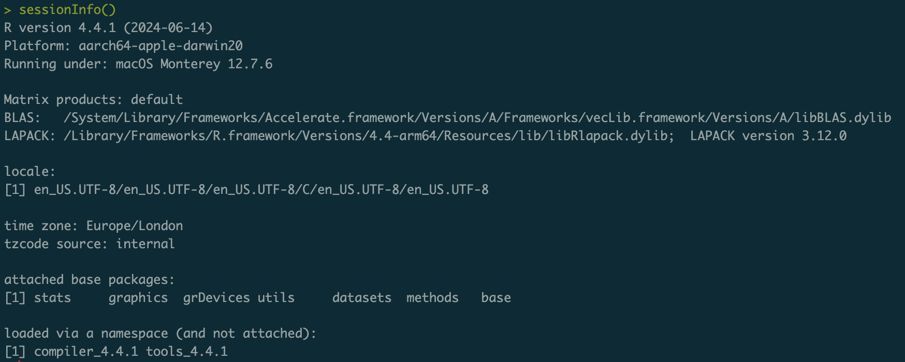

```{r packages, echo = FALSE, message=FALSE, warning=FALSE}
# library(tidyverse)
# library(rvest)
# library(DT)
```

class: middle

# R environment

---

## 🏁 Start with `sessionInfo()`

```{r echo=FALSE, out.width="70%"}

```

- `sessionInfo()` provides essential information about the current session environment (such as R version, operating system, and loaded packages). 

- Knowing the configuration of the R environment is vital when developing and sharing code, to ensure compatibility and proper functioning across different systems.

---

## For more information
Use `search` to get the list of all the attached packages in the R search path.

.pull-left[
```{r echo=TRUE,out.width="75%", R.options=list(width = 60)}
search()

```
]
.pull-right[
```{r echo=TRUE,message=FALSE, warning=FALSE,out.width="75%", R.options=list(width = 60),}
library(tidyverse)
search() 
```
]

---

Use `ls()` to see all the variables and functions that are defined in the current working directory in R. It returns a vector of character strings. 
```{r echo=TRUE}
ls()
```
--
If I add a variable or a function to the global environment. 
```{r echo=TRUE}
a <- 1; b <- 10; f <- function(x) x <- 1
ls()
```
--
Remove a variable or function from the global environment with `rm()`.
```{r echo=TRUE}
rm(a, f)
ls()
```

---

Use `ls()` to see what is defined in a specific package.

```{r echo=TRUE,out.width="65%"}
search()
```
Let's see what is in package `datasets` of the list.
```{r echo=TRUE,out.width=20,R.options=list(max.print = 15)}
ls(16)
```

---
Use `ls()` to list all the objects in a package.
```{r echo=TRUE, out.width="65%", R.options=list(max.print = 45)}
ls("package:datasets")
```

---

class: middle

# Functions

---

## When should you write a function?

.pull-left[
```{r echo=FALSE, out.width="100%"}
knitr::include_graphics("img/funct-all-things.png")
```
]
.pull-right[
When you’ve copied and pasted a block of code more than twice.
]

---
## Why functions?

- Automate common tasks in a more powerful and general way than copy-and-pasting:
    - Choose an informative name for your function to make code easier to understand
    - As requirements change, only need to update code in one place, instead of many
    - Eliminate chance of making incidental mistakes when you copy and paste (i.e. updating a variable name in one place, but not in another)

--

- Down the line: Improve your reach as a data scientist by writing functions (and packages!) that others can use

---


class: middle

# Writing functions

---

## Turn your code into a function

- Pick a short but informative **name**, preferably a verb.

<br>
<br>
<br>

```{r eval=FALSE}
name_function <- ..
  
  
  
..
```

---

## Turn your code into a function

- Pick a short but informative **name**, preferably a verb.
- List the function inputs, or **arguments**, inside `function(  )`. If there are more than one input, the syntax looks like `function(x, y, z)`.

<br>

```{r eval=FALSE}
name_function <- function(x){
  
  
  
}  
```

---

## Turn your code into a function

- Pick a short but informative **name**, preferably a verb.
- List the function inputs, or **arguments**, inside `function(  )`. If there are more than one input, the syntax looks like `function(x, y, z)`.
- Place the **code** you have developed in body of the function, a `{ .. }` block that immediately follows `function(...)`.

```{r eval=FALSE}
name_function  <- function(x){

  # code you want the function to do
  
}
```

---

## What goes in / what comes out?

.pull-left-wide[
- They take input(s) defined in the function definition

```{r eval=FALSE}
name_function <- function([inputs separated by commas]){
  # what to do with those inputs
}
```

- By default they return the last value computed in the function

```{r eval=FALSE}
name_function <- function(x){
  # do bunch of stuff with the input...
  
  # return the final object
  return(...)
}
```

- You can define more outputs to be returned in a list as well as nice print methods (but we won't go there for now...)
]

---

.question[
What is going on here?
]

```{r}
add_2 <- function(x){
  x + 2
  1000
}
```

```{r}
add_2(3)
add_2(10)
```

---

## R passes arguments by value

Which means that an R function cannot change the variable that you input to that function.

```{r}
triple <- function(x) {
  x <- 3*x # this change is only local to the function environment
  x
}
a <- 5
```

```{r}
triple(a)
a
```

---

## Naming functions

> "There are only two hard things in Computer Science: cache invalidation and naming things." - Phil Karlton

---

## Naming functions

- Names should be short but clearly inform on what the function does

- Names should be verbs, not nouns

- Multi-word names should be separated by underscores (`snake_case` as opposed to `snakeCase`)

- A family of functions should be named similarly (`scrape_page()`, `scrape_speech()` OR `str_remove()`, `str_replace()` etc.)

---
## Overwriting existing functions

```{r}
mean
mean(1:10)
```
What happens if we write a function with the same name?
```{r}
mean <- function(x){ x+2 }
mean(1:10)
```

---
## Overwriting existing functions
Now the new `mean` is:
```{r}
mean
```

How can we go back?
```{r}
mean <- base::mean
```

- Avoid overwriting existing (especially widely used) functions!


<!---
```{r eval=TRUE}
# JUST DON'T
mean <- function(x){ return(x+2) }
rm(mean)
mean(1:10)
```

--->

---

## Functions in action

Create a function that calculates the area of a circle.
  - Input: The function need as input the `r`adius of the circle.
  - Output: Return the area of the circle, $\pi \cdot r^2$

.pull-left[
```{r}
area <- function(r) { 
  return(pi*r^2)
}
area(2)
```
]
--
.pull-right[
If the input is negative?
```{r}
area(-2)
```

**Be careful!**
]


---

## Functions in action

If the input is negative, the function should return an error. Let's add a condition.

* `message`  prints a message but not stop execution.
* `warning`  prints a warning message but not stop execution.
* `stop`  stops execution of the current expression and executes an error action.


.pull-left[
```{r}
area <- function(r) {
  if (r < 0) 
    stop("Provide non-negative radius.")
  return(pi*r^2)
}
area(2)
```
]
--
.pull-right[
If the input is negative?
```{r eval=FALSE}
area(-2)
```
    ## Error in area(-2) : Provide non-negative 
    radius.
]

---

## Functions in action

If the input is negative, the function should return an error. Let's add a condition.

* `message`  prints a message but not stop execution.
* `warning`  prints a warning message but not stop execution.
* `stop`  stops execution of the current expression and executes an error action.


.pull-left[
```{r}
area <- function(r) {
  if (r < 0) 
    stop("Provide non-negative radius.")
  return(pi*r^2)
}
area(2)
```
]
.pull-right[
If the input is logical?
```{r}
area(TRUE)
```
]


---

## Functions in action

If the input is negative, the function should return an error. Let's add a condition.

* `message`  prints a message but not stop execution.
* `warning`  prints a warning message but not stop execution.
* `stop`  stops execution of the current expression and executes an error action.


.pull-left[
```{r}
area <- function(r) {
  if (r < 0) 
    stop("Provide non-negative radius.")
  return(pi*r^2)
}
area(2)
```
]
.pull-right[
If the input is logical?
```{r}
area(TRUE)
```
`TRUE` (logical) is converted to `1` (numeric). 
]


---
    
## Functions in action

Add the condition that `radius` should be a numeric value.
```{r,echo=TRUE}
area <- function(r) {
  if (r < 0 | !is.numeric(r) )
      stop("Provide non-negative numeric radius.")
  return(pi*r^2)
}
```

Try again.
```{r eval=FALSE}
area(TRUE)  
```

    ## Error in area(TRUE) : Provide non-negative numeric radius.


---
