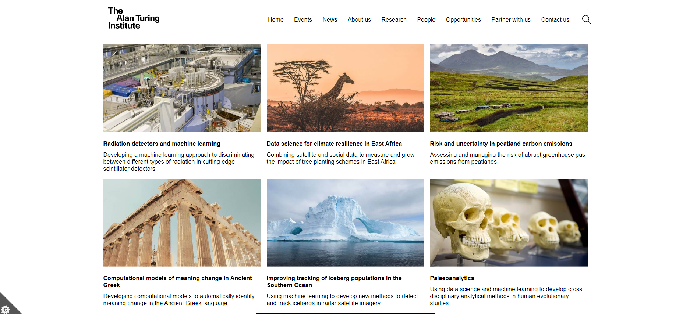
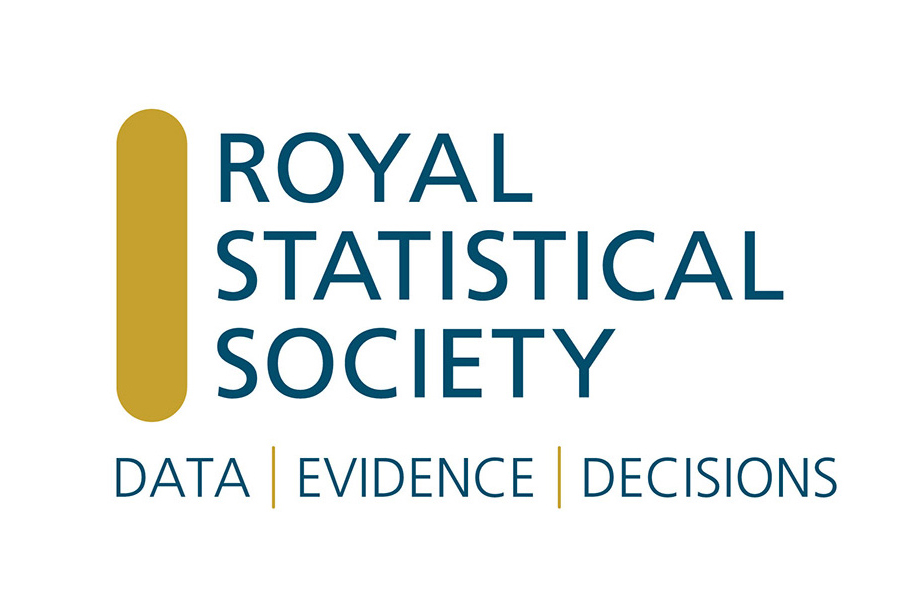
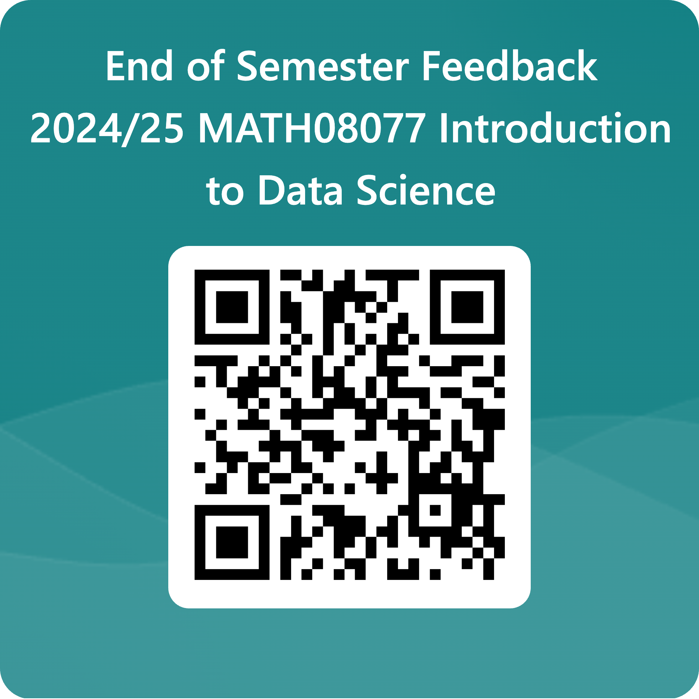

```{r packages, echo = FALSE, message=FALSE, warning=FALSE}
library(tidyverse)
library(magick)
library(dplyr)
library(tidymodels)
library(ggtext)
library(knitr)
library(kableExtra)
library(xaringanExtra)
library(Tmisc)
#library(emo)
library(openintro)
library(ggridges)
library(patchwork)
library(skimr)
library(webshot)
#library(datasauRus)

set.seed(1234)
options(
  warnPartialMatchArgs = FALSE,
  warnPartialMatchAttr = FALSE, 
  warnPartialMatchDollar = FALSE,
  width = 100
)

xaringanExtra::use_panelset()

elmhurst_boot <- bootstraps(elmhurst, times = 1000)

```

```{r setup, include=FALSE}
# R options
options(
  htmltools.dir.version = FALSE,
  dplyr.print_min = 6, 
  dplyr.print_max = 6,
  tibble.width = 65,
  width = 65
  )
# figure height, width, dpi
knitr::opts_chunk$set(echo = TRUE, 
                      fig.width = 8, 
                      fig.asp = 0.618,
                      out.width = "60%",
                      fig.align = "center",
                      dpi = 300,
                      message = FALSE)
# ggplot2
ggplot2::theme_set(ggplot2::theme_gray(base_size = 16))
# set seed
set.seed(1234)
# fontawesome
htmltools::tagList(rmarkdown::html_dependency_font_awesome())
# magick
dev.off <- function(){
  invisible(grDevices::dev.off())
}
# output number of lines
hook_output <- knitr::knit_hooks$get("output")
knitr::knit_hooks$set(output = function(x, options) {
  lines <- options$output.lines
  if (is.null(lines)) {
    return(hook_output(x, options))  # pass to default hook
  }
  x <- unlist(strsplit(x, "\n"))
  more <- "..."
  if (length(lines)==1) {        # first n lines
    if (length(x) > lines) {
      # truncate the output, but add ....
      x <- c(head(x, lines), more)
    }
  } else {
    x <- c(more, x[lines], more)
  }
  # paste these lines together
  x <- paste(c(x, ""), collapse = "\n")
  hook_output(x, options)
})

```

layout: true
  
<div class="my-footer">
<span>
University of Edinburgh
</span>
</div> 

---

## Reminders

  * **9.00-10.30**
      - Venue1: JCMB 4325c (Groups: 18, 2,20,21,22,23)	
      - Venue2: JCMB 5326 (Groups: 42,43,45,47,48). 
  * **10.30-12.00** 
      - Venue1: JCMB 4325c (Groups: 13, 14, 16, 24, 25, 55)	
      - Venue2: JCMB 5326 (Groups: 27, 7, 9, 52, 26).
  * **12.00-13.30** 
      - Venue1: JCMB 4325c (Groups: 1,5,6,8,56)	
      - Venue2: JCMB 5326 (Groups: 12,15,19,28,57)
      - Venue3: JCMB 4325b (Groups: 29,30,41,44,49).
  * **13.30-13.30** 
      - Venue1: JCMB 1206c (Groups: 10, 11, 17, 3, 53, 54)	
      - Venue2: JCMB 5326 (Groups: 31, 32, 33, 34, 35, 36)	
      - Venue3: JCMB 4325b (Groups: 37, 38, 39, 4, 40, 46, 51).

---

## Reminders

- Check your html file knits and loads properly

--

- HDMI port on laptop, if you need converter let us know

--

- Don't forget your peer evaluation form

--

- Don't forget to add the course GitHub page to your project

-- 

- Try to complete each requirement step by step and do submission on time to avoid extra stress!

---
## Topics for today

- Recap - what did people find difficult?

- Where can you go for more information?

- Next steps in R

- What else for Data Science?


---

## What have you learnt?

| Week | Topic                                     |
|------|-------------------------------------------|
| 1    | Welcome and Toolkit                       |
| 2    | Importing and recoding data               |
| 3    | Wrangling and tidying data                |
| 4    | Visualising data                          |
| 5    | Communicating effectively                 |
| 6    | Ethics                                    |
| 7    | Programming and Functions                 |
| 8    | Predictive Modelling                      |
| 9    | Classification and model building         |
| 10   | Validation and uncertainty quantification |
| 11   | Looking beyond IDS                        |

Which week did you find more difficult ? Wooclap using code **SJTGNO**

---

class:middle 

## IDS overall reflection

(hopefully) Positive impacts

  - You worked on generally the basics of data science pipeline in R language
  - Getting familiar with main steps of data analysis in general
  - IDS can be a good starting point for your personal further interest in Data Science

(Can be) Limited 

  - Not so much space for statistical terms and methods (definitely will learn more later) 
  - Maybe some re-ordering of the weekly topics can be discussed
  - Further details on modeling part is a must (you will learn later)

What do you want to add ?
- Connect to Wooclap using code **SJTGNO**

---

class:middle

## Looking Beyond IDS

---

## Books - I


```{r, echo=FALSE, out.width="25%", fig.show='hold', fig.align="center", fig.cap="  "}
knitr::include_graphics(c("img/IMS.png", "img/R4DS.jpeg", "img/AdvancedR.png"))
```

---

## Books - II


```{r, echo=FALSE, out.width="25%", fig.show='hold', fig.align="center", fig.cap="  "}
knitr::include_graphics(c("img/StatLiteracy.jpeg", "img/ArtofStats.jpg", "img/StatswithoutTears.jpg"))
```

---


## Courses 

- [Statistics (year 2)](http://www.drps.ed.ac.uk/23-24/dpt/cxmath08051.htm)
  * Estimators, including MLEs
  * Hypothesis Testing 
  * Linear Regression with theory
--

- [Statistical computing (year 3)](http://www.drps.ed.ac.uk/23-24/dpt/cxmath10093.htm)
  * optimising functions in R
  * programming statistical techniques and interpreting the results (including bootstrap algorithms)
--

- [Statistical methodology (year 3)](http://www.drps.ed.ac.uk/23-24/dpt/cxmath10095.htm)
  * maximum likelihood estimation
  * likelihood ratio tests
  * Bayes theorem and posterior distribution

---

## Courses 

- [Statistical Case Studies (year 4)](http://www.drps.ed.ac.uk/23-24/dpt/cxmath10102.htm)
  * Two real-world statistical projects that are meant to simulate consultancy-style work in a business/research environment

--

- [Machine Learning in Python (year 4)](http://www.drps.ed.ac.uk/23-24/dpt/cxmath11205.htm)
  * Supervised and Unsupervised learning methods
  * Coding with Python, two different projects.

--

- Projects in the last year

---
class:middle

## R capabilities: Special case

---

## Shiny Apps

.pull-left[
- Shiny is an R package that makes it easy to build interactive web apps straight from R
- You can host standalone apps on a webpage or embed them in R Markdown documents or build dashboards
- You can also extend your Shiny apps with CSS themes, htmlwidgets, and JavaScript actions
- Learn more at [shiny.rstudio.com](https://shiny.rstudio.com/)
]
.pull-right[
```{r echo=FALSE, fig.align = "left"}
knitr::include_graphics("img/shiny.png")
```
]

---

## High level view

- Every Shiny app has a webpage that the user visits, and behind this webpage there is a computer that serves this webpage by running R

- When running your app locally, the computer serving your app is your computer

- When your app is deployed, the computer serving your app is a web server

- If you want to try making your own, try working through the reading [here](https://mastering-shiny.org/basic-app.html)

---

## Some others

- Dynamic reporting with Rmd files with different programming language

- Widely considered the best tool for making beautiful graphs and visualizations. 

- Possible to find advanced statistics packages for high-level modeling.

--

**Key message**: If you learn a programming language to some extent, you can learn other tools intuitively  even if there are some differences on syntax. The battle of R vs Python is already over!

```{r echo=FALSE, out.width="20%"}
knitr::include_graphics("img/RPyhton.png")
```

---
class:middle

## Research in Data Science

---
## Turing Institute


```{r echo=FALSE, out.width="100%"}

```


---
class:middle

## Beyond your courses

---
## Royal Statistical Society

They offer free membership to all students in full-time education with an interest in statistics and data science.

The membership is called e-student so find out [benefits from here](https://rss.org.uk/membership/join-now/e-student/)


```{r echo=FALSE, out.width="50%"}

```

---

## Digital Skills Programme (UoE)

They offer various different training courses to develop your digital skills

- Introduction to Data Science

- Basic Data Visualizations

- Data and AI Ethics

- Introduction to R or Python

You can find more details from [digital skills programme for students](https://digitalskills.ed.ac.uk)


---

## Good luck!

for your project presentations and career after IDS...

Please give us some time to complete this small survey 

You can see the form [from the link](https://forms.office.com/e/T9qDnSXNUZ)

```{r echo=FALSE, out.width="30%"}

```
